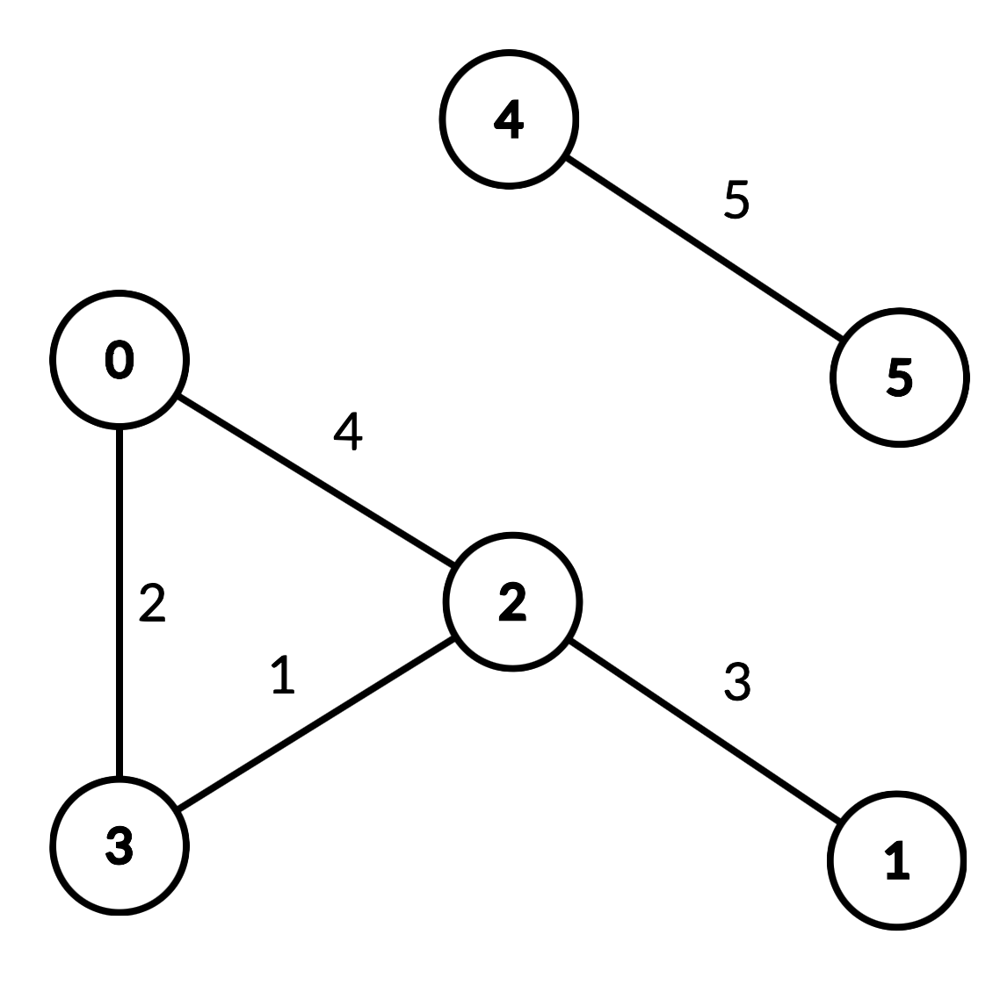

[toc]

An undirected graph of $n$ nodes is defined by `edgeList`, where `edgeList[i] = [ui, vi, disi]` denotes an edge between nodes $u_i$ and $v_i$ with distance $dis_i$. Note that there may be **multiple** edges between two nodes, and the graph may not be connected.

Implement the `DistanceLimitedPathsExist` class:

* `DistanceLimitedPathsExist(int n, int[][] edgeList)` Initializes the class with an undirected graph.
* `boolean query(int p, int q, int limit)` Returns `true` if there exists a path from $p$ to $q$ such that each edge on the path has a distance **strictly less than** `limit`, and otherwise `false`.


**Example 1**:



```
Input
["DistanceLimitedPathsExist", "query", "query", "query", "query"]
[[6, [[0, 2, 4], [0, 3, 2], [1, 2, 3], [2, 3, 1], [4, 5, 5]]], [2, 3, 2], [1, 3, 3], [2, 0, 3], [0, 5, 6]]
Output
[null, true, false, true, false]

Explanation
DistanceLimitedPathsExist distanceLimitedPathsExist = new DistanceLimitedPathsExist(6, [[0, 2, 4], [0, 3, 2], [1, 2, 3], [2, 3, 1], [4, 5, 5]]);
distanceLimitedPathsExist.query(2, 3, 2); // return true. There is an edge from 2 to 3 of distance 1, which is less than 2.
distanceLimitedPathsExist.query(1, 3, 3); // return false. There is no way to go from 1 to 3 with distances strictly less than 3.
distanceLimitedPathsExist.query(2, 0, 3); // return true. There is a way to go from 2 to 0 with distance < 3: travel from 2 to 3 to 0.
distanceLimitedPathsExist.query(0, 5, 6); // return false. There are no paths from 0 to 5.
```


**Constraints**:

* $2 \le n \le 10^4$
* $0 \le \text{edgeList.length} \le 10^4$
* $\text{edgeList[i].length} == 3$
* $0 \le u_i, v_i, p, q \le n-1$
* $u_i \ne v_i$
* $p \ne q$
* $1 \le dis_i, limit \le 10^9$
* At most $10^4$ calls will be made to `query`.


## 题目解读

&emsp;[#1697 Checking Existence of Edge Length Limited Paths](./#1697 Checking Existence of Edge Length Limited Paths.md)的线上查询版本。

```java
class DistanceLimitedPathsExist {

    public DistanceLimitedPathsExist(int n, int[][] edgeList) {

    }
    
    public boolean query(int p, int q, int limit) {

    }
}

/**
 * Your DistanceLimitedPathsExist object will be instantiated and called as such:
 * DistanceLimitedPathsExist obj = new DistanceLimitedPathsExist(n, edgeList);
 * boolean param_1 = obj.query(p,q,limit);
 */
```

## 程序设计

* 思路与[#1697 Checking Existence of Edge Length Limited Paths](./#1697 Checking Existence of Edge Length Limited Paths.md)类似，只是需要记录每次归并后的不相交集到红黑树中，在线查询通过红黑树来判断。

```java
class DistanceLimitedPathsExist {
    int idx;
    int[][] edgeList;
    DisJoint disJoint;
    // 记录限制和不相交集
    TreeMap<Integer, int[]> treeMap;

    public DistanceLimitedPathsExist(int n, int[][] edgeList) {
        this.edgeList = edgeList;
        Arrays.sort(this.edgeList, (a, b) -> a[2] - b[2]);
        this.disJoint = new DisJoint(n);
        this.treeMap = new TreeMap();
    }
    
    public boolean query(int p, int q, int limit) {

        while (idx < edgeList.length && edgeList[idx][2] < limit) {
            disJoint.union(disJoint.find(edgeList[idx][0]), disJoint.find(edgeList[idx][1]));
            treeMap.put(edgeList[idx][2], disJoint.history());
            idx++;
        }

        // 注意limit-1
        Map.Entry<Integer, int[]> entry = treeMap.floorEntry(limit - 1);
        if (entry != null && disJoint.findHistory(entry.getValue(), p) == disJoint.findHistory(entry.getValue(), q)) return true;
        return false; 
    }
}

class DisJoint {
    private int[] parent;

    DisJoint(int size) {
        this.parent = new int[size];
        Arrays.fill(parent, -1);
    }

    public void union(int r1, int r2) {
        if (parent[r1] >= 0 || parent[r2] >= 0) throw new IllegalArgumentException("invalid param");
        if (r1 == r2) return;

        if (parent[r1] <= parent[r2]) {
            parent[r1] += parent[r2];
            parent[r2] = r1;
        } else {
            parent[r2] += parent[r1];
            parent[r1] = r2;
        }
    }

    public int find(int idx) {
        if (parent[idx] < 0) return idx;
        return parent[idx] = find(parent[idx]);
    }

    public int[] history() {
        return Arrays.copyOf(parent, parent.length);
    }

    public int findHistory(int[] history, int idx) {
        if (history[idx] < 0) return idx;
        return history[idx] = findHistory(history, history[idx]);
    }
}
```

* 可在构造函数中提前维护好历史不相交集。

```java
class DistanceLimitedPathsExist {
    DisJoint disJoint;
    // 记录限制和不相交集
    TreeMap<Integer, int[]> treeMap;

    public DistanceLimitedPathsExist(int n, int[][] edgeList) {
        this.disJoint = new DisJoint(n);
        this.treeMap = new TreeMap();

        Arrays.sort(edgeList, (a, b) -> a[2] - b[2]);
        int left = 0, right = 0;
        while (right < edgeList.length) {
            if (edgeList[left][2] != edgeList[right][2]) {
                treeMap.put(edgeList[right - 1][2], disJoint.history());
                left = right;
            }
            disJoint.union(disJoint.find(edgeList[right][0]), disJoint.find(edgeList[right][1]));
            right++;;
        }
        treeMap.put(edgeList[right - 1][2], disJoint.history());
    }
    
    public boolean query(int p, int q, int limit) {
        // 注意limit-1
        Map.Entry<Integer, int[]> entry = treeMap.floorEntry(limit - 1);
        if (entry != null && disJoint.findHistory(entry.getValue(), p) == disJoint.findHistory(entry.getValue(), q)) return true;
        return false; 
    }
}

class DisJoint {
    private int[] parent;

    DisJoint(int size) {
        this.parent = new int[size];
        Arrays.fill(parent, -1);
    }

    public void union(int r1, int r2) {
        if (parent[r1] >= 0 || parent[r2] >= 0) throw new IllegalArgumentException("invalid param");
        if (r1 == r2) return;

        if (parent[r1] <= parent[r2]) {
            parent[r1] += parent[r2];
            parent[r2] = r1;
        } else {
            parent[r2] += parent[r1];
            parent[r1] = r2;
        }
    }

    public int find(int idx) {
        if (parent[idx] < 0) return idx;
        return parent[idx] = find(parent[idx]);
    }

    public int[] history() {
        return Arrays.copyOf(parent, parent.length);
    }

    public int findHistory(int[] history, int idx) {
        if (history[idx] < 0) return idx;
        return history[idx] = findHistory(history, history[idx]);
    }
}
```

## 性能分析

&emsp;构造函数时间复杂度为$O(N\log N)$，查询方法最坏时间复杂度为$O(N\log N)$，空间复杂度为$O(N)$。


&emsp;优化后，构造函数时间复杂度为$O(N\log N)$，查询方法时间复杂度为$O(\log N)$，空间复杂度为$O(N)$。


## 官方解题

&emsp;暂无，密切关注。
