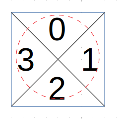

[toc]

In a $N \times N$ `grid` composed of $1 \times 1$ squares, each $1 \times 1$ square consists of a `/`, `\`, or blank space.  These characters divide the square into contiguous regions.

(Note that backslash characters are escaped, so a `\` is represented as `"\\"`.)

Return the number of regions.


**Note**:

* $1 \le \text{grid.length} == \text{grid[0].length} \le 30$
* `grid[i][j]` is either `'/'`, `'\'`, or `' '`.


## 题目解读

&emsp;给定正方形，每个格子可以是斜线、反斜线、空格，分别代表当前格子的划分策略。最后返回划分的区域。

```java
class Solution {
    public int regionsBySlashes(String[] grid) {

    }
}
```

## 程序设计

* 将每个格子换分为四部分，这样每种划分就对应了相应的合并操作；而对于相邻的格子，需要合并的格子也是固定的。



```java
class Solution {
    public int regionsBySlashes(String[] grid) {
        if(grid == null || grid.length == 0) {
            return 0;
        }
        int n = grid.length;
        // 将每个格子分为四个区域，上下为a0、a2，左右为a1、a3
        DisJoint disJoint = new DisJoint(4 * n * n);
        for (int i = 0; i < n; i++) {
            for (int j = 0; j < n; j++) {
                char c = grid[i].charAt(j);
                int idx = 4 * i * n + 4 * j;
                // 归并上、左区域和下、右区域
                if(c == '/') {
                    disJoint.union(disJoint.find(idx), disJoint.find(idx + 1));
                    disJoint.union(disJoint.find(idx + 2), disJoint.find(idx + 3));
                }
                // 归并上、右和下、左
                else if(c == '\\') {
                    disJoint.union(disJoint.find(idx), disJoint.find(idx + 3));
                    disJoint.union(disJoint.find(idx + 2), disJoint.find(idx + 1));
                }
                // 空格，则归并四个区域
                else {
                    disJoint.union(disJoint.find(idx), disJoint.find(idx + 1));
                    disJoint.union(disJoint.find(idx), disJoint.find(idx + 2));
                    disJoint.union(disJoint.find(idx), disJoint.find(idx + 3));
                }
                // 左边区域归并前一个格子的右边区域
                if(j > 0) disJoint.union(disJoint.find(idx + 1), disJoint.find(idx - 1));
                // 上边区域归并上一个格子的下边区域
                if(i > 0) disJoint.union(disJoint.find(idx), disJoint.find(idx - 4 * n + 2));
            }
        }

        return disJoint.size();
    }
}

class DisJoint {
    private int size;
    private int[] tree;

    DisJoint(int size) {
        this.size = size;
        this.tree = new int[size];
        Arrays.fill(tree, -1);
    }
    // 按规模并
    public void union(int root1, int root2) {
        if(tree[root1] >= 0 || tree[root2] >= 0) throw new IllegalArgumentException("not a root");
        if(root1 == root2) return;

        // 树2大，树1并入树2
        if(tree[root1] >= tree[root2]) {
            tree[root2] += tree[root1];
            tree[root1] = root2;
        } else {
            tree[root1] += tree[root2];
            tree[root2] = root1;
        }
        size--;
    }
    // 路径压缩
    public int find(int val) {
        if(tree[val] < 0) return val;
        return tree[val] = find(tree[val]);
    }

    public int size() {
        return size;
    }
}
```

## 性能分析

&emsp;时间复杂度为$O(N^2)$，空间复杂度为$O(N^2)$。

执行用时：5ms，在所有java提交中击败了90.00%的用户。

内存消耗：37.7MB，在所有java提交中击败了12.00%的用户。

## 官方解题

&emsp;官方思路同上。社区还有一种思路就是将格子转化为$3 \times 3$的矩阵，斜线位置转化为1，其余元素转化为0，这样就转变为寻找0的连通分量数目。