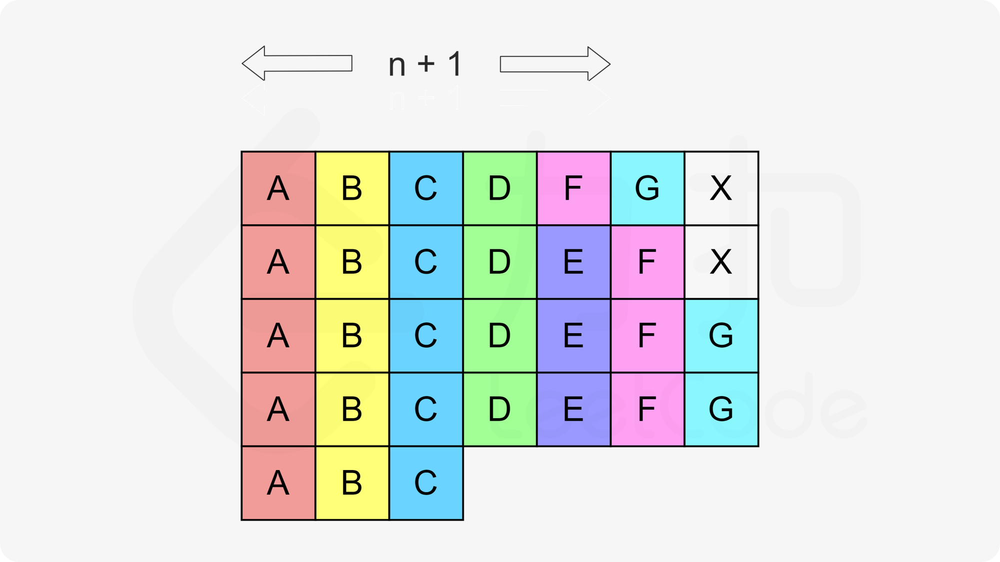

[toc]

Given a char array representing tasks CPU need to do. It contains capital letters A to Z where different letters represent different tasks. Tasks could be done without original order. Each task could be done in one interval. For each interval, CPU could finish one task or just be idle.

However, there is a non-negative cooling interval **n** that means between two **same tasks**, there must be at least n intervals that CPU are doing different tasks or just be idle.

You need to return the **least** number of intervals the CPU will take to finish all the given tasks.


**Note**:

* The number of tasks is in the range [1, 10000].
* The integer n is in the range [0, 100].


## 题目解读

&emsp;给定字符数组表示CPU需要执行的任务列表，其中包含使用大写的`A-Z`字母表示的26种不同种类的任务。任务可以以任意顺序执行，并且每个任务都可以在1个单位时间内执行完。CPU在任何一个单位时间内都可以执行一个任务，或者在待命状态。需要注意的是两个相同种类的任务之间必须有长度为n的冷却时间，因此至少有连续$n$个单位时间内CPU在执行不同的任务，或者在待命状态。需要计算完成所有任务所需要的最短时间。

```java
class Solution {
    public int leastInterval(char[] tasks, int n) {
        
    }
}
```

## 程序设计

* 首先想到的是当前轮，也就是要选择$n$个任务，可以选择出现次数最多的前$n$个任务，这样就需要排序；选择完成后相应数目减一，并需要再次排序。

```java
class Solution {
    public int leastInterval(char[] tasks, int n) {
        int[] counter = new int[26];
        for(char c : tasks) counter[c - 'A']++;
        Arrays.sort(counter);
        
        int time = 0;
        // counter[25]为最大任务数
        while(counter[25] > 0) {
            // 每一轮选择n+1个
            int task = 0;
            while(task <= n) {
                // 最大任务数是0，无任务可选，结束循环
                if(counter[25] == 0) {
                    break;
                }

                // 选择任务，计数减一
                if(25 - task >=0 && counter[25 - task] > 0) {
                    counter[25 - task] -= 1;
                }
                // 如果上面25-task有任务可选，则时间更新
                // 如果上面25-task值为0，无任务可选，但是25值不为0，表示选择未结束，本轮只能选idle
                time++;
                task++;
            }
            // 再次排序
            Arrays.sort(counter);
        }
        return time;
    }
}
```

* 可见整个过程实际上是在动态排序的过程中完成，可使用优先级队列。

```java
class Solution {
    public int leastInterval(char[] tasks, int n) {
        // 26个字母统计技术
        int[] counter = new int[26];
        for(char c : tasks) {
            counter[c - 'A']++;
        }
        // 最大堆
        PriorityQueue<Integer> queue = new PriorityQueue<>(26, (a, b) -> b - a);
        // 入队
        for(int count : counter) {
            if(count > 0) queue.add(count);
        }
        int time = 0;
        while(!queue.isEmpty()) {
            // 选择n+1个任务
            int task = 0;
            // 记录本轮选择的任务
            List<Integer> temp = new LinkedList<>();
            while(task <= n) {
                // 出队表示分配到当前任务窗口。任务数大于1则先保存到数组，待本轮结束再重新入队
                if(!queue.isEmpty()) {
                    if(queue.peek() > 1) {
                        temp.add(queue.poll() - 1);
                    } else {
                        queue.poll();
                    }
                }
                // 如果队列不为空，表示本次选择了队头任务；如果为空，表示选择了idle任务
                // 堆为空，链表不为空，表示选择未结束，只是本轮没有可选择的任务，只能选择idle
                time++;
                task++;
                // 队列为空且链表为空，表示任务已经选择完，结束内外层循环
                if(queue.isEmpty() && temp.size() == 0) {
                    break;
                }
            }
            // 结束上一轮选择，将链表中的值入队
            for(int count : temp) {
                queue.add(count);
            }
        }
        return time;
    }
}
```

## 性能分析

&emsp;数组排序方法最后得到时间为$time$，即选择了$time/n$轮。每轮选择完需要排序，总的时间复杂度为$O(\frac{time}{n}\log_226)$，$n \le time$，即总的时间复杂度为$O(time)$。由于数组固定26，空间复杂度为$O(1)$。

执行用时：10ms，在所有java提交中击败了48.72%的用户。

内存消耗：48.6MB，在所有java提交中击败了5.02%的用户。

&emsp;优先级队列方法时间复杂度为$O(time)$。由于数组和堆固定26，空间复杂度为$O(1)$。

执行用时 :85 ms, 在所有 Java 提交中击败了5.65%的用户

内存消耗 :49.3 MB, 在所有 Java 提交中击败了5.02%的用户

## 官方解题

&emsp;官方除了上述两种思路，还提供了另一种思路。一下来自官方解题思路：在前两种方法中尽早安排出现次数较多的任务。假设`A`为出现次数最多的任务，出现了`p`次，考虑到冷却时间，那么执行完所有任务的时间至少为`(p - 1) * (n + 1) + 1`。这个过程如图1所示，CPU产生了`(p - 1) * n` 个空闲时间，只有`p`个时间是在工作的。因此应当考虑把剩余的任务安排到这些空闲时间里。仍然按照这些任务的出现次序，从大到小进行安排会有下面三种情况：

* 某个任务和`A`出现的次数相同，例如图2中的任务`B`。此时只能让`B`占据`p - 1`个空闲时间，而在非空闲时间里额外安排一个时间给`B`执行；

* 某个任务比`A`出现的次数少1，例如图2中的任务`C`。此时可以让`C`占据`p - 1`个空闲时间，就可以全部执行完；

* 某个任务比`A`出现的次数少2或更多，例如图2中的任务`D`。此时可以按照列优先的顺序，将`D`填入空闲时间中。因为`D`出现的次数少于`p - 1`，因此无论从哪个位置开始按照列优先的顺序放置，都可以保证相邻的两个`D`之间满足冷却时间的要求。

如果分配完成后，空闲时间大于0，如图2，则最终花费的时间是任务数加最终空闲时间数。如果分配完后，空闲时间小于等于0，则最终花费时间是任务数，因为其它任务数小于等于`A`的数目，最后分配不了的可以放在图2`A`的最后一行，整体看时间为任务数。



```java
class Solution {
    public int leastInterval(char[] tasks, int n) {
        int[] counter = new int[26];
        for(char c : tasks) counter[c - 'A']++;
        Arrays.sort(counter);
        
        // p - 1及待分配的空闲位置数
        int p1 = counter[25] - 1, free = p1 * n;
        int a = 1;
        // 从左至右遍历
        for(int i = 24; i >= 0 && counter[i] > 0; i--) {
           // 按列分配，不能超过列的大小p1
           free -= Math.min(counter[i], p1);
        }
        // 大于0则未分配完，时间为任务加idle
        // 小于等于0则分配完，时间为任务数
        return free > 0 ? tasks.length + free : tasks.length;
    }
}
```

&emsp;时间复杂度为$O(N)$，空间复杂度为$O(1)$。为最佳解法。

执行用时：3ms，在所有java提交中击败了80.43%的用户。

内存消耗：47.4MB，在所有java提交中击败了5.02%的用户。