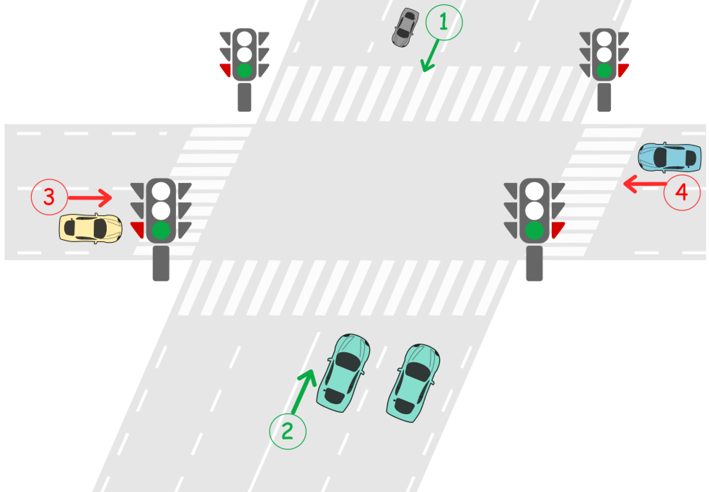

[toc]

There is an intersection of two roads. First road is road A where cars travel from North to South in direction 1 and from South to North in direction 2. Second road is road B where cars travel from West to East in direction 3 and from East to West in direction 4.



There is a traffic light located on each road before the intersection. A traffic light can either be green or red.

* **Green** means cars can cross the intersection in both directions of the road.
* **Red** means cars in both directions cannot cross the intersection and must wait until the light turns green.

The traffic lights cannot be green on both roads at the same time. That means when the light is green on road A, it is red on road B and when the light is green on road B, it is red on road A.

Initially, the traffic light is **green** on road A and **red** on road B. When the light is green on one road, all cars can cross the intersection in both directions until the light becomes green on the other road. No two cars traveling on different roads should cross at the same time.

Design a deadlock-free traffic light controlled system at this intersection.

Implement the function `void carArrived(carId, roadId, direction, turnGreen, crossCar)` where:

* `carId` is the id of the car that arrived.
* `roadId` is the id of the road that the car travels on.
* `direction` is the direction of the car.
* `turnGreen` is a function you can call to turn the traffic light to green on the current road.
* `crossCar` is a function you can call to let the current car cross the intersection.

Your answer is considered correct if it avoids cars deadlock in the intersection. Turning the light green on a road when it was already green is considered a wrong answer.


Constraints:

* $1 \le \text{cars.length} \le 20$
* $\text{cars.length} = \text{directions.length}$
* $\text{cars.length} = \text{arrivalTimes.length}$
* All values of cars are unique
* $1 \le \text{directions[i]} \le 4$
* `arrivalTimes` is non-decreasing


## 题目解读

&emsp;十字路口红绿灯决定车辆是否通过，同一时刻不能通过两辆车。

```java
class TrafficLight {

    public TrafficLight() {
        
    }
    
    public void carArrived(
        int carId,           // ID of the car
        int roadId,          // ID of the road the car travels on. Can be 1 (road A) or 2 (road B)
        int direction,       // Direction of the car
        Runnable turnGreen,  // Use turnGreen.run() to turn light to green on current road
        Runnable crossCar    // Use crossCar.run() to make car cross the intersection 
    ) {
        
    }
}
```

## 程序设计

* 红绿灯是竞态条件，对红绿灯加锁即可。

```java
class TrafficLight {

    // 代表当前路是否是绿灯
    boolean road1;
    boolean road2;
    // 红绿灯锁
    ReentrantLock lock;

    public TrafficLight() {
        this.lock = new ReentrantLock();
        this.road1 = true;
        this.road2 = false;
    }
    
    public void carArrived(
        int carId,           // ID of the car
        int roadId,          // ID of the road the car travels on. Can be 1 (road A) or 2 (road B)
        int direction,       // Direction of the car
        Runnable turnGreen,  // Use turnGreen.run() to turn light to green on current road
        Runnable crossCar    // Use crossCar.run() to make car cross the intersection 
    ) {
        // 获取红绿灯锁
        lock.lock();
        try {
            // 红灯，变为绿灯再通过
            if ((roadId == 1 && road2) || (roadId == 2 && road1)) {
                road1 = !road1;
                road2 = !road2;
                turnGreen.run();
            }
            crossCar.run();
        } finally {
            lock.unlock();
        }
    }
}

```

* 可以直接使用关键字`synchronized`。

```java
class TrafficLight {

    // 代表当前路是否是绿灯
    boolean road1;
    boolean road2;

    public TrafficLight() {
        this.road1 = true;
        this.road2 = false;
    }
    
    public void carArrived(
        int carId,           // ID of the car
        int roadId,          // ID of the road the car travels on. Can be 1 (road A) or 2 (road B)
        int direction,       // Direction of the car
        Runnable turnGreen,  // Use turnGreen.run() to turn light to green on current road
        Runnable crossCar    // Use crossCar.run() to make car cross the intersection 
    ) {
        synchronized(this) {
            // 红灯，变为绿灯再通过
        if ((roadId == 1 && road2) || (roadId == 2 && road1)) {
            road1 = !road1;
            road2 = !road2;
            turnGreen.run();
        }
        crossCar.run();
        }
    }
}

```

## 性能分析

执行用时：11ms，在所有java提交中击败了93.01%的用户。

内存消耗：40.7MB，在所有java提交中击败了100.00%的用户。

## 官方解题

&emsp;暂无，密切关注。