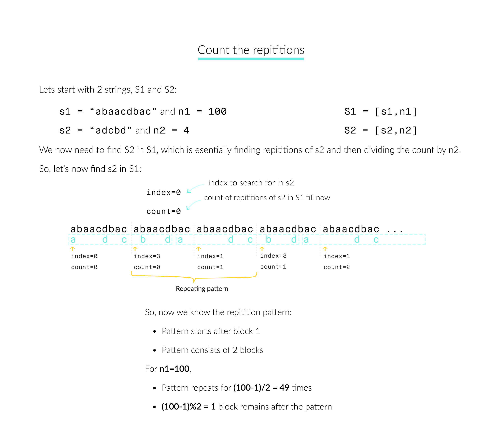

[toc]

Define `S = [s,n]` as the string S which consists of n connected strings s. For example, `["abc", 3] ="abcabcabc"`.

On the other hand, we define that string s1 can be obtained from string s2 if we can remove some characters from s2 such that it becomes s1. For example, `“abc”` can be obtained from `“abdbec”` based on our definition, but it can not be obtained from `“acbbe”`.

You are given two non-empty strings s1 and s2 (each at most 100 characters long) and two integers $0 \le n_1 \le 10^6$ and $1 \le n_2 \le 10^6$. Now consider the strings S1 and S2, where `S1=[s1,n1]` and `S2=[s2,n2]`. Find the maximum integer M such that `[S2,M]` can be obtained from S1.


## 题目解读

&emsp;求字符串`S1=[s1,n1]`中可得到的`S2=[s2,n2]`的最大数目。

```java
class Solution {
    public int getMaxRepetitions(String s1, int n1, String s2, int n2) {

    }
}
```

## 程序设计

* 最基础的思路是暴力遍历，遍历$n_1$个`s1`，每匹配完一个`s2`就更新计数，并将`s2`的索引重置到开头继续匹配。该方法时间复杂度为$O(M_1M_2N_1)$，空间复杂度为$O(1)$，在字符串较长或$n_1$较大的情况下会超时。

```java
class Solution {
    public int getMaxRepetitions(String s1, int n1, String s2, int n2) {
        if (s1 == null || s2 == null) throw new IllegalArgumentException("invalid param");

        // 记录匹配的s2长度，记录匹配到的s2数目
        int len = 0, count = 0;
        // 暴力遍历s1
        for (int i = 0; i < n1; i++) {
            // 遍历当前n1的s1
            for (int j = 0; j < s1.length(); j++) {
                // 匹配成功
                if (s1.charAt(j) == s2.charAt(len)) len++;

                // 表示匹配完一个s2，计数并重置到开头
                if (len == s2.length()) {
                    len = 0;
                    count++;
                }
            }
        }
        return count / n2;
    }
}
```

* 可以考虑找出`s2`在`S1`中出现的规律，如果找到了循环节，那么就可以很快算出`s2`在`S1`中出现的次数。如图，可以找到除了第一个字符串从$0$开始，后续匹配都是从前一个`s1`的最后一个`a`开始，后一个`s1`的最后一个`d`结束。这样可知在第一个字符串后，两个`s1`对应一个`s2`，$100$个`s1`对应$(100 - 1)/2 + 1 = 49$个，加的$1$表示第一个`s1`对应的`s2`。



* 为实现上述思路，需要两个数组分别记录当前轮次匹配到的最后一位`s2`中的字符索引及截止当前轮次匹配成功的数目；每次遍历匹配完一轮，假设当前为`i`轮，从索引数组遍历查找与`i`轮最后匹配索引一直的轮次，假设为`j`，则`j~i`是一个循环节，假设`n = i - j`，`m`为这两个轮次匹配`s2`数目的差，这样我们就得到从轮次`j`开始，存在`n`个`s1`包含了`m`个`s2`的循环节，循环节的数目为`(n1 - 1 - j) / (i - j) `，而余下的`(n1 - 1 - j) % (i - j)`个必定在循环周期里面，就是`j + (n1 - 1 - j) % (i - j)`处的计数值；除了`j`后面的匹配数，还需要加上`j`前面的匹配数。

```java
class Solution {
    public int getMaxRepetitions(String s1, int n1, String s2, int n2) {
        if (s1 == null || s2 == null) throw new IllegalArgumentException("invalid param");

        // 记录匹配到当前n1的s2中的最后一位字符索引
        int[] index = new int[n1];
        // 记录匹配到当前n1次的s2数目
        int[] counter = new int[n1];

        // 记录匹配的s2长度，记录匹配到的s2数目
        int len = 0, count = 0;
        // 暴力遍历s1
        for (int i = 0; i < n1; i++) {
            // 遍历当前n1的s1
            for (int j = 0; j < s1.length(); j++) {
                // 匹配成功
                if (s1.charAt(j) == s2.charAt(len)) len++;

                // 表示匹配完一个s2，计数并重置到开头
                if (len == s2.length()) {
                    len = 0;
                    count++;
                }
            }
            // 第i个s1匹配完成，记录匹配s2的最后一位索引
            index[i] = len;
            counter[i] = count;
            // 遍历查找循环节
            for (int j = 0; j < i; j++) {
                if (index[j] != len) continue;
                // 找到循环节
                int block = i - j;
                // 循环节之前的匹配数
                int preCount = counter[j];
                // 循环节的匹配数
                int patternCount = (n1 - 1 - j) / block * (counter[i] - counter[j]);
                // 剩余的匹配数
                int remainCount = counter[j + (n1 - 1 - j) % block] - counter[j];

                return (preCount + patternCount + remainCount) / n2;
            }
        }
        // 未找到循环节
        return count / n2;
    }
}
```

## 性能分析

&emsp;时间复杂度为$O(\max(N_1^2,N_1M_1))$，空间复杂度为$O(N_1)$。

执行用时：13ms，在所有java提交中击败了70.64%的用户。

内存消耗：57.1MB，在所有java提交中击败了12.50%的用户。

## 官方解题

&emsp;上述思路参考官方，还可将字符串转为数组加快时间性能。