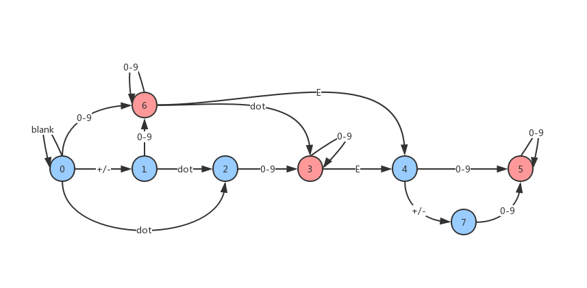

[toc]

Validate if a given string can be interpreted as a decimal number.

Some examples:

```
"0" => true
" 0.1 " => true
"abc" => false
"1 a" => false
"2e10" => true
" -90e3   " => true
" 1e" => false
"e3" => false
" 6e-1" => true
" 99e2.5 " => false
"53.5e93" => true
" --6 " => false
"-+3" => false
"95a54e53" => false
```


**Note**: It is intended for the problem statement to be ambiguous. You should gather all requirements up front before implementing one. However, here is a list of characters that can be in a valid decimal number:

* Numbers `0-9`
* Exponent - `"e"`
* Positive/negative sign - `"+"/"-"`
* Decimal point - `"."`

Of course, the context of these characters also matters in the input.


## 题目解读

&emsp;判断字符串是否是一个数字。

```java
class Solution {
    public boolean isNumber(String s) {

    }
}
```

## 程序设计

* 字符串中只能存在`-`、`+`、`e`、`.`和数字，`e`只能存在一个，其前后都是数字，其后的数字不能是小数；对于每个数字可以是格式包含`.`的小数。
* 首先检测`e`，将数字分为前后两半，分别检测是否是符合要求的数字；检测分割的数字，需要判断表示小数的逗号，将数字分割为两半，继续检测。
* 需注意`.`是非法的，但`.3`和`3.`是正确的；其次需注意小数点后的数字不能有符号位，指数后的数字不能有小数；其次题目要求字符串前后的空格需去除，中间不能有空格。

```java
class Solution {
    public boolean isNumber(String s) {
        if (s == null || s.isEmpty()) return false;

        char[] str = s.toCharArray();
        // 消除首尾空格
        int i = 0, j = str.length - 1;
        while (i <= j && str[i] == ' ') i++;
        while (i <= j && str[j] == ' ') j--;
        if (i > j) return false;

        // 寻找e
        int split;
        for (split = i; split <= j; split++) {
            if (str[split] == 'e') break;
        }

        // e在最后一位，没有指数
        if (split == j) return false;
        // 不存在e
        if (split > j) return isDigit(str, i, j, true, true);
        // 存在e，切分为两半
        else return isDigit(str, i, split - 1, true, true) && isDigit(str, split + 1, j, false, true);
    }

    // 检测是否是数字表示（不能包含科学计数法），flag表示是否包含小数点号
    private boolean isDigit(char[] s, int i, int j, boolean flag, boolean op) {
        if (i >= s.length || j >= s.length) return true;
        // 符号位跳过
        if (op && (s[i] == '-' || s[i] == '+')) i++;
        if (i > j) return false;

        // 检测只有一个.的情况
        if (i == j && s[i] == '.') return false;

        for (int k = i; k <= j; k++) {
            if (Character.isDigit(s[k])) continue;
            // 小数点
            if (flag && s[k] == '.') {
                // 检测后半部分是否是数字（不能是小数），如果不存在直接返回
                return k >= j || isDigit(s, k + 1, j, false, false);    
            } 
            // 包含其它字符
            else {
                return false;
            }
        }
        return true;
    }
}
```

## 性能分析

&emsp;时间复杂度为$O(N)$，空间复杂度为$O(N)$。

执行用时：2ms，在所有java提交中击败了100.00%的用户。

内存消耗：39.7MB，在所有java提交中击败了50.00%的用户。

## 官方解题

&emsp;暂无，密切关注。社区巧妙使用有限状态机的思路来解决，为了简化，加入状态8表示前后字符串的空格。特别需要注意状态$6$，即无小数数字后接小数点转为状态3，因为本题中`3.`也是合法数字。

| state | blank | +/-  | 0-9  |  .   |  e   | other |
| :---: | :---: | :--: | :--: | :--: | :--: | :---: |
|   0   |   0   |  1   |  6   |  2   |  -1  |  -1   |
|   1   |  -1   |  -1  |  6   |  2   |  -1  |  -1   |
|   2   |  -1   |  -1  |  3   |  -1  |  -1  |  -1   |
|   3   |   8   |  -1  |  3   |  -1  |  4   |  -1   |
|   4   |  -1   |  7   |  5   |  -1  |  -1  |  -1   |
|   5   |   8   |  -1  |  5   |  -1  |  -1  |  -1   |
|   6   |   8   |  -1  |  6   |  3   |  4   |  -1   |
|   7   |  -1   |  -1  |  5   |  -1  |  -1  |  -1   |
|   8   |   8   |  -1  |  -1  |  -1  |  -1  |  -1   |



```java
class Solution {
    // 所有终止状态，分别是状态3\5\6\8
    final static int finalState = 0b101101000;
    // 状态转移矩阵
    final static int[][] transfer = new int[][]{
        { 0, 1, 6, 2,-1,-1},
        {-1,-1, 6, 2,-1,-1},
        {-1,-1, 3,-1,-1,-1},
        { 8,-1, 3,-1, 4,-1},
        {-1, 7, 5,-1,-1,-1},
        { 8,-1, 5,-1,-1,-1},
        { 8,-1, 6, 3, 4,-1},
        {-1,-1, 5,-1,-1,-1},
        { 8,-1,-1,-1,-1,-1}
    };

    public boolean isNumber(String s) {
        if (s == null || s.isEmpty()) return false;
        // 初始状态为0
        int state = 0;
        for (char c : s.toCharArray()) {
            int idx = getIdx(c);
            // 新状态
            state = transfer[state][idx];
            // 终止状态
            if (state == -1) return false;
        }
        // 最终状态必须是终止状态，不是中间状态
        return ((1 << state) & finalState) > 0; 
    }

    // 返回对应状态矩阵中的列索引
    private int getIdx(char c) {
        switch(c) {
            // 空格
            case ' ':
                return 0;
            // 符号
            case '-':
            case '+':
                return 1;
            // 数字
            case '0':
            case '1':
            case '2':
            case '3':
            case '4':
            case '5':
            case '6':
            case '7':
            case '8':
            case '9':
                return 2;
            // 小数点
            case '.':
                return 3;
            // 指数
            case 'e':
                return 4;
            // 其它
            default:
                return 5;
        }
    }
}
```

&emsp;时间复杂度为$O(N)$，空间复杂度为$O(1)$。

执行用时：2ms，在所有java提交中击败了100.00%的用户。

内存消耗：39.3MB，在所有java提交中击败了50.00%的用户。