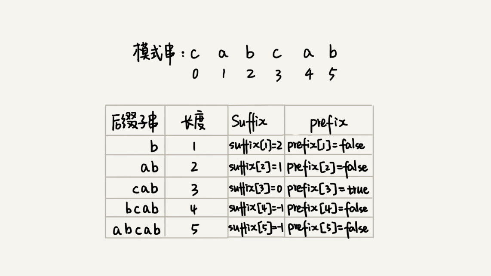
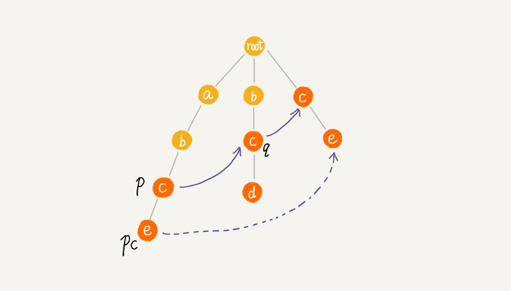

[toc]

&emsp;首先对于字符串匹配问题，定义主串和模式串；根据主串匹配模式串的数目分为单模式匹配和多模式匹配。

## 单模式串匹配

### BF（Brute Force）暴力匹配算法

&emsp;假设主串长度为$n$，模式串长度为$m$，本质思想是在主串起始位置$0,1,\dots,n -m$的$m$个子串是否和模式串匹配。BF算法的时间复杂度是$O(NM)$，但在实际的开发中，却是比较常用的字符串匹配算法。因为大部分情况下模式串和主串的长度都不会太长。


* $\bigstar$中等[#5 Longest Palindromic Substring](./#5 Longest Palindromic Substring.md)    回文的中心字符扩展匹配（最优曼彻斯特）
* 简单[#14 Longest Common Prefix](./#14 Longest Common Prefix.md)    字符串遍历匹配
* 简单[#58 Length of Last Word](./#58 Length of Last Word.md)    倒序遍历返回最后一个单词长度
* 困难[#214 Shortest Palindrome](./#214 Shortest Palindrome.md)    曼彻斯特算法应用
* 简单[#392 Is Subsequence](./#392 Is Subsequence.md)    字符串遍历匹配
* 繁杂[#408 Valid Word Abbreviation](./#408 Valid Word Abbreviation.md)    变形的字符串遍历匹配，[#320 Generalized Abbreviation](../算法设计基础/#320 Generalized Abbreviation.md)与[#411 Minimum Unique Word Abbreviation](../算法设计基础/#411 Minimum Unique Word Abbreviation.md)的相关主题
* 中等[#647 Palindromic Substrings](./#647 Palindromic Substrings.md)    曼彻斯特算法
* 繁杂[#722 Remove Comments](./#722 Remove Comments.md)    细节繁多，需理清

### RK（Rabin-Karp）算法

&emsp;通过哈希算法对主串中的$n - m + 1$个子串分别求哈希值，然后逐个与模式串的哈希值比较大小。如果某个子串的哈希值与模式串相等，在不考虑哈希冲突的情况下，说明对应的子串和模式串匹配。RK算法重点在于哈希算法的设计，以全部小写字母组成的字符串为例，把字母映射为数字，小写字母有26个，可以认为是26进制的数字，这样哈希算法就是这段字母表示的数字大小。这样设计的好处还有以$m$长度的窗口滑动时不需要重新遍历计算当前窗口的字母，当前窗口的哈希值与上一窗口有关联。这样总的时间复杂度就是$O(N)$。


### BM（Boyer-Moore）算法

&emsp;在某些极端情况下，BF算法性能会退化，而RK算法需要用到哈希算法，而设计一个可以应对各种类型字符的哈希算法并不简单。BM算法包含两部分，分别是坏字符规则（bad character rule）和好后缀规则（good suffix shift）。

* 坏字符规则

&emsp;BM算法的匹配顺序按照模式串下标从大到小的顺序倒着匹配，当发现某个字符没法匹配的时候，把这个没有匹配的字符叫作坏字符。然后使用坏字符在模式串中查找。


如果坏字符在模式串中存在，设坏字符对应的模式串中的字符下标记作$s_i$，坏字符在模式串中的下标记作$x_i$；如果坏字符在模式串中不存在，则$x_i$ 记作-1。这两种情况模式串往后移动的位数就等于$s_i - x_i$。需注意如果坏字符在模式串里多处出现，$x_i$选择最后面那个。

> 由于只需记录最后出现的位置，可以使用散列表记录模式串中每个字符出现的最后的位置，避免遍历搜索。

&emsp;利用坏字符规则，BM算法在最好情况下的时间复杂度是$O(n/m)$。比如主串是`aaabaaabaaabaaab`，模式串是`aaaa`。每次比对模式串都可以直接后移四位。单纯使用坏字符规则还不够，因为根据$s_i - x_i$计算出来的移动位数有可能是负数，BM算法还需要用到好后缀规则。

* 好后缀规则


&emsp;思路类似坏字符，将好后缀在模式串中查找，如果找到了另一个跟好后缀相匹配的子串，就将模式串滑动到这个子串与主串中好后缀对齐的位置。如果在模式串中找不到另一个等于好后缀的子串，需要根据情况判断：好后缀中的后缀子串与模式串开头的前缀子串没有重合，则可以直接移动到好后缀后面；如果有，则需要将前缀子串与后缀子串对齐。


当模式串和主串中的某个字符不匹配的时，可分别计算好后缀和坏字符往后滑动的位数，然后取两个数中最大的作为模式串往后滑动的位数。这种处理方法可以避免根据坏字符规则计算后移位数是负数的情况。

> 为了加快匹配后缀子串，可以引入数组`Suffix`，索引对应后缀子串的长度，数组值表示与好后缀的匹配的子串的起始索引。存在多个后缀子串匹配则选择索引较大（后缀长度较长的）的。其次还需引入`Prefix`数组来记录后缀子串是否匹配好后缀的后缀子串。
>
> 

```java
public int bm(String source, String pattern) {
        int n = source.length(), m = pattern.length();
        // 坏字符索引表
        int[] bc = initBc(pattern);
        // 好后缀索引表
        int[] suffix = new int[m];
        boolean[] prefix = new boolean[m];
        initGs(pattern, m, suffix, prefix);

        // 主串的匹配起始位置
        int sIdx = 0;
        // 从后往前匹配
        while (sIdx <= n - m) {
            // 主串匹配的尾部位置（对应的模式串索引为eIdx - sIdx）
            int eIdx = sIdx + m - 1;
            // 遍历查找坏字符
            while (eIdx >= sIdx && source.charAt(eIdx) == pattern.charAt(eIdx - sIdx)) {
                eIdx--;
            }
            // 匹配成功
            if (eIdx - sIdx < 0) return sIdx;
            // 根据坏字符计算后移量（可能是负数）
            int offset = Math.max(0, eIdx - sIdx - bc[source.charAt(eIdx) - 'a']);
            // 根据好后缀计算后移量（当等于eIdx - sIdx时，即最后一个字符不匹配，好后缀为0不存在）
            if (eIdx - sIdx < m - 1) {
                offset = Math.max(offset, offsetByGs(eIdx - sIdx, m, suffix, prefix));
            }

            sIdx += offset;
        }
        return -1;
    }

    // 初始化坏字符索引表
    private int[] initBc(String pattern) {
        // 假设全部由小写字母构成
        int[] bc = new int[26];
        Arrays.fill(bc, -1);
        int idx = 0;
        // 记录最后的位置
        for (char c : pattern.toCharArray()) {
            bc[c - 'a'] = idx++;
        }
        return bc;
    }
    // 初始化好后缀索引表
    private void initGs(String pattern, int m, int[] suffix, boolean[] prefix) {
        Arrays.fill(suffix, -1);
        // 初始化填充，寻找0～i与0～m-1的公共后缀（由于好后缀在长度相等的情况下只记录位置较后的，故从头遍历）
        for (int i = 0; i < m - 1; i++) {
            // j为0～i的尾部索引，k为公共后缀子串长度
            int j = i, k = 0;
            while (j >= 0 && pattern.charAt(j) == pattern.charAt(m - 1 - k)) {
                // 记录长度为k+1的好后缀起始索引
                suffix[++k] = j--;
            }
            // 公共后缀子串同时也是模式串前缀，标记为true
            if (j == -1) prefix[k] = true;
        }
    }
    // 计算好后缀偏移，bcIdx为坏字符在模式串中的索引
    private int offsetByGs(int bcIdx, int m, int[] suffix, boolean[] prefix) {
        // 好后缀长度
        int k = m - 1 - bcIdx;
        // 存在公共后缀，需对齐，此时好后缀起始为j+1，而公共后缀起始为suffix[k]，需要将这两个位置对齐
        // 移动距离为j+1-suffix[k]
        if (suffix[k] != -1) return bcIdx + 1 - suffix[k];
        // 不存在公共后缀，检索是否存在重叠
        // 如模式串cabcab，公共后缀为bcab，此时suffix为-1，需要遍历检查长度小于4的prefix，此处长度为3时为true，表示将cab对齐
        // 好后缀j+1～m-1不存在公共后缀，从j+2开始检查j+2～m-1是否是模式串起始段
        for (int r = bcIdx + 2; r < m; i++) {
            // 表示r～m-1后缀子串是模式串前缀，移动对齐，即0需要对齐到r，距离为r-0
            if (prefix[m - r]) return r;
        }
        // 整体后移
        return m;
    }
```


### KMP（Knuth Morris Pratt）算法

&emsp;首先类似BM算法定义好前缀，把好前缀的所有后缀子串中，最长的可匹配前缀子串的后缀子串，叫作最长可匹配后缀子串；对应的前缀子串，叫作最长可匹配前缀子串。


求解好前缀只需通过模式串本身。类似BM算法中的`bc`、`suffix`、`prefix`数组，KMP算法也可以提前构建一个数组，用来存储模式串中每个前缀的最长可匹配前缀子串的结尾字符下标。把这个数组定义为`next`数组，也叫失效函数（failure function）。数组的下标是候选前缀在模式串中结尾字符下标，数组的值是这个候选前缀作为字符串的最长可以匹配前缀子串的结尾字符下标。如图，模式串`ababacd`的候选前缀`abab`结尾字符在模式串索引为3，而该字符串`ab`是最长后缀子串匹配的最长前缀子串，最长前缀子串为第一个`ab`，结尾索引为1。


`next`数组的计算非常巧妙，如果 `next[i-1] = k-1`，也就是说子串`b[0, k-1]`是`b[0, i-1]`的最长可匹配前缀子串。如果子串`b[0, k-1]`的下一个字符`b[k]`与`b[0, i-1]`的下一个字符`b[i]`匹配，那子串`b[0, k]`就是`b[0, i]`的最长可匹配前缀子串。但是如果`b[0, k-1]`的下一字符`b[k]`跟`b[0, i-1]`的下一个字符`b[i]`不相等时就不能简单地通过`next[i-1]`得到`next[i]`。


假设`b[0, i]`的最长可匹配后缀子串是`b[r, i]`。如果把最后一个字符去掉，`b[r, i-1]`肯定是`b[0, i-1]`的可匹配后缀子串，但不一定是最长可匹配后缀子串。所以既然`b[0, i-1]`最长可匹配后缀子串对应的模式串的前缀子串的下一个字符并不等于b[i]，那么就可以考察`b[0, i-1]`的次长可匹配后缀子串`b[x, i-1]`对应的可匹配前缀子串`b[0, i-1-x]`的下一个字符`b[i-x]`是否等于`b[i]`。如果等于`b[x, i]`就是`b[0, i]`的最长可匹配后缀子串，问题转化为查找`b[0, i-1]`的次长可匹配后缀子串。而注意到最长匹配前缀必然包含次长匹配后缀，是最长匹配前缀的最长匹配前缀。


这样问题就转化为考察$0 \sim i - 1$字符串的最长匹配前缀子串，不满足要求这考察该子串的最长匹配字符串，以此类推直到找到或未找到。

```java
    public int kmp(String source, String pattern) {
        int n = source.length(), m = pattern.length();
        // 初始化next数组
        int[] next = new int[m];
        initNext(next, m, pattern);

        // 从头遍历，i为主串索引，j为模式串索引
        int j = 0;
        for (int i = 0; i < n; i++) {
            // 当前字符不相等，则通过好前缀持续查找，直到遇到相等的或查不到
            while (j > 0 && source.charAt(i) != pattern.charAt(j)) {
                // 将j定位到0～j-1的最长匹配前缀子串的后一位继续比较
                j = next[j - 1] + 1;
            }
            // 成功则比较下一位
            if (source.charAt(i) == pattern.charAt(j)) j++;
            // 匹配完成，此时i为结束索引，减去长度得到起始索引
            if (j == m) return i - m + 1;
        }
        return -1;
    }

    private void initNext(int[] next, int m, String pattern) {
        // 首字符不存在最长匹配前缀字符
        next[0] = -1;
        // 假设当前序列为0～i，k表示0～i-1序列的最长匹配前缀结束索引
        int k = -1;
        for (int i = 1; i < m; i++) {
            // 前一序列的最长匹配前缀构不成当前序列的最长匹配前缀，则查找次长……直到找到满足的前缀或查找不到
            while (k != - 1 && pattern.charAt(k + 1) != pattern.charAt(i)) {
                // 关键步骤，动态规划查找比当前序列次小的最长匹配前缀
                k = next[k];
            }
            // 表示最终找到0～k的序列是0～i-1序列的匹配前缀子串（不一定是最长），然后的字符与当前字符一致，可以组成更长的匹配子串
            // 可证明是当前0～i的最长匹配前缀，更新前缀结尾索引
            if (pattern.charAt(k + 1) == pattern.charAt(i)) k++;
            // 如果没找到匹配的，此处为-1
            next[i] = k;
        }
    }
```

> KMP算法的时间复杂度是$O(m + n)$。

* $\bigstar$简单[#28 Implement strStr()](./#28 Implement strStr().md)    字符串匹配BF、RK、BM、KMP算法实现

## 多模式串匹配

### Trie树

&emsp;字典树是一种专门处理字符串匹配的数据结构，用来解决在一组字符串集合中快速查找某个字符串的问题。Trie树本质是利用字符串之间的公共前缀，将重复的前缀合并在一起。其中根节点不包含任何信息；每个节点表示一个字符串中的字符，从根节点到某个标识节点的路径表示一个字符串。字典树的本质是多叉树，对于只有26个小写字母单词的情况，数据结构可以简化为：

```java
class TrieNode {
    // 是否是单词结尾字符，标识结点
    boolean isEnding;
    // 长度26的数组，每个索引对应一个字符，没有该字符则为null
    TrieNode[] children;
}
```

基本的插入查找都是树的常规操作，构建时间复杂度为$O(N)$，$N$为字符串总长；查询时间复杂度为$O(K)$，$K$为查询字符串长度。

> Trie树如果遇到字符集太大、前缀重合不多的情况，空间消耗比较大。可以将子节点的数组结构替换为其它数据结构优化。在工程中，精确匹配查找更倾向于用散列表或者红黑树。Trie树比较适合的是查找前缀匹配的字符串。

* $\clubs$中等[#208 Implement Trie (Prefix Tree)](./#208 Implement Trie (Prefix Tree).md)    字典树简单原理的实现
* 中等[#211 Add and Search Word - Data structure design](./#211 Add and Search Word - Data structure design.md)    字典树与前序遍历的结合
* $\bigstar$困难[#212 Word Search II](./#212 Word Search II.md)    字典树与矩形深度优先搜索的结合
* $\clubs$中等[#421 Maximum XOR of Two Numbers in an Array](./#421 Maximum XOR of Two Numbers in an Array.md)    借鉴字典树前缀匹配寻找最大异或值
* $\bigstar$繁杂[#642 Design Search Autocomplete System](./#642 Design Search Autocomplete System.md)    将句子看做单词转化为字典树前缀匹配
* 中等[#676 Implement Magic Dictionary](./#676 Implement Magic Dictionary.md)    字典树检索遍历
* $\bigstar$中等[#745 Prefix and Suffix Search](./#745 Prefix and Suffix Search.md)    将后缀和单词组合为新的字符串

### AC自动机（Aho-Corasick）

&emsp;AC自动机的构建，包含两个操作：将多个模式串构建成Trie树；在Trie树上构建失败指针（相当于KMP中的失效函数next数组）。譬如紫色结点的失败指针指向其它模式串的最长可匹配前缀字符串的最后一个字符。失败指针的构建过程，是一个按层遍历树的过程。


&emsp;同KMP算法，假设节点`p`的失败指针指向节点`q`，如果`p`的子节点`pc`对应的字符与`q`的一个子节点`qc`相等，则将节点`pc`的失败指针指向节点`qc`。


如果节点`q`中没有子节点的字符等于节点`pc`包含的字符，则在`q`的失败指针结点中继续查找，直到`q`是`root`为止，如果还没有找到相同字符的子节点，就让节点`pc`的失败指针指向`root`。这个过程类似KMP的next数组过程，只是在树中是按层构建。




&emsp;主串匹配，若当前匹配不到主串字符，则通过失败指针遍历查找，直到匹配到；匹配到后需要遍历失败指针判断结尾字符，将匹配到的词语放入链表。

```java
class AC {
    ACNode root;

    // 构建AC树
    AC(String[] patterns) {
        this.root = new ACNode(' ');
        for (String pattern : patterns) {
            ACNode temp = root;
            for (char c : pattern.toCharArray()) {
                if (temp.children[c - 'a'] == null) temp.children[c - 'a'] = new ACNode(c);

                temp = temp.children[c - 'a'];
            }
            temp.isEnding = true;
            temp.length = pattern.length();
        }
        // 构建失败指针
        buildFailPointer();
    }

    private void buildFailPointer() {
        Queue<ACNode> queue = new LinkedList<>();
        queue.add(root);

        while (!queue.isEmpty()) {
            ACNode p = queue.poll();
            for (int i = 0; i < 26; i++) {
                ACNode pc = p.children[i];
                if (pc == null) continue;

                // 首字符没有最长前缀匹配串，统一指向根节点
                if (p == this.root) pc.fail = root;
                // 匹配最长前缀
                else {
                    ACNode q = p.fail;
                    // 遍历找到qc
                    while (q != null && q.children[pc.c - 'a'] == null) {
                        q = q.fail;
                    }
                    // 未找到
                    if (q == null) pc.fail = root;
                    // 找到，则设置pc的失败指针为qc
                    else pc.fail = q.children[pc.c - 'a'];
                }
                // 加入队列，处理下一层结点
                queue.add(pc);
            }
        }
    }

    public List<String> match(String source) {
        List<String> res = new LinkedList<>();
        char[] str = source.toCharArray();
        int n = str.length;

        ACNode p = root;
        for (int i = 0; i < n; i++) {
            int idx = str[i] - 'a';
            // 当前模式串子字符不匹配主串，则通过失败指针寻找最长匹配前缀继续比较
            while (p.children[idx] == null && p != root) {
                p = p.fail;
            }
            // 迭代
            p = p.children[idx];
            // 未找到匹配当前字符的模式串，则重新定位到根结点，下一轮继续比较
            if (p == null) p = root;
            // 通过失败指针遍历所有字符串，将结尾的字符串（即匹配成功）放入链表
            ACNode temp = p;
            while (temp != root) {
                if (temp.isEnding) {
                    res.add(source.substring(i - temp.length + 1, i + 1));
                }
                // 迭代
                temp = temp.fail;
            }
        }
        return res;
    }
}

class ACNode {
    // 字符
    char c;
    // 结尾字符标识
    boolean isEnding = false;
    // 字符串长度（结尾字符属性）
    int length = -1;

    ACNode[] children = new ACNode[26];
    // 失败指针
    ACNode fail;

    ACNode(char c) {
        this.c = c;
    }
}
```

&emsp;AC自动机构建的粗略时间复杂度为$O(L)$，匹配时间复杂度为$O(N)$。

* $\bigstar$困难[#1032 Stream of Characters](./#1032 Stream of Characters.md)    AC自动机对字符流判断

## 其它

* $\clubs$中等[#6 ZigZag Conversion](./#6 ZigZag Conversion.md)    Z字型周期规律遍历
* 中等[#8 String to Integer (atoi)](./#8 String to Integer (atoi).md)    字符串数字转整数
* 简单[#38 Count and Say](./#38 Count and Say.md)    字符串递归计数
* 简单[#67 Add Binary](./#67 Add Binary.md)    字符串遍历求和
* 困难[#68 Text Justification](./#68 Text Justification.md)    文本左右对齐
* 简单[#125 Valid Palindrome](./#125 Valid Palindrome.md)    双指针遍历比较字符串
* 中等[#151 Reverse Words in a String](./#151 Reverse Words in a String.md)    翻转并格式化单词
* 中等[#165 Compare Version Numbers](./#165 Compare Version Numbers.md)    划分版本号区间，根据区间数字比较
* 简单[#186 Reverse Words in a String II](./#186 Reverse Words in a String II.md)    翻转单词
* $\clubs$中等[#273 Integer to English Words](./#273 Integer to English Words.md)    数字单位的周期分切
* 简单[#344 Reverse String](./#344 Reverse String.md)    交换字符位置
* $\clubs$中等[#438 Find All Anagrams in a String](./#438 Find All Anagrams in a String.md)    计数字符出现次数，队列出队入队
* 中等[#443 String Compression](./#443 String Compression.md)    压缩字符串
* $\clubs$技巧[#466 Count The Repetitions](./#466 Count The Repetitions.md)    循环节规律，周期化字符串
* 繁杂[#468 Validate IP Address](./#468 Validate IP Address.md)    繁琐规律验证
* 中等[#557 Reverse Words in a String III](./#557 Reverse Words in a String III.md)    翻转句子中的单词
* 中等[#567 Permutation in String](./#567 Permutation in String.md)    [#438 Find All Anagrams in a String](./#438 Find All Anagrams in a String.md)的简化