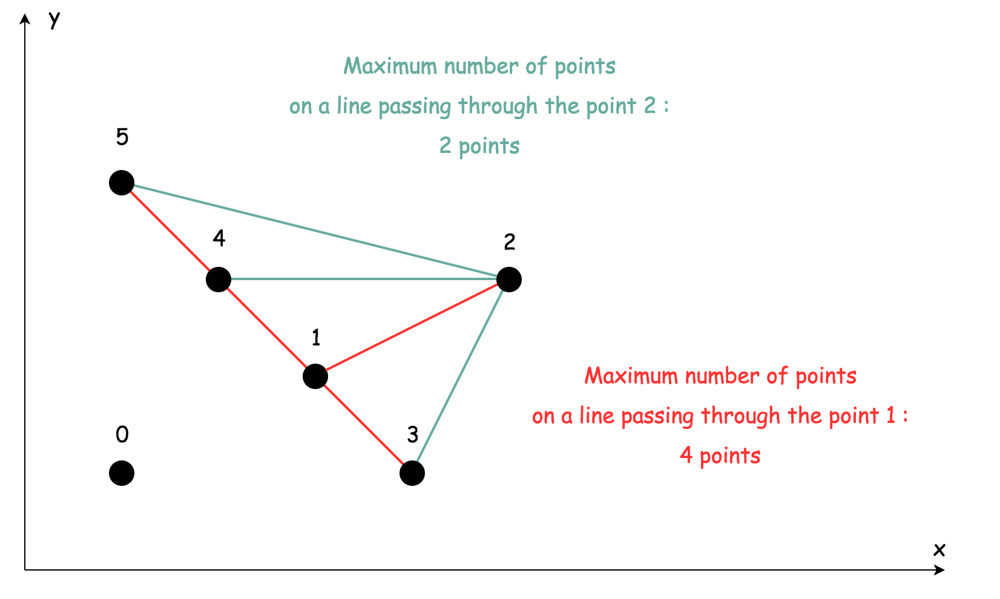

[toc]

Given $n$ points on a 2D plane, find the maximum number of points that lie on the same straight line.


## 题目解读

&emsp;给定二维平面数组，计算最多有多少个点在同一条直线上。

```java
class Solution {
    public int maxPoints(int[][] points) {

    }
}
```

## 程序设计

* 首先最容易想到的是一条直线由斜率和偏差构成，可以将问题转化为根据斜率和偏差的分类问题。遍历数组，计算当前结点和之前结点的斜率和偏差，并更新集合。最后一条直线上的结点数就是集合的尺寸。
* 但是该方法不通过，由于涉及浮点数操作，导致斜率的精度无法保证。如`[[0,0],[94911151,94911150],[94911152,94911151]]`，明显斜率是不同的，但计算出的斜率一致，导致无法通过。

```java
class Solution {
    public int maxPoints(int[][] points) {
        if(points == null || points.length == 0) {
            return 0;
        }
        Map<String, Set<Integer>> group = new HashMap<>();
        int max = 1;
        // 记录斜率和偏差系数
        double a, b;
        for(int i = 1; i < points.length; i++) {
            int[] cur = points[i];
            // 每个点都在其竖线上
            String key = "#" + cur[0];
            if(group.get(key) == null ) {
                group.put(key, new HashSet<>());
            }
            group.get(key).add(i);
            for(int j = 0; j < i; j++) {
                // 当前点在结点i的竖线上
                key = "#" + cur[0];
                // 不是竖线，则计算斜率和偏差
                if(cur[0] - points[j][0] != 0) {
                    a = ((double)cur[1] - points[j][1]) / (cur[0] - points[j][0]);
                    b = ((double)cur[1] * points[j][0] - points[j][1] * cur[0]) / (cur[0] - points[j][0]);
                    // 注意double类型存在两个0，-0.0和0.0，此处需判断
                    key = "#" + a + "#" + (b == 0 ? 0 : b);
                }
                if(group.get(key) == null ) {
                    group.put(key, new HashSet<>());
                }
                // 加入线段的两点
                group.get(key).add(i);
                group.get(key).add(j);
                max = Math.max(max, group.get(key).size());
            }
        }
        return max;
    }
}
```

* 为了优化这个问题，不再使用除法，采用分数的表达形式，通过函数将分子分母约分，最后得到统一的形式。

```java
class Solution {
    public int maxPoints(int[][] points) {
        if(points == null || points.length == 0) {
            return 0;
        }
        Map<String, Set<Integer>> group = new HashMap<>();
        int max = 1;
        // 记录斜率和偏差系数
        String a, b;
        for(int i = 1; i < points.length; i++) {
            int[] cur = points[i];
            // 每个点都在其竖线上
            String key = "#" + cur[0];
            if(group.get(key) == null ) {
                group.put(key, new HashSet<>());
            }
            group.get(key).add(i);
            for(int j = 0; j < i; j++) {
                // 当前点在结点i的竖线上
                key = "#" + cur[0];
                // 不是竖线，则计算斜率和偏差
                if(cur[0] - points[j][0] != 0) {
                    a = getFracString(cur[1] - points[j][1], cur[0] - points[j][0]);
                    b = getFracString(cur[1] * points[j][0] - points[j][1] * cur[0], cur[0] - points[j][0]);
                    key = "#" + a + "#" + b;
                }
                if(group.get(key) == null ) {
                    group.put(key, new HashSet<>());
                }
                // 加入线段的两点
                group.get(key).add(i);
                group.get(key).add(j);
                max = Math.max(max, group.get(key).size());
            }
        }
        return max;
    }

    // 获取分子形式字符串，分子分母约分
    private String getFracString(int a, int b) {
        // 分子为0
        if(a == 0) {
            return "0.0";
        }
        // 保证分子为正数
        b = a < 0 ? -b : b;
        a = a < 0 ? -a : a;
        // 若能被5\3\2约分，就分子分母同时约分
        while(a / 5 * 5 == a && b / 5 * 5 == b) {
        	a /= 5;
            b /= 5;
        }
       	while(a / 3 * 3 == a && b / 3 * 3 == b) {
        	a /= 3;
            b /= 3;
        }
		while(a / 2 * 2 == a && b / 2 * 2 == b) {
			a /= 2;
            b /= 2;
        }
        return a + "." + b;
    }
}
```

## 性能分析

&emsp;时间复杂度为$O(N^2)$，空间复杂度为$O(N^2)$。

执行用时：62ms，在所有java提交中击败了12.12%的用户。

内存消耗：43.7MB，在所有java提交中击败了5.13%的用户。

## 官方解题

&emsp;考虑到上述思路，对于`[[0,0],[94911151,94911150],[94911152,94911151]]`，如果全局计算斜率和偏差并记录，则索引`(0,1)`，`(0,2)`组成的线段计算后斜率相同，显然错误会发生。如果只记录当前结点和之前点的线段，而不是全局记录则不会发生这个错误。但是一只记录当前结点及其之前的结点的线段怎么能保证是全局最优解？当前结点组成的最长线段若后续还有结点在这条线上，则会继续更新；如果不经过这条线段，则本次计算的就是最终这条线段上的结点数。这样每次计算完，只需取最大值即可。其次需要注意相同结点的计数。



```java
class Solution {
    public int maxPoints(int[][] points) {
        if(points == null || points.length == 0) {
            return 0;
        }
        // 至少存在一条线段
        int max = 1;
        Map<Double, Integer> record;
        for(int i = 1; i < points.length; i++) {
           record = new HashMap<>();
           // 记录当前结点与前面结点组成的线段最大结点数
           int curMax = 0;
            // 记录前面与当前结点相同的结点
           int same = 0;
           for(int j = 0; j < i; j++) {
               int dx = points[i][0] - points[j][0];
               int dy = points[i][1] - points[j][1];
               // 相同点，记录并继续迭代
               if(dx == 0 && dy == 0) {
                   same++;
                   continue;
               }
               // 不相同点，计算斜率并更新线段数目
               double slope = dx == 0 ? Integer.MAX_VALUE : (double)dy / dx;
               int count = record.getOrDefault(slope, 0);
               record.put(slope, ++count);
               if(count > curMax) {
                   curMax = count;
               }
           }
           // 当前点结点最多的线段上结点数目为其它点、相同点、当前点之和
           max = Math.max(max, curMax + same + 1);
        }
        return max;
    }
}
```

&emsp;时间复杂度为$O(N^2)$，空间复杂度为$O(N)$。

执行用时：17ms，在所有就java提交中击败了72.95%的用户。

内存消耗：40.6MB，在所有java提交中击败了5.70%的用户。