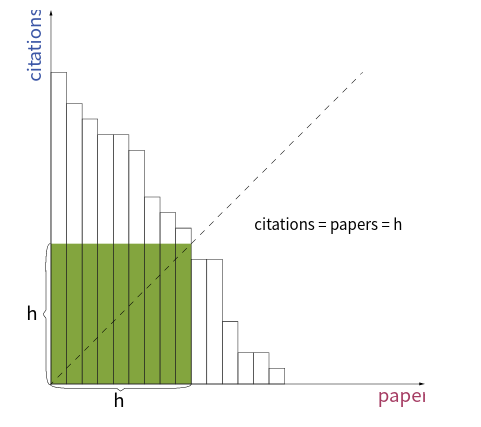

[toc]

Given an array of citations (each citation is a non-negative integer) of a researcher, write a function to compute the researcher's h-index.

According to the definition of h-index on Wikipedia: "A scientist has index h if h of his/her N papers have **at least** h citations each, and the other N − h papers have no more than h citations each."

Note: If there are several possible values for h, the maximum one is taken as the h-index.


## 题目解读

&emsp;计算h指数。

```java
class Solution {
    public int hIndex(int[] citations) {
        
    }
}
```

## 程序设计

* 首先可以排序后采用二分查找的方式得出。



```java
class Solution {
    public int hIndex(int[] citations) {
        if(citations == null || citations.length == 0) {
            return 0;
        }
        Arrays.sort(citations);
        int left = 0, right = citations.length;
        while(left < right) {
            int mid = left + (right - left) / 2;
            if(citations[mid] >= citations.length - mid) {
                right = mid;
            } else {
                left = mid + 1;
            }
        }
        return left == citations.length ? 0 : citations.length - left;
    }
}
```

## 性能分析

&emsp;二分查找时间复杂度为$O(N\log_2N)$，空间复杂度为$O(1)$。

执行用时：1ms，在所有java提交中击败了89.28%的用户。

内存消耗：37.6MB，在所有java提交中击败了5.17%的用户。

## 官方解题

&emsp;除了排序思路，官方通过数组映射论文引用和计数，然后遍历数组判断。

```java
class Solution {
    public int hIndex(int[] citations) {
        if(citations == null || citations.length == 0) {
            return 0;
        }
        // 论文引用数和计数映射关系（引用数大于n则记作n）
        int[] max = new int[citations.length + 1];
        for(int c : citations) {
            // 引用超过n则只记录n
            max[Math.min(c, citations.length)]++;
        }
        // 从后往前遍历，找到引用数等于累计计数的索引
        int idx = citations.length;
        // 累计计数
        int count = max[idx];
        while(idx > 0 && idx > count) {
            idx--;
            count += max[idx];
        }
        return idx;
    }
}
```

&emsp;时间复杂度为$O(N)$，空间复杂度为$O(N)$。

执行用时：0ms，在所有java提交中击败了100.00%的用户。

内存消耗：37.8MB，在所有java提交中击败了5.17%的用户。