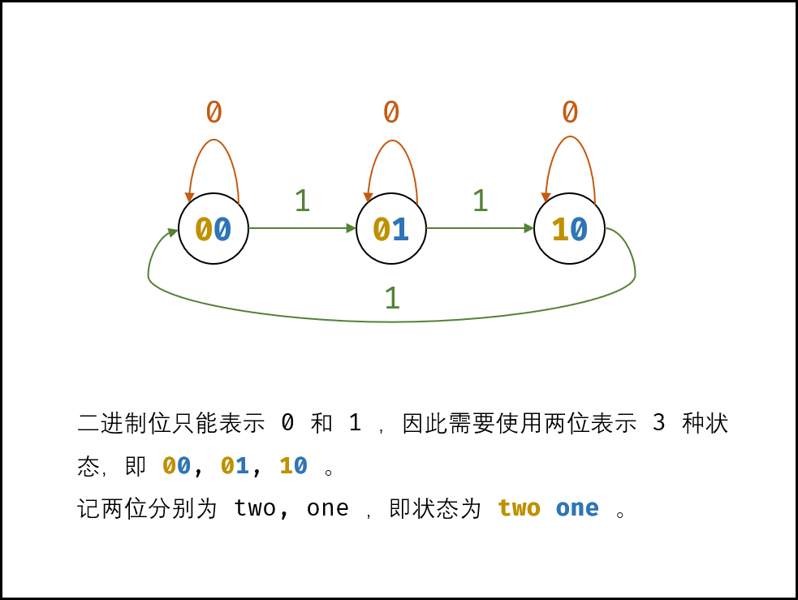

[toc]

Given a **non-empty** array of integers, every element appears three times except for one, which appears exactly once. Find that single one.

Note:

Your algorithm should have a linear runtime complexity. Could you implement it without using extra memory?


## 题目解读

&emsp;给定数组，只有一个数字是单个的，其它数字都存在三个。找到这个数字。

```java
class Solution {
    public int singleNumber(int[] nums) {

    }
}	
```

## 程序设计

* 比较数字的二进制位并统计，如果当前位不能被3整除，说明单独的数字当前位是该数值。


```java
class Solution {
    public int singleNumber(int[] nums) {
        long mask = 1;
        int res = 0, count = 0, epoch = 0;

        // 掩码操作统计32位
        while (epoch < 32) {
            for (int num : nums) {
                if ((num & mask) == mask) count++;
            }
            // 说明此位为1，拼接到答案
            if (count % 3 == 1) res |= mask;
            // 迭代
            mask <<= 1;
            epoch++;
            // 重置计数
            count = 0;
        }
        return res;
    }
}
```

## 性能分析

&emsp;时间复杂度为$O(N)$，空间复杂度为$O(1)$。

执行用时：4ms，在所有java提交中击败了47.15%的用户。

内存消耗：39.6MB，在所有java提交中击败了14.29%的用户。

## 官方解题

&emsp;官方更巧妙的采用位操作解决。上述统计每个位然后取余的操作可使用如下有限状态机来表示，`00`表示取余后为`0`，`01`、`02`表示取余后为`1`、`2`；将状态的两位使用`one`、`two`表示，则可得到：



当新数字当前位为`0`时，两个状态位不变；当新数字当前位为`1`时，若`one`为`0`，`two`为`0`，则变为`1`，`two`为`1`则变为`0`，若`one`为`1`则变为`0`；可将计算`one`的方式归纳为`one=~two & (one ^ n)`，此处用到了亦或`1`相当于取反，亦或`0`当与与本身；再来看`two`，以新计算的`one`为基准，当新数字当前位为`1`时，新的`one`为`1`，则`two`为`0`；新的`one`为`0`，若`two`为`1`则变为`0`，为`0`则变为`1`；归纳得`two=~one & (two ^ n)`。上述单位的计算可以推广到`32`位数。

```java
class Solution {
    public int singleNumber(int[] nums) {
        int one = 0, two = 0;
        for (int num : nums) {
            one = ~two & (one ^ num);
            two = ~one & (two ^ num);
        }
        return one;
    }
}
```

&emsp;时间复杂度为$O(N)$，空间复杂度为$O(1)$。

执行用时：0ms，在所有java提交中击败了100.00%的用户。

内存消耗：39.8MB，在所有java提交中击败了14.29%的用户。