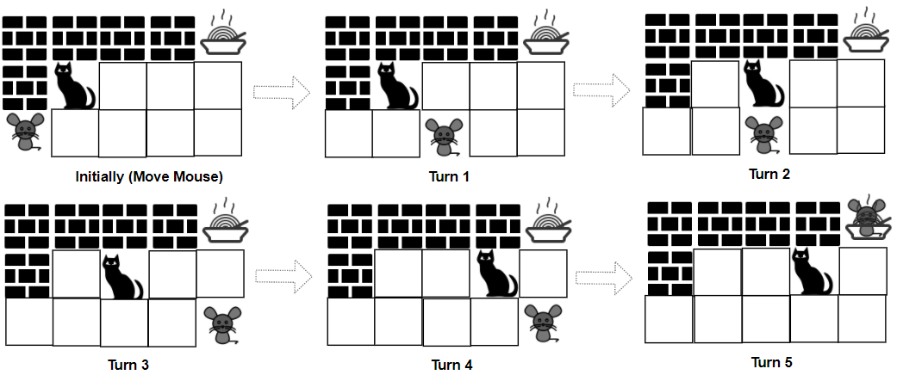

[toc]

A game is played by a cat and a mouse named Cat and Mouse.

The environment is represented by a `grid` of size $rows \times cols$, where each element is a wall, floor, player (Cat, Mouse), or food.

* Players are represented by the characters `'C'`(Cat),`'M'`(Mouse).
* Floors are represented by the character `'.'` and can be walked on.
* Walls are represented by the character `'#'` and cannot be walked on.
* Food is represented by the character `'F'` and can be walked on.
* There is only one of each character `'C'`, `'M'`, and `'F'` in `grid`.

Mouse and Cat play according to the following rules:

* Mouse **moves first**, then they take turns to move.
* During each turn, Cat and Mouse can jump in one of the four directions (left, right, up, down). They cannot jump over the wall nor outside of the `grid`.
* `catJump`, `mouseJump` are the maximum lengths Cat and Mouse can jump at a time, respectively. Cat and Mouse can jump less than the maximum length.
* Staying in the same position is allowed.
* Mouse can jump over Cat.

The game can end in $4$ ways:

* If Cat occupies the same position as Mouse, Cat wins.
* If Cat reaches the food first, Cat wins.
* If Mouse reaches the food first, Mouse wins.
* If Mouse cannot get to the food within $1000$ turns, Cat wins.

Given a $rows \times cols$ matrix `grid` and two integers `catJump` and `mouseJump`, return `true` if Mouse can win the game if both Cat and Mouse play optimally, otherwise return `false`.

 

**Example 1**:



```
Input: grid = ["####F","#C...","M...."], catJump = 1, mouseJump = 2
Output: true
Explanation: Cat cannot catch Mouse on its turn nor can it get the food before Mouse.
```

**Example 2**:


```
Input: grid = ["M.C...F"], catJump = 1, mouseJump = 4
Output: true
```

**Example 3**:

```
Input: grid = ["M.C...F"], catJump = 1, mouseJump = 3
Output: false
```

**Example 4**:

```
Input: grid = ["C...#","...#F","....#","M...."], catJump = 2, mouseJump = 5
Output: false
```

**Example 5**:

```
Input: grid = [".M...","..#..","#..#.","C#.#.","...#F"], catJump = 3, mouseJump = 1
Output: true
```


**Constraints**:

* $rows == \text{grid.length}$
* $cols = \text{grid[i].length}$
* $1 \le rows, cols \le 8$
* `grid[i][j]` consist only of characters `'C'`, `'M'`, `'F'`, `'.'`, and `'#'`.
* There is only one of each character `'C'`, `'M'`, and `'F'` in `grid`.
* $1 \le \text{catJump}, \text{mouseJump} \le 8$


## 题目解读

&emsp;给定矩形，格子表示墙、猫、老鼠、食物，判断老鼠是否必胜。

```java
class Solution {
    public boolean canMouseWin(String[] grid, int catJump, int mouseJump) {

    }
}
```

## 程序设计

* 参考社区解法，不同于[#913 Cat and Mouse](./#913 Cat and Mouse.md)，首先猫和鼠可以跳跃而非一步步移动，其次猫鼠可以在本轮选择不移动；注意到上述不同，其他思路类似。

```java
class Solution {
    private final static int[] delta = new int[]{0, 1, 0, -1, 0};

    public boolean canMouseWin(String[] grid, int catJump, int mouseJump) {
        // 转换
        char[][] newGrid = transfer(grid);
        int m = newGrid.length, n = newGrid[0].length;
        // 五个纬度分别为鼠的坐标，猫的坐标，当前玩家；状态为1老鼠胜，2猫胜
        int[][][][][] status = new int[m][n][m][n][2];
        int[][][][][] degree = new int[m][n][m][n][2];
        // 猫、鼠、食物坐标
        int cx = -1, cy = -1, mx = -1, my = -1, fx = -1, fy = -1;

        // 预处理
        for (int i = 0; i < m; i++) {
            for (int j = 0; j < n; j++) {
                if (newGrid[i][j] == '#') continue;
                if (newGrid[i][j] == 'C') {
                    cx = i;
                    cy = j;
                } else if (newGrid[i][j] == 'M') {
                    mx = i;
                    my = j;
                } else if (newGrid[i][j] == 'F') {
                    fx = i;
                    fy = j;
                }

                for (int k = 0; k < m; k++) {
                    for (int l = 0; l < n; l++) {
                        if (newGrid[k][l] == '#') continue;
                        degree[i][j][k][l][0] = getArriveList(i, j, mouseJump, newGrid).size();
                        degree[i][j][k][l][1] = getArriveList(k, l, catJump, newGrid).size();
                    }
                }
            }
        }

        Queue<int[]> queue = new LinkedList<>();
        // 猫鼠同位置
        for (int i = 0; i < m; i++) {
            for (int j = 0; j < n; j++) {
                if (newGrid[i][j] == '#' || newGrid[i][j] == 'F') continue;
                status[i][j][i][j][0] = status[i][j][i][j][1] = 2;
                queue.add(new int[]{i, j, i, j, 0, 2});
                queue.add(new int[]{i, j, i, j, 1, 2});
            }
        }
        // 猫或鼠到达食物
        for (int i = 0; i < m; i++) {
            for (int j = 0; j < n; j++) {
                if (newGrid[i][j] == '#' || newGrid[i][j] == 'F') continue;
                status[fx][fy][i][j][0] = status[fx][fy][i][j][1] = 1;
                status[i][j][fx][fy][0] = status[i][j][fx][fy][1] = 2;
                queue.add(new int[]{fx, fy, i, j, 0, 1});
                queue.add(new int[]{fx, fy, i, j, 1, 1});
                queue.add(new int[]{i, j, fx, fy, 0, 2});
                queue.add(new int[]{i, j, fx, fy, 1, 2});
            }
        }

        while (!queue.isEmpty()) {
            int[] cur = queue.poll();
            // 起始状态找到
            if (cur[0] == mx && cur[1] == my && cur[2] == cx && cur[3] == cy && cur[4] == 0) return status[mx][my][cx][cy][0] == 1;

            // 之前为老鼠，本轮为猫
            if (cur[4] == 0) {
                List<int[]> arrive = getArriveList(cur[2], cur[3], catJump, newGrid);
                for (int[] next : arrive) {
                    if (status[cur[0]][cur[1]][next[0]][next[1]][1] == 0) {
                        --degree[cur[0]][cur[1]][next[0]][next[1]][1];
                        // 后一状态为猫赢，当前状态必为猫赢
                        if (cur[5] == 2) {
                            status[cur[0]][cur[1]][next[0]][next[1]][1] = 2;
                            queue.add(new int[]{cur[0], cur[1], next[0], next[1], 1, 2});
                        }
                        // 所有后一状态为鼠赢，则当前状态为鼠赢
                        else if (degree[cur[0]][cur[1]][next[0]][next[1]][1] == 0) {
                            status[cur[0]][cur[1]][next[0]][next[1]][1] = 1;
                            queue.add(new int[]{cur[0], cur[1], next[0], next[1], 1, 1});
                        }
                    }
                }
            }
            // 之前为猫，本轮为老鼠
            else {
                List<int[]> arrive = getArriveList(cur[0], cur[1], mouseJump, newGrid);
                for (int[] next : arrive) {
                    if (status[next[0]][next[1]][cur[2]][cur[3]][0] == 0) {
                        --degree[next[0]][next[1]][cur[2]][cur[3]][0];
                        if (cur[5] == 1) {
                            status[next[0]][next[1]][cur[2]][cur[3]][0] = 1;
                            queue.add(new int[]{next[0], next[1], cur[2], cur[3], 0, 1});
                        }
                        else if (degree[next[0]][next[1]][cur[2]][cur[3]][0] == 0) {
                            status[next[0]][next[1]][cur[2]][cur[3]][0] = 2;
                            queue.add(new int[]{next[0], next[1], cur[2], cur[3], 0, 2});
                        }
                    }
                }
            }
        }
        return false;
    }

    private char[][] transfer(String[] grid) {
        char[][] newGrid = new char[grid.length][];
        for (int i = 0; i < grid.length; i++) {
            newGrid[i] = grid[i].toCharArray();
        }
        return newGrid;
    }

    // 获取当前可到达位置的数目
    private List<int[]> getArriveList(int x, int y, int jump, char[][] grid) {
        List<int[]> res = new LinkedList<>();
        // 重要，猫鼠可以选择不移动，故加入当前坐标
        res.add(new int[]{x, y});
        for (int i = 0; i < 4; i++) {
            for (int len = 1; len <= jump; len++) {
                int newX = x + len * delta[i], newY = y + len * delta[i + 1];
                // 出界或碰壁
                if (newX < 0 || newX >= grid.length || newY < 0 || newY >= grid[0].length || grid[newX][newY] == '#') break;
                res.add(new int[]{newX, newY});
            }
        }
        return res;
    }
}
```

## 性能分析

&emsp;时间复杂度为$O(M^2N^2(M + N))$，空间复杂度为$O(M^2N^2)$。

执行用时：57 ms, 在所有 Java 提交中击败了93.43%的用户。

内存消耗：39.2 MB, 在所有 Java 提交中击败了91.24%的用户。

## 官方解题

&emsp;暂无，密切关注。
