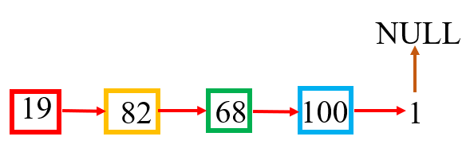

[toc]

Write an algorithm to determine if a number is "happy".

A happy number is a number defined by the following process: Starting with any positive integer, replace the number by the sum of the squares of its digits, and repeat the process until the number equals 1 (where it will stay), or it loops endlessly in a cycle which does not include 1. Those numbers for which this process ends in 1 are happy numbers.


## 题目解读

&emsp;判断一个数是不是快乐数。一个快乐数定义为：对于一个正整数，每一次将该数替换为它每个位置上的数字的平方和，然后重复这个过程直到这个数变为$1$，也可能是无限循环但始终变不到$1$。如果可以变为$1$，那么这个数就是快乐数。

```java
class Solution {
    public boolean isHappy(int n) {

    }
}
```

## 程序设计

* 采用递归思路，将当前值每一位数乘方相加，递归判断。需注意递归终止条件除了1还有7，需要手动推断，不推荐递归思路。

```java
class Solution {
    public boolean isHappy(int n) {
        // 递归终止条件
        if(n == 1 || n == 7) {
            return true;
        }
        // 不满足条件
        else if(n < 10) {
            return false;
        }
        
        int sum = 0;
        while(n > 0) {
            int cur = n % 10;
            sum += cur * cur;
            n /= 10;
        }
        // 递归
        return isHappy(sum);
    }
}
```

## 性能分析

执行用时：1ms，在所有java提交中击败了100.00%的用户。

内存消耗：36.7MB，在所有java提交中击败了5.05%的用户。

## 官方解题

&emsp;暂无，密切关注。社区性能较好方法使用快慢指针，将链表判断环的逻辑应用到该问题中。如果把链表的节点看成问题中的状态的话，可以代表问题中的一个数字、一个阶段等等，是很泛化的东西。而链表的唯一指向关系代表着状态与状态之间是唯一确定转换的。显然快乐数的转换规则完美的符合了这个特性，是一个泛化链表结构。



根据题目的意思就将`1`作为链表的结尾即`null`。如果不存在欢乐数就意味着链表有环，无法走到`1`。那么快乐数问题就被抽象为链表中是否有环的问题。

&emsp;考虑问题规模，如果输入值为int，最大为2147483647。而1999999999的平方和无疑是最大的，为$9 \times 9^2 + 1 = 730$。也就是说所有的整数平方和不超过730，意味着抽象的链表结构中节点数目最多不会超过730个，如果快指针一次走两步、慢指针一次走一步的话，那么慢指针走的最多，许多走1462步，快指针最多走731步。

```java
class Solution {
    public boolean isHappy(int n) {
        if(n <= 0) return false;
        
        int slow = n, fast = n;
        do {
            // 快慢指针
            slow = squareSum(slow);
            fast = squareSum(squareSum(fast));
        } while (slow != fast);
        // 存在环路，且环的交叉点不是1，表示不是欢乐数，是1表示是欢乐数
        return slow == 1;
    }

    private int squareSum(int n) {
        int sum = 0;
        while(n > 0) {
            int cur = n % 10;
            n /= 10;
            sum += cur * cur;
        }
        return sum;
    }
}
```

执行用时：1ms，在所有java提交中击败了100.00%的用户。

内存消耗：37MB，在所有java提交中击败了5.05%的用户。