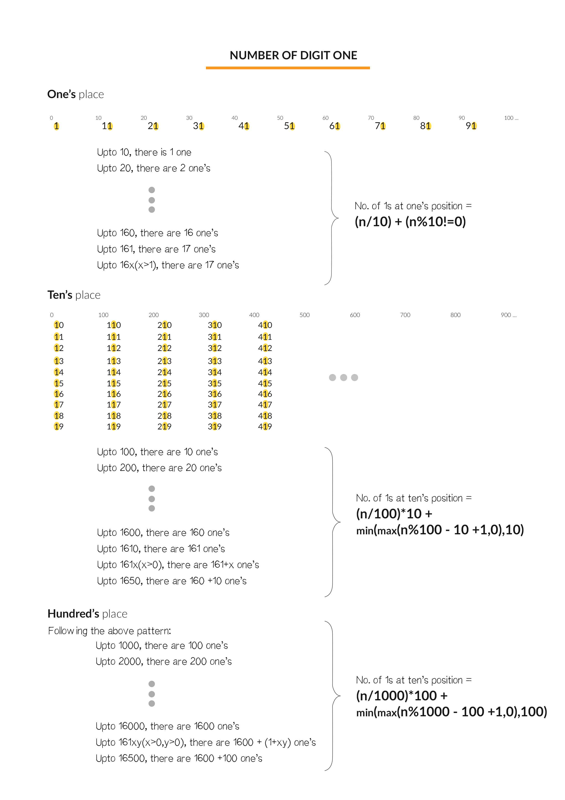

[toc]

Given an integer `n`, count the total number of digit 1 appearing in all non-negative integers less than or equal to `n`.


## 题目解读

&emsp;给定$n$，找到$0 \sim n$之间数字出现的$1$的数目。

```java
class Solution {
    public int countDigitOne(int n) {
        
    }
}
```

## 程序设计

* 仔细分析，以$12345$为例，首先考虑$5$位数字存在$1$的数目：
  * 最高位为$1$，则最高位存在$1$的数字有$10000 \sim 12345$，共$2346$个；
  * 最高位大于$1$，则最高位存在$1$的数字有$10000 \sim 19999$，共$10000$个；
  * 后四位，任意一位为$1$，除了最高位，其它位都有$10$个选择，假设最高位为$x$，则任意一位有$x * 10^{len - 2}$，总的数目为$x * (len - 1) * 10^{len - 2}$。以$12345$第$4$位为$1$为例，即$11\cdots$有$1000$个数字，加上其它两位总的数目为$1 * 4 * 10^3$。
  * 计算完当前位数的$1$的数目，除去最高位，递归计算下一位数的$1$的数目。
* 特殊情况如$10203$，中间位存在$0$，最高位为$1$的情况仍然不变，后四位由于存在$0$，似乎上述思路不满足条件。第四位为$1$时，是不可能存在$11\cdots$，但是存在$01\cdots$；针对高位后是$0$的情况，如果高位$x = 1$，实际转化为$09999$数字中存在$1$的数目，如果高位不是$1$，则转化为$(x - 1)9999$的数字中存在$1$的数目。此时每个位置仍然是$10$个选择，最高位$0 \sim x - 1$仍然是$x$个，即上面的式子在特殊情况通用。

```java
class Solution {
    public int countDigitOne(int n) {
        if (n < 1) return 0;
        if (n < 10) return 1;

        int digit = 1, len = 1;
        while (n / digit >= 10) {
            digit *= 10;
            len++;
        }
        int high = n / digit;
        int count = 0;
        // 最高位为1，则有100…0～n种数字
        if (high == 1) {
            count = n - digit + 1;
        } 
        // 最高位为其它值，则有100…0～199…9种数字
        else {
            count = digit;
        }
        // 除了最高位，其它位为1的情况
        count += high * (len - 1) * (int)Math.pow(10, len - 2);

        return count + countDigitOne(n - high * digit);
    }
}
```

## 性能分析

&emsp;时间复杂度为$O(\log_{10}N)$，空间复杂度为$O(1)$。

执行用时：0ms，在所有java提交中击败了100.00%的用户。

内存消耗：36.4MB，在所有java提交中击败了33.33%的用户。

## 官方解题

&emsp;官方思路从数学规律的角度出发。首先个位上的$1$每隔$10$次出现一次，可得规律$n / 10 + \mathbb{I}(n \% 10 \ne 0)$；十位上的$1$每隔$100$次连续出现$10$次，可得$n / 100 * 10 + \min(\max(n\%100 - 10 + 1, 0), 10)$；百位等依次类推。有了这一系列规律，可从个位开始累积计算$1$的出现次数。



```java
class Solution {
    public int countDigitOne(int n) {
        if (n < 0) return 0;

        // 注意数值溢出，使用long
        long res = 0;
        for (long digit = 1; digit <= n; digit *= 10) {
            long base = digit * 10;
            // 计算当前位1的数目
            res += n / base * digit + (int)Math.min(Math.max(n % base - digit + 1, 0), digit);
        }
        return (int)res;
    }
}
```

&emsp;时间复杂度为$O(\log_{10}N)$，空间复杂度为$O(1)$。

执行用时：0ms，在所有java提交中击败了100.00%的用户。

内存消耗：36.3MB，在所有java提交中击败了33.33%的用户。