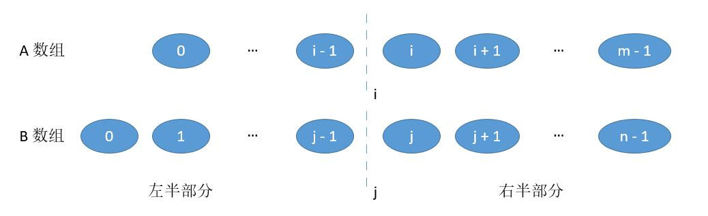
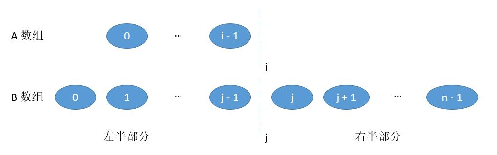

[toc]

There are two sorted arrays **nums1** and **nums2** of size m and n respectively.

Find the median of the two sorted arrays. The overall run time complexity should be O(log (m+n)).

You may assume **nums1** and **nums2** cannot be both empty.


## 题目解读

&emsp;给定两个有序数组，数组不能同时为空，需要求出这两个数组的中位数。对时间复杂度有要求。

```java
class Solution {
    public double findMedianSortedArrays(int[] nums1, int[] nums2) {
        
    }
}
```

## 程序设计

* 给定两个有序数组求解中位数，首先想到的是合并两个数组为一个有序数组，对于奇数长数组中位数就是中间值，对于偶数长数组中位数就是中间两个值的平均。但是这种方法时间复杂度为$O(N + M)$，不符合要求。
* 求中位数可以看做是求两个有序数组第$k$小的值的问题。首先比较两个数组$\frac{k}{2}$处的值，小的值所在的数组的前$\frac{k}{2}$绝对不是第$k$小的值；这样问题转化为在剩余数组查找第$\frac{k}{2}$小的值的问题；重复这个过程，直到问题是第$1$小的值的问题，判断哪个值小，哪个就是第$k$小的值。具体的，以$k = 7$为例：


对于长度不足$\frac{k}{2}$的情况：


比如$\frac{k}{2} = 3$，而上面的链表只有$2$，则比较长度为$2$的数组，上图比较完第二个元素值，直接在下面数组取第$5$个元素就是第$7$小元素。

* 对于奇数元素的中位数，就是第$\frac{N + M}{2}$小的值，对于偶数长的中位数，就是第$\frac{N + M}{2}$小值的问题最后第$1$小值判断的两个值的平均。

```java
class Solution {
    public double findMedianSortedArrays(int[] nums1, int[] nums2) {
        int n = nums1.length;
        int m = nums2.length;

        // 奇数时，center1、2都是同一中间索引；
        // 偶数时，center1、2分别为中间两个结点的索引。
        int center1 = (n + m +1) >> 1;
        int center2 = (n + m +2) >> 1;
        // 对应奇偶数情况
        if(center1 == center2) {
            return getKth(nums1, 0, n -1, nums2, 0, m - 1, center1);
        } else {
            // 乘0.5浮点数化
            return (getKth(nums1, 0, n -1, nums2, 0, m - 1, center1) + getKth(nums1, 0, n -1, nums2, 0, m - 1, center2)) * 0.5;
        }
    }

    private int getKth(int[] nums1, int start1, int end1, int[] nums2, int start2, int end2, int k) {
        int len1 = end1 - start1 + 1;
        int len2 = end2 - start2 + 1;
        if(len1 > len2) {
            return getKth(nums2, start2, end2, nums1, start1, end1, k);
        }
        // 其中一个为空，直接返回
        if(len1 == 0) {
            return nums2[start2 + k -1];
        }
        // 递归终止条件
        if(k ==1) {
            return nums1[start1] < nums2[start2] ? nums1[start1] : nums2[start2];
        }
        // 比较第k/2个，如果不满足长度，则比较长度个
        int index1 = (len1 < k/2 ? len1 : k/2) + start1 - 1;
        int index2 = (len2 < k/2 ? len2 : k/2) + start2 - 1;

        // 递归
        if(nums1[index1] < nums2[index2]) {
            return getKth(nums1, index1 + 1, end1, nums2, start2, end2, k - (index1 - start1 + 1));
        } else {
            return getKth(nums1, start1, end1, nums2, index2 + 1, end2, k - (index2 - start2 + 1));
        }
    }
}
```

测试样例：一个数组为空的情况；两个数组为偶数长的情况；两个数组为奇数长的情况；两个数组分别为奇、偶数长的情况；两个数组等长的情况。对于空间复杂度，由于递归是尾调用，堆栈不需要保存局部变量，空间复杂度为$O(1)$。

## 性能分析

&emsp;递归通过对$k/2$，直到$k = 1$，时间复杂度为$O(\log_2k)$，又$k = \frac{N + M}{2}$，故时间复杂度为$O(\log_2(N + M))$。

执行用时：3ms，在所有java提交中击败了98.37%的用户。

内存消耗：46.6MB，在所有java提交中击败了54.94%的用户。

## 官方解题

&emsp;中位数的意义在于划分集合为两半部分。把数组分别切分：



如果总长度为偶数，则左半部分等于右半部分：
$$
i + j = m - i + j - i\\
\implies j = \frac{m + n}{2} - i
$$
且左半部分的最大值小于等于右半部分的最小值。当总长度是奇数时，如果我们保证左半部分的长度比右半部分大1，则：
$$
i + j = m - i + n - j + 1\\
\implies j = \frac{m + n + 1}{2} - i
$$
上述条件可以合并为$j = \frac{m + n + 1}{2} - i$，因为偶数除以2仍然是整数。由于$0 \le j \le n$、$0 \le i \le m$，故$\frac{m + n + 1}{2} - i \ge 0 \implies m \le n$，即要保证$m \le n$。

&emsp;对于中位数左半部分的最大值小于等于右半部分的最小值，即$\max\{A[i-1],B[j-1]\} \le \min\{A[i],B[j]\}$。由于同一数组是有序的，只需保证$B[j-1] \le A[i]$和$A[i - 1] \le B[j]$。首先如果$B[j-1] > A[i]$时，$i$需要增大使得$B[j-1] \le A[i]$；由于初始化时，两半部分是相等的，$i$增加则$j$需要减少，根据公式$j = \frac{m + n + 1}{2} - i$可见$j$随$i$增大而减少。如果$A[i - 1] > B[j]$则$i$需要减少，$j$随着增大。考虑边界情况：



当$i = 0$时，左半部分最大值就是$B[j-1]$；当$j=0$时，左半部分最大值是$A[i-1]$。当$i = m$或$j = n$时，右边部分最小值分别是$B[j]$、$A[i]$。增加$i$的方式使用二分法。

```java
class Solution {
    public double findMedianSortedArrays(int[] nums1, int[] nums2) {
        int m = nums1.length;
        int n = nums2.length;
        // 保证m <= n
        if(m > n) {
            return findMedianSortedArrays(nums2, nums1);
        }
        int start1 = 0, end1 = m;
        int i, j;
        while(start1 <= end1) {
            i = (start1 + end1) / 2;
            j = (m + n + 1) / 2 - i;
            // A[i - 1] > B[j]，i需要减少
            if(i != 0 && j != n && nums1[i - 1] > nums2[j]) {
                end1 = i - 1;
            } 
            // B[j - 1] > A[i]，i需要增大
            else if(j != 0 && i != m && nums2[j - 1] > nums1[i]){
                start1 = i + 1;
            }
            // 达到要求
            else {
                int maxLeft;
                // 边界条件
                if(i == 0) {
                    maxLeft = nums2[j - 1];
                } else if(j == 0) {
                    maxLeft = nums1[i - 1];
                } 
                // 一般条件
                else {
                    maxLeft = nums1[i - 1] > nums2[j - 1] ? nums1[i - 1] : nums2[j - 1];
                }
                // 总长度为奇数，只需返回右边第一个
                if((m + n) % 2 == 1) {
                    return maxLeft;
                }
                // 总长度为偶数，返回均值
                int minRight;
                if(i == m) {
                    minRight = nums2[j];
                } else if(j == n) {
                    minRight = nums1[i];
                } else {
                    minRight = nums1[i] < nums2[j] ? nums1[i] : nums2[j];
                }
                return (maxLeft + minRight) * 0.5;
            }
        }
        // 基本不会走到这一步
        return 0.0;
    }
}
```

> 保证$m \le n$；奇数表长下保证右边比左边多一个结点；需要考虑边界条件。

&emsp;由于对较短的数组遍历，时间复杂度为$O(\log_2M)$，空间复杂度为$O(1)$。

执行用时：3ms，在所有java提交中击败了98.37%的用户。

内存消耗：46.8 MB，在所有java提交中击败了44.91%的用户。