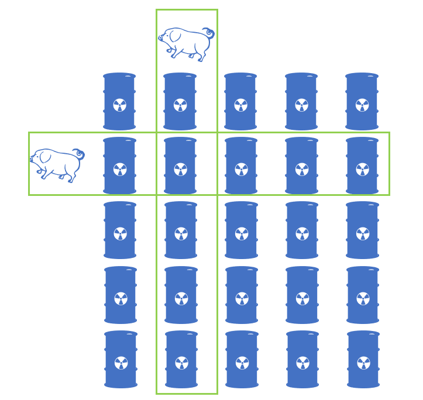

[toc]

There are `1000` buckets, one and only one of them is poisonous, while the rest are filled with water. They all look identical. If a pig drinks the poison it will die within `15` minutes. What is the minimum amount of pigs you need to figure out which bucket is poisonous within one hour?

Answer this question, and write an algorithm for the general case.

 

**General case**:

If there are $n$ buckets and a pig drinking poison will die within $m$ minutes, how many pigs (`x`) you need to figure out the **poisonous** bucket within $p$ minutes? There is exactly one bucket with poison.

 

**Note**:

* A pig can be allowed to drink simultaneously on as many buckets as one would like, and the feeding takes no time.
* After a pig has instantly finished drinking buckets, there has to be a **cool down time** of m minutes. During this time, only observation is allowed and no feedings at all.
* Any given bucket can be sampled an infinite number of times (by an unlimited number of pigs).


## 题目解读

&emsp;返回在规定时间内完成实验所需要的猪的数目。

```java
class Solution {
    public int poorPigs(int buckets, int minutesToDie, int minutesToTest) {

    }
}
```

## 程序设计

* 每头猪在规定的时间内最多可以喝`k = minutesToTest / minutesToDie`轮水，每轮喝水后猪存在两种状态，死亡或存活，存活则进行下轮喝水实验；这样完成所有实验，一头猪可以表示`k+1`个状态：第一轮死亡，第二轮死亡，…，第`k`轮死亡，存活。
* 假设有`m`头猪，每个小猪可以表示$(0,1,\cdots,k)$的状态，$m$个小猪的$k + 1$进制状态组合有$(k + 1)^m$个，最多可检测$(k + 1)^m$桶水，即$N \le (k + 1)^m \implies m \ge \log_{k + 1}N$。

```java
class Solution {
    public int poorPigs(int buckets, int minutesToDie, int minutesToTest) {
        int stat = minutesToTest / minutesToDie + 1;
        return (int)Math.ceil(Math.log(buckets) / Math.log(stat));
    }
}
```

> 以两头猪为例，进行四轮，也就是五个状态，每一轮喝五桶水，则策略如下：
>
> 
>
> 如果使用五进制对桶编号，得到：
> $$
> \begin{matrix}
> 00&01&02&03&04\\
> 10&11&12&13&14\\
> 20&21&22&23&24\\
> 30&31&32&33&34\\
> 40&41&42&43&44\\
> \end{matrix}
> $$
> 可见从$0$轮开始，两个小猪分别喝编号第一位、第二位为当前轮数的桶，如在第$1$轮第一个小猪喝$1x$编号的水，第二个小猪喝$x1$编号的水。当有一头小猪死亡后，固定相应编号，其它小猪继续下一个轮次。直到所有小猪死亡或轮次结束。推广到$m$头小猪，最多可以检测$(k+1)^m$个桶，将桶使用$k + 1$进制编号，每个小猪负责检测对应的比特位数值。

## 性能分析

&emsp;时间复杂度为$O(1)$，空间复杂度为$O(1)$。

执行用时：0ms，在所有java提交中击败了100.00%的用户。

内存消耗：36.7MB，在所有java提交中击败了100.00%的用户。

## 官方解题

&emsp;同上。信息量是知晓一个未知事物需要查询的信息的多少，可以理解为猜测的次数，其概率的倒数就是信息量；信息熵是信息量的期望。首先考虑单轮实验，以题目中的$1000$桶水为例，“1000桶水中有一桶有毒”的信息熵为
$$
H(X) = -\sum_{i = 1}^{1000}\frac{1}{1000}\log_2\frac{1}{1000} = -\log_2\frac{1}{1000} \approx 9.966
$$
一头小猪喝水后死亡或存活的信息熵为
$$
H(Y) = - \frac{1}{2}\log_2\frac{1}{2} - \frac{1}{2}\log_2\frac{1}{2} = 1
$$
$m$头小猪喝完水后有$2^m$个状态，信息熵为
$$
H(Z) = -\sum_{i = 1}^{2^m}\frac{1}{2^m}\log_2\frac{1}{2^m} = m
$$
由于至少需要$m$头小猪找到毒水，故需要$H(Z) > H(X)$，即$m \ge 9.669 \implies m = 10$。
&emsp;扩展到进行$k$轮实验，则每个猪在实验结束后有$s = k + 1$个状态，则
$$
H(Y) = -\sum_{i = 1}^s\frac{1}{s}\log_2\frac{1}{s} = \log_2s
$$
对于$m$个猪，实验结束后有$s^m$个状态，则
$$
H(Z) = -\sum_{i = 1}^{s^m}\frac{1}{5^m}\log_2\frac{1}{5^m} = m\log_2s
$$
由$H(Z) > H(X) \implies m\log_2s \ge 9.669 \implies m \ge \frac{\log_21000}{\log_2s} = \log_s1000$