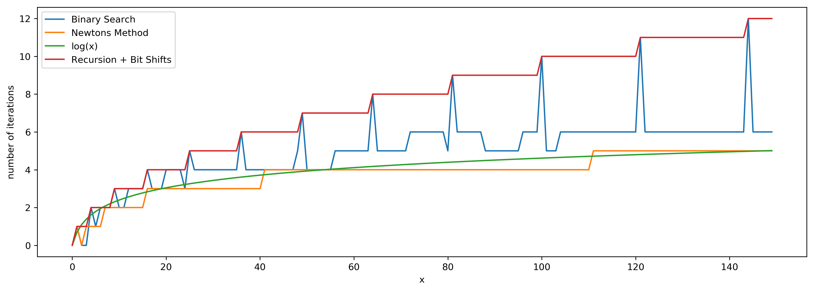

[toc]

Implement `int sqrt(int x)`.

Compute and return the square root of x, where x is guaranteed to be a non-negative integer.

Since the return type is an integer, the decimal digits are truncated and only the integer part of the result is returned.


## 题目解读

&emsp;实现正数的开方运算。

```java
class Solution {
    public int mySqrt(int x) {
        
    }
}
```

## 程序设计

* 最容易想到的是二分法，二分查找平方是否等于`x`，是则返回，否则继续二分查找。

```java
class Solution {
    public int mySqrt(int x) {
        // 0或1
        if(x < 2) {
            return x;
        }
        // 注意right为x除2
        int left = 2, right = x / 2;
        while(left <= right) {
            int mid  = (left + right) / 2;
            // 注意此处要转为long
            long temp = (long)mid * mid;
            if(temp == x) {
                return mid;
            } else if(temp > x) {
                right = mid - 1;
            } else {
                left = mid + 1;
            }
        }
        // right为较小的值
        return right;
    }
}
```

> 如果不限定为整数，可以使用`double`，并设定误差值，当达到或小于误差值的时候结束二分，并返回结果。

* 牛顿法是解平方根的最优解法。对于曲线$f(x) = 0$，寻求其解的方法是选定曲线上一个点$x_n$，做切线，此时相交于横坐标轴的坐标为$x_{n+1}$为下一次迭代值，可知切线为$y = f'(x_n)(x - x_n) + f(x_n)$，令$y = 0$得到$x_{n+1} = x_n - \frac{f(x_n)}{f'(x_n)}$。
* 本题中曲线是二次曲线，转化为$f(x) = 0$的形式就是$t^2 - x=0$，$x$就是要求平方根的值。带入得迭代公式为$t_{n+1} = \frac{1}{2}\big[t_n + \frac{x}{t_n}\big]$。每次迭代完成比较误差值，小于$1$则结束。

```java
class Solution {
    public int mySqrt(int x) {
        if(x < 2) return x;
        
        // 初始为x/2
        double t = x / 2;
        // 迭代（误差小于1，最后取整）
        while (Math.abs(t * t - x) >= 1) {
            t = (t + x / t) / 2;
        }
        return (int)t;
    }
}
```

## 性能分析

&emsp;二分法时间复杂度为$O(\log_2N)$，空间复杂度为$O(1)$。

执行用时：2ms，在所有java提交中击败了83.62%的用户。

内存消耗：39.6MB，在所有java提交中击败了5.06%的用户。

&emsp;牛顿法时间复杂度为$O(\log_2N)$，空间复杂度为$O(1)$。

执行用时：1ms，在所有java提交中击败了100.00%的用户。

内存消耗：39.7MB，在所有java提交中击败了5.06%的用户。

## 官方解题

&emsp;官方除了上述思路，还提供了利用对数计算的思路，即$\sqrt{x} = \exp^{\frac{1}{2}\log{x}}$。

```java
class Solution {
  public int mySqrt(int x) {
    if (x < 2) return x;

    int left = (int)Math.pow(Math.E, 0.5 * Math.log(x));
    int right = left + 1;
    return (long)right * right > x ? left : right;
  }
}
```

递归加位操作：

```java
class Solution {
  public int mySqrt(int x) {
    if (x < 2) return x;

    int left = mySqrt(x >> 2) << 1;
    int right = left + 1;
    return (long)right * right > x ? left : right;
  }
}
```

四种方法比较如下：

