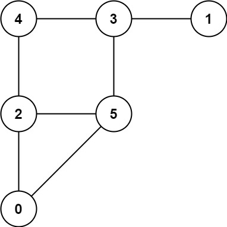

[toc]

A game on an **undirected** graph is played by two players, Mouse and Cat, who alternate turns.

The graph is given as follows: `graph[a]` is a list of all nodes `b` such that `ab` is an edge of the graph.

The mouse starts at node $1$ and goes first, the cat starts at node $2$ and goes second, and there is a hole at node $0$.

During each player's turn, they **must** travel along one edge of the graph that meets where they are.  For example, if the Mouse is at node $1$, it **must** travel to any node in `graph[1]`.

Additionally, it is not allowed for the Cat to travel to the Hole (node 0.)

Then, the game can end in three ways:

* If ever the Cat occupies the same node as the Mouse, the Cat wins.
* If ever the Mouse reaches the Hole, the Mouse wins.
* If ever a position is repeated (i.e., the players are in the same position as a previous turn, and it is the same player's turn to move), the game is a draw.

Given a `graph`, and assuming both players play optimally, return

* $1$ if the mouse wins the game,
* $2$ if the cat wins the game, or
* $0$ if the game is a draw.


**Example 1**:



```
Input: graph = [[2,5],[3],[0,4,5],[1,4,5],[2,3],[0,2,3]]
Output: 0
```

**Example 2**:


```
Input: graph = [[1,3],[0],[3],[0,2]]
Output: 1
```


**Constraints**:

* $3 \le \text{graph.length} \le 50$
* $1 \le \text{graph[i].length} < \text{graph.length}$
* $0 \le \text{graph[i][j]} < \text{graph.length}$
* $\text{graph[i][j]} \ne i$
* `graph[i]` is unique.
* The mouse and the cat can always move. 


## 题目解读

&emsp;猫鼠轮流移动，判断是否胜利或平局。

```java
class Solution {
    public int catMouseGame(int[][] graph) {

    }
}
```

## 程序设计

* 参考社区自顶向下的思路，采用`status(s,i,j)`表示$s$步，老鼠位于$i$，猫位于$j$的状态；首先由于每一步都是最优选择，不管是猫还是老鼠都优先选择可使自己胜利的后继步骤，如果没有，则优先选择平局步骤，没有则必输。

```java
class Solution {
    public int catMouseGame(int[][] graph) {
        int n = graph.length;
        // 表示在第n步，老鼠处于i，猫处于j的状态
        int[][][] status = new int[2 * n][n][n];
        for (int[][] arr : status) {
            for (int[] a : arr) {
                Arrays.fill(a, -1);
            }
        }
        return catMouseGame(1, 2, 0, graph, status);
    }

    private int catMouseGame(int mouse, int cat, int step, int[][] graph, int[][][] status) {
        int turn = step & 1;
        // 超出步数，平局
        if (step >= 2 * graph.length) return 0;
        // 老鼠与猫同位，猫赢
        if (mouse == cat) return status[step][mouse][cat] = 2;
        // 老鼠已到达洞口，老鼠赢
        if (mouse == 0) return status[step][mouse][cat] = 1;

        if (status[step][mouse][cat] != -1) return status[step][mouse][cat];

        // 当前角色是否会输
        boolean flag = false;
        // 当前为老鼠
        if (turn == 0) {
            // 老鼠移动位置
            for (int next : graph[mouse]) {
                int nextStatus = catMouseGame(next, cat, step + 1, graph, status);
                // 老鼠选择该next位置即可获胜
                if (nextStatus == 1) return status[step][mouse][cat] = 1;
                // 存在平局，则老鼠不会输
                else if (nextStatus == 0) flag = true;
            }
            // 存在平局，则选择平局，不存在则老鼠输猫赢
            return status[step][mouse][cat] = flag ? 0 : 2;
        }
        // 当前为猫
        else {
            // 猫移动位置
            for (int next : graph[cat]) {
                // 洞口无法到达
                if (next == 0) continue;
                int nextStatus = catMouseGame(mouse, next, step + 1, graph, status);
                // 存在猫胜，选择该步即可
                if (nextStatus == 2) return status[step][mouse][cat] = 2;
                // 猫可以选择平局，输不了
                else if (nextStatus == 0) flag = true;
            }
            // 存在平局则选择平局，否则猫输老鼠赢
            return status[step][mouse][cat] = flag ? 0 : 1;
        }
    }
}
```

> 假设轮流步骤超过$2 * n$还存在非平局点，则有一方必然会重复到达图中的某个位置，则在该角色已做出最优判断的情况下回到了原来的点，而另一角色也可以回到原来的点，从而形成死环，与假设冲突，故超过$2 * n$步后必然是平局。

## 性能分析

&emsp;时间复杂度为$O(N^3)$，空间复杂度为$O(N^3)$。

执行用时：19 ms, 在所有 Java 提交中击败了46.00%的用户。

内存消耗：40 MB, 在所有 Java 提交中击败了7.89%的用户。

## 官方解题

&emsp;官方思路更为抽象巧妙，将状态抽象为点，状态间构成有向拓扑图，采用自底向上的思路，根据当前状态来推断前一步状态，使用`status(i,j,t)`表示老鼠在$i$，猫在$j$，当前角色为$t$行动的状态；则：

* 当前为`status(i,j,1)`表示当前老鼠行动的状态：
  * 为$0$，表示当前为平局，此时表明前一个状态`status(i,pre,2)`中必然存在一个或多个平局，不存在老鼠赢；
  * 为$1$，表示老鼠赢，此时表明前一个状态`status(i,pre,2)`中必然存在一个或多个老鼠赢；
  * 为$2$，表示猫赢，由于老鼠会选择最优步数，可知所有前一步`status(i,pre,2)`只能是猫赢，不存在平局或老鼠赢，否则当前老鼠可选择更优结果；
* 当前为`status(i,j,2)`表示当前猫行动的状态：
  * 为$0$，表示当前为平局，此时表明前一个状态`status(pre,j,1)`中必然存在一个或多个平局，不存在猫赢；
  * 为$1$，表示老鼠赢，由于猫会选择最优步数，可知所有前一步`status(pre,j,1)`只能是老鼠赢，不存在平局或猫赢，否则当前猫可选择更优结果；
  * 为$2$，表示猫赢，此时表明前一个状态`status(pre,j,1)`中必然存在一个或多个猫赢；

其实最本质的就是每一轮角色，若子状态存在败态，优先选择，其次是平局，最后是胜态；具体来说前一轮为猫，若存在子状态老鼠是败肽，则猫是胜态；若子状态是老鼠平局和胜态，则猫优先选择平局；若子状态全是老鼠胜态，则猫必然败态；反之亦然。

在代码实现中，由于是自底向上，当前老鼠是败态，则前一猫的状态必然是胜态；当前一猫的所有老鼠子状态都是胜态，则猫必然是败态；否则猫为平局。为了方便实现，使用度来记录平局子状态，如果为$0$，表示不存在平局子状态，此时就可具体判断状态类型。

```java
class Solution {
    // 平局、老鼠赢、猫赢的状态
    private static final int DRAW = 0, MOUSE = 1, CAT = 2;

    public int catMouseGame(int[][] graph) {
        int n = graph.length;
        // 老鼠在i，猫在j，当前为老鼠或猫行动时的状态（k=0无效）
        int[][][] status = new int[n][n][3];
        // 老鼠在i，猫在j，当前行动为老鼠或猫的子状态为平局的数目（度）
        int[][][] degree = new int[n][n][3];
        // 初始化
        for (int i = 0; i < n; i++) {
            for (int j = 0; j < n; j++) {
                degree[i][j][MOUSE] = graph[i].length;
                degree[i][j][CAT] = graph[j].length;
                for (int next : graph[j]) {
                    if (next == 0) {
                        degree[i][j][CAT]--;
                        break;
                    }
                }
            }
        }

        Queue<int[]> queue = new LinkedList<>();
        // 初始化状态
        for (int i = 1; i < n; i++) {
            // 老鼠已达洞口，老鼠赢
            status[0][i][MOUSE] = status[0][i][CAT] = MOUSE;
            // 猫鼠同位置，猫赢
            status[i][i][MOUSE] = status[i][i][CAT] = CAT;

            // 放入队列中，分别为老鼠、猫的位置，当前执行者，状态
            queue.add(new int[]{0, i, MOUSE, MOUSE});
            queue.add(new int[]{0, i, CAT, MOUSE});
            queue.add(new int[]{i, i, MOUSE, CAT});
            queue.add(new int[]{i, i, CAT, CAT});
        }

        // 队列中存放非平局状态
        while (!queue.isEmpty()) {
            // 当前状态
            int[] cur = queue.poll();
            // 起始状态，返回
            if (cur[0] == 1 && cur[1] == 2 && cur[2] == MOUSE) return cur[3];

            // 前一步的执行者
            int preTurn = 3 - cur[2];
            for (int pre : graph[preTurn == MOUSE ? cur[0] : cur[1]]) {
                // 前一步的位置
                int preMouse = preTurn == MOUSE ? pre : cur[0];
                int preCat = preTurn == CAT ? pre : cur[1];

                // 前一状态未计算
                if (preCat != 0 && status[preMouse][preCat][preTurn] == DRAW) {
                    // 子状态为败态则当前为胜态，或所有子状态为胜态则当前为败态
                    // 除此之外为平局，不入队
                    if (preTurn == cur[3] || --degree[preMouse][preCat][preTurn] == 0) {
                        status[preMouse][preCat][preTurn] = cur[3];
                        queue.add(new int[]{preMouse, preCat, preTurn, cur[3]});
                    }
                }
            }
        }

        // 超出步数，平局
        return DRAW;
    }
}
```

> 对于最后的平局可用反证法证明。对于任意已标记为胜态或败态的状态，必然可通过有限次步骤达到，假设为$k$，假设存在标记为平局，实际上是老鼠胜的位置，则必然存在一条全是老鼠胜的路径到达该点，然后步骤大于$k$；如果这一步发生在猫的回合内，猫是败态，直接标记该节点为胜态；如果发生在老鼠的回合内，则是胜态，该节点其他的子节点必然是胜态，也会标记为胜态，这样分析，该节点到达洞口的步骤数仍然是小于等于$k$的，与假设冲突。故最后必然是平局。

&emsp;状态点有$N^2$个，每个状态转移边最多有$N$个，故时间复杂度为$O(N^3)$，空间复杂度为$O(N^2)$。

执行用时：12 ms, 在所有 Java 提交中击败了78.00%的用户。

内存消耗：38.5 MB, 在所有 Java 提交中击败了63.16%的用户。