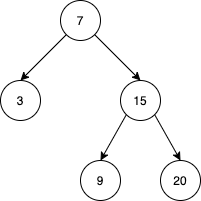

[toc]

Implement the `BSTIterator` class that represents an iterator over the in-order traversal of a binary search tree (BST):

* `BSTIterator(TreeNode root)` Initializes an object of the `BSTIterator` class. The `root` of the BST is given as part of the constructor. The pointer should be initialized to a non-existent number smaller than any element in the BST.
* `boolean hasNext()` Returns `true` if there exists a number in the traversal to the right of the pointer, otherwise returns `false`.
* `int next()` Moves the pointer to the right, then returns the number at the pointer.
* `boolean hasPrev()` Returns `true` if there exists a number in the traversal to the left of the pointer, otherwise returns `false`.
* `int prev()` Moves the pointer to the left, then returns the number at the pointer.

Notice that by initializing the pointer to a non-existent smallest number, the first call to `next()` will return the smallest element in the BST.

You may assume that `next()` and `prev()` calls will always be valid. That is, there will be at least a next/previous number in the in-order traversal when `next()/prev()` is called.

 

**Example 1**:



```
Input
["BSTIterator", "next", "next", "prev", "next", "hasNext", "next", "next", "next", "hasNext", "hasPrev", "prev", "prev"]
[[[7, 3, 15, null, null, 9, 20]], [null], [null], [null], [null], [null], [null], [null], [null], [null], [null], [null], [null]]
Output
[null, 3, 7, 3, 7, true, 9, 15, 20, false, true, 15, 9]

Explanation
// The underlined element is where the pointer currently is.
BSTIterator bSTIterator = new BSTIterator([7, 3, 15, null, null, 9, 20]); // state is   [3, 7, 9, 15, 20]
bSTIterator.next(); // state becomes [3, 7, 9, 15, 20], return 3
bSTIterator.next(); // state becomes [3, 7, 9, 15, 20], return 7
bSTIterator.prev(); // state becomes [3, 7, 9, 15, 20], return 3
bSTIterator.next(); // state becomes [3, 7, 9, 15, 20], return 7
bSTIterator.hasNext(); // return true
bSTIterator.next(); // state becomes [3, 7, 9, 15, 20], return 9
bSTIterator.next(); // state becomes [3, 7, 9, 15, 20], return 15
bSTIterator.next(); // state becomes [3, 7, 9, 15, 20], return 20
bSTIterator.hasNext(); // return false
bSTIterator.hasPrev(); // return true
bSTIterator.prev(); // state becomes [3, 7, 9, 15, 20], return 15
bSTIterator.prev(); // state becomes [3, 7, 9, 15, 20], return 9
```


**Constraints**:

* The number of nodes in the tree is in the range $[1, 10^5]$.
* $0 \le \text{Node.val} \le 10^6$
* At most $10^5$ calls will be made to `hasNext`, `next`, `hasPrev`, and `prev`.


## 题目解读

&emsp;设计二叉查找树中序遍历迭代器。

```java
/**
 * Definition for a binary tree node.
 * public class TreeNode {
 *     int val;
 *     TreeNode left;
 *     TreeNode right;
 *     TreeNode() {}
 *     TreeNode(int val) { this.val = val; }
 *     TreeNode(int val, TreeNode left, TreeNode right) {
 *         this.val = val;
 *         this.left = left;
 *         this.right = right;
 *     }
 * }
 */
class BSTIterator {

    public BSTIterator(TreeNode root) {

    }
    
    public boolean hasNext() {

    }
    
    public int next() {

    }
    
    public boolean hasPrev() {

    }
    
    public int prev() {

    }
}

/**
 * Your BSTIterator object will be instantiated and called as such:
 * BSTIterator obj = new BSTIterator(root);
 * boolean param_1 = obj.hasNext();
 * int param_2 = obj.next();
 * boolean param_3 = obj.hasPrev();
 * int param_4 = obj.prev();
 */
```

## 程序设计

* 除了最简单的在初始化时生成中序序列的思路，可在调用时动态生成。可使用栈的中序遍历方法记录当前节点入栈次数，链表记录之前的遍历结果。

```java
class BSTIterator {
    // 中序遍历栈
    Stack<TreeNode> stack;
    Stack<Integer> counter;
    // 记录遍历序列
    int idx = -1;
    List<Integer> list;

    public BSTIterator(TreeNode root) {
        this.stack = new Stack<>();
        this.counter = new Stack<>();
        stack.push(root);
        counter.push(1);
        this.list = new ArrayList<>();
    }
    
    public boolean hasNext() {
        // 将空节点出栈
        while (!stack.isEmpty() && stack.peek() == null) {
            stack.pop();
            counter.pop();
        }
        return idx < list.size() - 1 || !stack.isEmpty();
    }
    
    public int next() {
        if (idx >= list.size() - 1) {
            // 入栈次数只有一次，继续入栈，并入栈左子节点
            while (counter.peek() == 1) {
                TreeNode cur = stack.pop();
                int count = counter.pop();
                if (cur == null) continue;

                stack.push(cur);
                counter.push(count + 1);
                stack.push(cur.left);
                counter.push(1);
            }
            // 入栈两次，则出栈，并入栈右子节点
            TreeNode cur = stack.pop();
            counter.pop();
            stack.push(cur.right);
            counter.push(1);
            list.add(cur.val);
        }

        return list.get(++idx);
    }
    
    public boolean hasPrev() {
        return idx > 0;
    }
    
    public int prev() {
        return list.get(--idx);
    }
}
```

## 性能分析

&emsp;各操作均摊时间复杂度为$O(1)$，空间复杂度为$O(N)$。

执行用时：104 ms, 在所有 Java 提交中击败了32.56%的用户。

内存消耗：71.7 MB, 在所有 Java 提交中击败了34.88%的用户。

## 官方解题

&emsp;暂无，密切关注。
