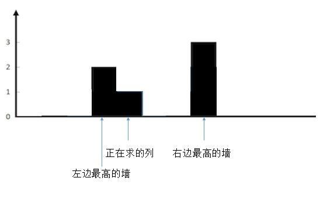

[toc]

Given n non-negative integers representing an elevation map where the width of each bar is 1, compute how much water it is able to trap after raining.


The above elevation map is represented by array [0,1,0,2,1,0,1,3,2,1,2,1]. In this case, 6 units of rain water (blue section) are being trapped. 


## 题目解读

&emsp;给出非负数组，每个数代表了一个`bar`的长度，每个`bar`的宽度为`1`。求能够存储的雨水数目。

```java
class Solution {
    public int trap(int[] height) {
        
    }
}
```

## 程序设计

* 最直接的，按行计算雨水量，即从第一行开始遍历，中间为0，两侧有不为0的挡板的区域可以存储雨水；然后遍历第二行，即两侧有高度为2以上的挡板，中间区域高度低于1，可以存储雨水；依次类推，直到遍历最高层，假设为$M$，则总的时间复杂度为$O(MN)$。
* 更易于理解的，如果按列计算雨水量，当前列的雨水量取决于两侧最高挡板中的较低的那个挡板，最后当前列存储雨水量就是较低挡板减去当前列的高度。两侧挡板可理解为河岸，当前列可理解为河床。



```java
class Solution {
    public int trap(int[] height) {
        int sum = 0;
        // 遍历，由于首尾必然没有雨水，跳过首尾
        for(int i = 1; i < height.length - 1; i++) {
            // 遍历结点的左右挡板高度
            int maxLeft = 0, maxRight = 0;
            // 寻找左侧最高挡板，分三种情况：左侧最高挡板低于当前列（无雨水），
            // 左侧最高挡板等于当前列（无雨水），左侧最高挡板高于的前列（可能有雨水，取决于右侧挡板）
            // 从当前列开始遍历，使得无雨水的两种情况得到的挡板高度和当前列一致，便于统一运算
           for(int j = i; j >= 0; j--) {
               if(height[j] > maxLeft) {
                   maxLeft = height[j];
               }
           }
           // 寻找右侧最高挡板，与上同理
           for(int j = i; j < height.length; j++) {
               if(height[j] > maxRight) {
                   maxRight = height[j];
               }
           }
           // 两侧挡板较低的高度减去当前列的高度
           sum += (maxLeft < maxRight ? maxLeft : maxRight) - height[i];
        }
        return sum;
    }
}
```

测试样例：`[0,1,0,2,1,0,1,3,2,1,2,1]`输出`6`。

## 性能分析

&emsp;每遍历一个元素，还需要前后遍历得到挡板高度，总的时间复杂度为$O(N^2)$。空间复杂度为$O(1)$。

执行用时：73ms，在所有java提交中击败了17.19%的用户。

内存消耗：40.5MB，在所有java提交中击败了5.00%的用户。

## 代码优化

&emsp;上述代码每次遍历元素都要前后遍历最高挡板高度，可引入额外空间来保存这些信息，即动态规划的解法。

```java
class Solution {
    public int trap(int[] height) {
        if(height == null || height.length == 0) {
            return 0;
        }
        int sum = 0;
        // 动态规划，引入额外存储空间
        int[] maxLeft = new int[height.length];
        maxLeft[0] = height[0];
        int[] maxRight = new int[height.length];
        maxRight[height.length - 1] = height[height.length - 1];
        // 动态规划得到挡板高度
        for(int i = 1; i < height.length; i++) {
           maxLeft[i] = height[i] > maxLeft[i - 1] ? height[i] : maxLeft[i - 1];
        }
        for(int i = height.length - 2; i >= 0; i--) {
           maxRight[i] = height[i] > maxRight[i + 1] ? height[i] : maxRight[i + 1];
        }

        for(int i = 1; i < height.length - 1; i++) {
           // 两侧挡板较低的高度减去当前列的高度
           sum += (maxLeft[i] < maxRight[i] ? maxLeft[i] : maxRight[i]) - height[i];
        }
        return sum;
    }
}
```

&emsp;时间复杂度$O(N)$，空间复杂度$O(N)$。

执行用时：1ms，在所有java提交中击败了99.98%的用户。

内存消耗：37.7MB，在所有java提交中击败了39.50%的用户。

&emsp;还可以进一步优化使得空间复杂度为$O(1)$：上述用到了三个循环，前两个动态规划生成两个数组，左侧挡板是从左往右遍历生成，右侧挡板从右往左遍历生成。事实上我们每次计算列的雨水量都是取两侧最低挡板计算，使用双指针`left`、`right`来标识当前左右挡板的位置，如果`maxLeft[left - 1]`与`left`的最大值小于`maxRight[right + 1]`与`right`的最大值，则表明`left`这个位置是按照`maxLeft[left]`来计算的；反之，表明`right`这个位置是按照`maxRight[right]`计算的。事实上，采用上述策略后，左右挡板不需要使用数组保存，可以使用两个整数变量表示。

```java
class Solution {
    public int trap(int[] height) {
        if(height == null || height.length == 0) {
            return 0;
        }
        int sum = 0;
        // 左右计算指针
        int left = 1, right = height.length - 2;
        // 左右挡板最高高度
        int maxLeft = height[0], maxRight = height[height.length - 1];
        // 重复操作i次，计算出所有列的雨水量
        for(int i = 1; i < height.length - 1; i++) {
            // 计算left列的雨水量并更新left下标及maxLeft
            if(Math.max(height[left], maxLeft) < Math.max(height[right], maxRight)) {
                maxLeft = Math.max(height[left], maxLeft);
                sum += maxLeft - height[left];
                left++;
            } 
            // 计算right列的雨水量并更新right及maxRight
            else {
                maxRight = Math.max(height[right], maxRight);
                sum += maxRight - height[right];
                right--;
            }
        }
        return sum;
    }
}
```

&emsp;时间复杂度为$O(N)$，空间复杂度为$O(1)$。通过指针模拟动态规划中自左向右、自右向左的遍历，计算列的雨水量不再是线性遍历，而是随着左右指针不断计算，直到左右指针重合，计算完成。

执行用时：1ms，在所有java提交中击败了99.98%的用户。

内存消耗：36.8MB，在所有java提交中击败了96.43%的用户。

## 官方解题

&emsp;除了上述思路，官方提供了栈的思路。如果当前挡板的高度小于等于栈顶挡板的高度，说明会有积水，入栈继续遍历；如果当前挡板的高度大于栈顶挡板高度，积水不会漫过这个挡板，出栈计算积水，并将挡板入栈。


```java
class Solution {
    public int trap(int[] height) {
        if(height == null || height.length == 0) {
            return 0;
        }
        int sum = 0;
        // 栈保存挡板索引
        Stack<Integer> stack = new Stack<>();
        for(int i = 0; i < height.length; i++) {
            // 有积水，将挡板入栈
            if(stack.isEmpty() || height[stack.peek()] >= height[i]) {
                stack.push(i);
            } 
            // 出栈计算索引
            else {
                // 向前遍历计算每列或多个列的积水
                while(!stack.isEmpty() && height[stack.peek()] <= height[i]) {
                     int index = stack.pop();
                     // 栈为空，表示没有对应的左挡板，没有积水
                     if(stack.isEmpty()) {
                         break;
                     }
                     // 左右挡板选择最低的那个
                     int high = Math.min(height[i], height[stack.peek()]);
                     // 距离，中间为积水区域（由于涉及出栈，i与stack.peek()不一定紧跟，即多个列的情况）
                     int distance = i - stack.peek() - 1;
                     sum += (high - height[index]) * distance;
                }
                stack.push(i);
            }
        }
        return sum;
    }
}
```

&emsp;时间复杂度为$O(N)$，空间复杂度为$O(N)$。

执行用时：8ms，在所有java提交中击败了28.56%的用户。

内存消耗：36.6MB，在所有java提交中击败了97.43%的用户。