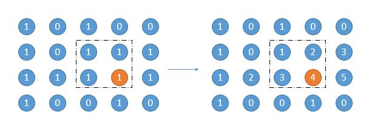

[toc]

Given a 2D binary matrix filled with 0's and 1's, find the largest rectangle containing only 1's and return its area.


## 题目截图

&emsp;给定一个二维矩阵，只包含$0$和$1$，需要找出最大的矩形区域。是[#84 Largest Rectangle in Histogram](./#84 Largest Rectangle in Histogram.md)的扩展。

```java
class Solution {
    public int maximalRectangle(char[][] matrix) {
        
    }
}
```

## 程序设计

* 最直接的使用暴力法求解，遍历每个点，每遍历一个点就开始检查遍历对角线点是否为1，然后对对角结点所在列及行继续遍历判断是否为1。该方法时间复杂度为$O(N^3M^3)$。
* 一种优化的暴力法统计每一行连续的1的个数，如图，在遍历的过程中每行连续的1都记为其编号；当前结点，比如图中的4表示在第三行以4结尾的矩阵面积为4，然后4向上扩展，也就是第二行的点2，发现点2连续结点只有两个，故组成的矩形就是图中圈起来的区域；继续向上扩展，发现第一行结点是0，没有连续点，无法组成矩阵，则当前点4可以组成的矩形最大面积就是4。以此类推，遍历结束选取最大面积返回即可。



```java
class Solution {
    public int maximalRectangle(char[][] matrix) {
        if(matrix == null || matrix.length == 0
            || matrix[0] == null || matrix[0].length == 0) {
                return 0;
        }
        int maxArea = 0;
        // 记录连续编号
        int[][] record = new int[matrix.length][matrix[0].length];
        for(int row = 0; row < matrix.length; row++) {
            int wide;
            for(int col = 0; col < matrix[0].length; col++) {
                // 记录连续的1的编号
                if(matrix[row][col] == '1') {
                    if(col == 0) {
                        record[row][col] = 1;
                    } else {
                        record[row][col] = record[row][col-1] + 1;
                    }
                } else {
                    record[row][col] = 0;
                }
                // 矩形的宽
                wide = record[row][col];
                // 向上扩展，搜索当前结点为顶点组成的最大矩形
                for(int k = row; k >= 0; k--) {
                    // 新的宽
                    wide = Math.min(wide, record[k][col]);
                    // 面积为宽乘高
                    maxArea = Math.max(maxArea, wide * (row - k + 1));
                }
            }
        }
        return maxArea;
    }
}
```

## 性能分析

&emsp;整体遍历行两遍，列一遍，时间复杂度为$O(N^2M)$，空间复杂度因为引入数组，为$O(NM)$。

执行用时：37ms，在所有java提交中击败了28.51%的用户。

内存消耗：41.7MB，在所有java提交中击败了71.23%的用户。

## 官方解题

&emsp;如果把矩形按每一行逐次划分，如下，可以发现矩形最大的问题就是[#84 Largest Rectangle in Histogram](./#84 Largest Rectangle in Histogram.md)中查找直方图矩形最大的问题。


```java
class Solution {
    public int maximalRectangle(char[][] matrix) {
        if(matrix == null || matrix.length == 0
            || matrix[0] == null || matrix[0].length == 0) {
                return 0;
        }
        int maxArea = 0;
        int[] heights = new int[matrix[0].length];
        // 生成直方图
        for(int row = 0; row < matrix.length; row++) {
            // 为每个列生成直方图
            for(int col = 0; col < matrix[0].length; col++) {
                // 该列为1，在原来的基础上继续加一
                if(matrix[row][col] == '1') {
                    heights[col] += 1;
                } 
                // 否则清零
                else {
                    heights[col] = 0;
                }
            }
            // 调用#84的方法
            maxArea = Math.max(maxArea, largestRectangleArea(heights));
        }
        return maxArea;
    }
	
    // #84题解法
    public int largestRectangleArea(int[] heights) {
        int maxArea = 0;
        Stack<Integer> stack = new Stack<>();
        stack.push(-1);
        for(int i = 0; i < heights.length; i++) {
            while(stack.peek() != -1 && heights[i] <= heights[stack.peek()]) {
                maxArea = Math.max(maxArea, heights[stack.pop()] * (i - stack.peek() - 1));
            }
            stack.push(i);
        }
        while(stack.peek() != -1) {
            maxArea = Math.max(maxArea, heights[stack.pop()] * (heights.length - stack.peek() - 1));
        } 
        return maxArea;
    }
}
```

&emsp;时间复杂度$O(NM)$，空间复杂度$O(M)$。

执行用时：36ms，在所有java提交中击败了34.84%的用户。

内存消耗：43.9MB，在所有java提交中击败了14.25%的用户。