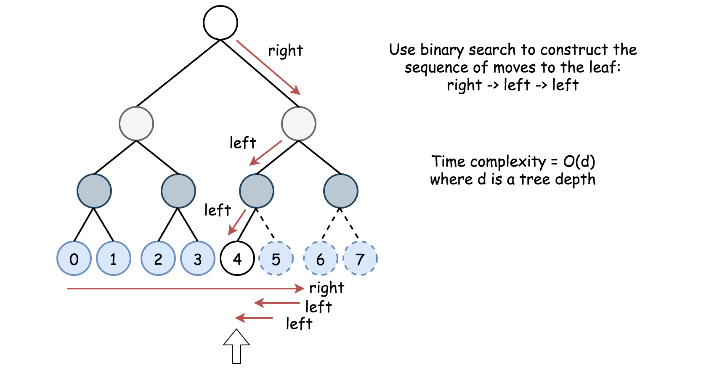

[toc]

Given a **complete** binary tree, count the number of nodes.

**Note**:

Definition of a complete binary tree from Wikipedia:
In a complete binary tree every level, except possibly the last, is completely filled, and all nodes in the last level are as far left as possible. It can have between $1$ and $2^h$ nodes inclusive at the last level $h$.


## 题目解读

&emsp;给定完全二叉树，计算树的结点。

```java
/**
 * Definition for a binary tree node.
 * public class TreeNode {
 *     int val;
 *     TreeNode left;
 *     TreeNode right;
 *     TreeNode(int x) { val = x; }
 * }
 */
class Solution {
    public int countNodes(TreeNode root) {
        
    }
}
```

## 程序设计

* 最简单的采用递归方法遍历计算所有结点。

```java
class Solution {
    public int countNodes(TreeNode root) {
        if(root == null) {
            return 0;
        }
        int left = countNodes(root.left);
        int right = countNodes(root.right);
        return left + right + 1;
    }
}
```

* 可利用完全二叉树的性质来计算最后一层的结点数，从而得到所有的节点数。查找最后一层结点可以使用树的二分查找。如图，完全二叉树的中间点是根节点，最接近根节点的就是根节点的右子节点的支路末端叶节点。



```java

```

## 性能分析

&emsp;递归时间复杂度为$O(N)$，空间复杂度为$O(\log_2N)$，最坏为$O(N)$。

执行用时：1ms，在所有java提交中击败了24.00%的用户。

内存消耗：51.6MB，在所有java提交中击败了5.12%的用户。

## 官方解题

&emsp;官方提供了空间复杂度为$O(1)$的二分查找的思路，实现较为繁琐。社区通过将二分应用到递归，得到简介的解法。

```java
class Solution {
    public int countNodes(TreeNode root) {
        if(root == null) {
            return 0;
        }
        // 最左测的层数
        int left = getLevel(root.left);
        // 根节点后的层数（也就是树的中间结点）
        int right = getLevel(root.right);
        // 层数相同，继续向右递归，再做二分查找
        if(left == right) {
            // 1 << left  - 1为root.left子树的节点数，加上根节点的数目就是1 << left
            return countNodes(root.right) + (1 << left);
        }
        // 层数不同，由于是完全二叉树，必定在前面查找
        // 同理右子树和根的节点数为 1 << right
        return countNodes(root.left) + (1 << right);
    }

    private int getLevel(TreeNode root) {
        int level = 0;
        while(root != null) {
            root = root.left;
            level++;
        }
        return level;
    }
}
```

&emsp;由于需要递归树的深度次，每次递归又需要遍历深度次找到层数，故时间复杂度为$O(\log_2^2N)$，由于是尾递归，空间复杂度为$O(1)$。