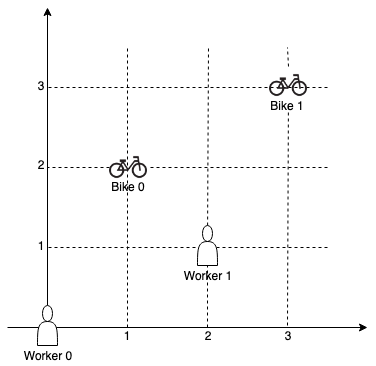

[toc]

On a campus represented as a 2D grid, there are N workers and M bikes, with N <= M. Each worker and bike is a 2D coordinate on this grid.

We assign one unique bike to each worker so that the sum of the Manhattan distances between each worker and their assigned bike is minimized.

The Manhattan distance between two points p1 and p2 is Manhattan(p1, p2) = |p1.x - p2.x| + |p1.y - p2.y|.

Return the minimum possible sum of Manhattan distances between each worker and their assigned bike.

 

**Example 1**:



```
Input: workers = [[0,0],[2,1]], bikes = [[1,2],[3,3]]
Output: 6
Explanation: 
We assign bike 0 to worker 0, bike 1 to worker 1. The Manhattan distance of both assignments is 3, so the output is 6.
```

**Example 2**:


```
Input: workers = [[0,0],[1,1],[2,0]], bikes = [[1,0],[2,2],[2,1]]
Output: 4
Explanation: 
We first assign bike 0 to worker 0, then assign bike 1 to worker 1 or worker 2, bike 2 to worker 2 or worker 1. Both assignments lead to sum of the Manhattan distances as 4.
```

**Example 3**:

```
Input: workers = [[0,0],[1,0],[2,0],[3,0],[4,0]], bikes = [[0,999],[1,999],[2,999],[3,999],[4,999]]
Output: 4995
```


**Constraints**:

* $N == \text{workers.length}$
* $M == \text{bikes.length}$
* $1 \le N \le M \le 10$
* $\text{workers[i].length} == 2$
* $\text{bikes[i].length} == 2$
* $0 \le \text{workers[i][0], workers[i][1], bikes[i][0], bikes[i][1]} < 1000$
* All the workers and the bikes locations are **unique**.


## 题目解读

&emsp;求校园分配自行车到每个工人的曼哈顿距离之和最小值。

```java
class Solution {
    public int assignBikes(int[][] workers, int[][] bikes) {

    }
}
```

## 程序设计

* 由于个人和自行车的数目只有$10$个，故可采用状态压缩动态规划，`dp(1,j)`表示前$i$个个人分配自行车状态为$j$的最小路径和。

```java
class Solution {
    public int assignBikes(int[][] workers, int[][] bikes) {
        int m = workers.length, n = bikes.length;
        // 表示前i个人分配自行车状态为j的最小距离和
        int[][] dp = new int[m + 1][1 << n];
        for (int[] arr : dp) {
            Arrays.fill(arr, Integer.MAX_VALUE);
        }
        dp[0][0] = 0;
        for (int i = 0; i < m; i++) {
            for (int status = 0; status < (1 << n); status++) {
                if (dp[i][status] == Integer.MAX_VALUE) continue;
                for (int j = 0; j < n; j++) {
                    if (((status >> j) & 1) == 1) continue;
                    dp[i + 1][status | (1 << j)] = Math.min(dp[i + 1][status | (1 << j)], dp[i][status] + getDis(workers[i][0], workers[i][1], bikes[j][0], bikes[j][1]));
                }
            }
        }

        int res = Integer.MAX_VALUE;
        for (int status = 0; status < (1 << n); status++) {
            res = Math.min(res, dp[m][status]);
        }
        return res;
    }

    private int getDis(int x1, int y1, int x2, int y2) {
        return Math.abs(x1 - x2) + Math.abs(y1 - y2);
    }
}
```

* 由于自行车总是比人多，可以使用`dp(i,j)`表示前$i$个自行车分配人的状态为$j$的最小和。需注意不同于人分配车，每次必须分配一辆，车分配人，可以分配，也可以不分配。

```java
class Solution {
    public int assignBikes(int[][] workers, int[][] bikes) {
        int m = workers.length, n = bikes.length, len = 1 << m;
        // 表示前i个车分配工人状态为j的最小距离和
        int[][] dp = new int[n + 1][1 << m];
        for (int[] arr : dp) {
            Arrays.fill(arr, Integer.MAX_VALUE);
        }
        dp[0][0] = 0;
        for (int i = 0; i < n; i++) {
            for (int status = 0; status < len; status++) {
                // 当前车不分配人的情况
                dp[i + 1][status] = Math.min(dp[i + 1][status], dp[i][status]);
                if (dp[i][status] == Integer.MAX_VALUE) continue;
                
                // 分配的情况
                for (int j = 0; j < m; j++) {
                    // 已分配
                    if (((status >> j) & 1) == 1) continue;
                    // 尝试分配
                    dp[i + 1][status | (1 << j)] = Math.min(dp[i + 1][status | (1 << j)], dp[i][status] + getDis(workers[j][0], workers[j][1], bikes[i][0], bikes[i][1]));
                }
            }
        }

        int res = Integer.MAX_VALUE;
        for (int i = 1; i <= n; i++) {
            res = Math.min(res, dp[i][len - 1]);
        }
        return res;
    }

    private int getDis(int x1, int y1, int x2, int y2) {
        return Math.abs(x1 - x2) + Math.abs(y1 - y2);
    }
}
```

> 可进一步优化空间复杂度。

## 性能分析

&emsp;时间复杂度为$O(MN2^N)$，空间复杂度为$O(M2^N)$。

执行用时：5 ms, 在所有 Java 提交中击败了77.61%的用户。

内存消耗：37.8 MB, 在所有 Java 提交中击败了26.41%的用户。

&emsp;时间复杂度为$O(MN2^M)$，看见复杂度为$O(N2^M)$。

执行用时：7 ms, 在所有 Java 提交中击败了74.63%的用户。

内存消耗：36.4 MB, 在所有 Java 提交中击败了32.08%的用户。

## 官方解题

&emsp;暂无，密切关注。
