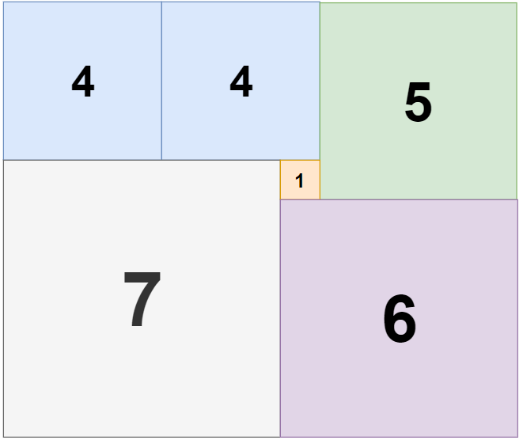

[toc]

Given a rectangle of size $n \times m$, find the minimum number of integer-sided squares that tile the rectangle.


**Constraints:**

- $1 \le n \le 13$
- $1 \le m \le 13$


## 题目解读

&emsp;给定矩形，输出填充矩形最少的正方形数目。

```java
class Solution {
    public int tilingRectangle(int n, int m) {

    }
}
```

## 程序设计

* 首先先到的是贪婪法，每次分割最大的正方形，但是显然不正确，不满足如图的情况。

```java
class Solution {
    public int tilingRectangle(int n, int m) {
        if (n == m) return 1;
        if (n > m) return 1 + tilingRectangle(n - m, m);
        else return 1 + tilingRectangle(m - n, n);
    }
}
```



* 查阅资料，该题目前通用解法是暴力回溯填充矩形，找到最小的数目。

```java
class Solution {
    int minCount = Integer.MAX_VALUE;

    public int tilingRectangle(int n, int m) {
        if (n <= 0 || m <= 0) return 0;
        if (n == m) return 1;

        // 加入所有的点，集合方便判断是否未填充
        Set<Integer> set = new HashSet<>();
        for (int i = 0; i < n * m; i++) {
            set.add(i);
        }
        // 填充从左至右，优先级队列提供判断，每次队首值是未填充值最前且最左的
        PriorityQueue<Integer> queue = new PriorityQueue<>(set);
        tilingRectangle(queue, set, n, m, 0);
        return minCount;
    }


    private void tilingRectangle(PriorityQueue<Integer> queue, Set<Integer> set, int n, int m, int count) {
        // 若大于当前最小值，停止回溯
        if (count > minCount) return;
        // 找到一组分割方案，更新
        if (queue.isEmpty()) {
            minCount = count;
            return;
        }
        // 当前起点
        int start = queue.poll();
        int x = start / m, y = start % m;

        // 从大到小划分（结合终止条件过滤不必要划分）
        for (int len = Math.min(n - x, m - y); len > 0; len--) {
            // 该长度不符合要求
            if (!isAvalibaleLen(set, x, y, len, m)) continue;
            // 试探
            doTry(queue, set, x, y, len, m);
            tilingRectangle(queue, set, n, m, count + 1);

            // 回溯
            back(queue, set, x, y, len, m);
        }
    }

    // 检查当前长度的区域是否可填充
    private boolean isAvalibaleLen(Set<Integer> set, int x, int y, int len, int m) {
        for (int i = x; i < x + len; i++) {
            for (int j = y; j < y + len; j++) {
                if (!set.contains(i * m + j)) return false;
            }
        }
        return true;
    }

    // 移除填充点
    private void doTry(PriorityQueue<Integer> queue, Set<Integer> set, int i, int j, int len, int m) {
        for (int k = 0; k < len; k++) {
            for (int l = 0; l < len; l++) {
                int idx = (i + k) * m + j + l;
                queue.remove(idx);
                set.remove(idx);
            }
        }
    }

    // 添加填充点
    private void back(PriorityQueue<Integer> queue, Set<Integer> set, int i, int j, int len, int m) {
        for (int k = 0; k < len; k++) {
            for (int l = 0; l < len; l++) {
                int idx = (i + k) * m + j + l;
                queue.add(idx);
                set.add(idx);
            }
        }
    }
}
```

## 性能分析

执行用时：230ms，在所有java提交中击败了25.26%的用户。

内存消耗：39 MB，在所有java提交中击败了100.00%的用户。

## 官方解题

&emsp;暂无，密切关注。