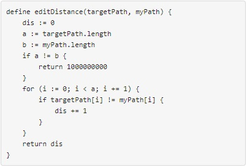
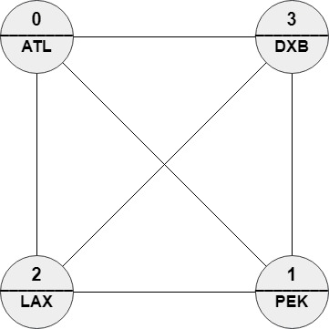

[toc]

We have $n$ cities and $m$ bi-directional roads where `roads[i] = [ai, bi]` connects city `ai` with city `bi`. Each city has a name consisting of exactly 3 upper-case English letters given in the string array `names`. Starting at any city `x`, you can reach any city `y` where $y \ne x$ (i.e. the cities and the roads are forming an undirected connected graph).

You will be given a string array `targetPath`. You should find a path in the graph of the **same length** and with the **minimum edit distance** to `targetPath`.

You need to return the order of the nodes in the path with the minimum edit distance, The path should be of the same length of `targetPath` and should be valid (i.e. there should be a direct road between `ans[i]` and `ans[i + 1]`). If there are multiple answers return any one of them.

The **edit distance** is defined as follows:



**Follow-up**: If each node can be visited only once in the path, What should you change in your solution?

 

**Example 1**:


```
Input: n = 5, roads = [[0,2],[0,3],[1,2],[1,3],[1,4],[2,4]], names = ["ATL","PEK","LAX","DXB","HND"], targetPath = ["ATL","DXB","HND","LAX"]
Output: [0,2,4,2]
Explanation: [0,2,4,2], [0,3,0,2] and [0,3,1,2] are accepted answers.
[0,2,4,2] is equivalent to ["ATL","LAX","HND","LAX"] which has edit distance = 1 with targetPath.
[0,3,0,2] is equivalent to ["ATL","DXB","ATL","LAX"] which has edit distance = 1 with targetPath.
[0,3,1,2] is equivalent to ["ATL","DXB","PEK","LAX"] which has edit distance = 1 with targetPath.
```

**Example 2**:



```
Input: n = 4, roads = [[1,0],[2,0],[3,0],[2,1],[3,1],[3,2]], names = ["ATL","PEK","LAX","DXB"], targetPath = ["ABC","DEF","GHI","JKL","MNO","PQR","STU","VWX"]
Output: [0,1,0,1,0,1,0,1]
Explanation: Any path in this graph has edit distance = 8 with targetPath.
```

**Example 3**:


```
Input: n = 6, roads = [[0,1],[1,2],[2,3],[3,4],[4,5]], names = ["ATL","PEK","LAX","ATL","DXB","HND"], targetPath = ["ATL","DXB","HND","DXB","ATL","LAX","PEK"]
Output: [3,4,5,4,3,2,1]
Explanation: [3,4,5,4,3,2,1] is the only path with edit distance = 0 with targetPath.
It's equivalent to ["ATL","DXB","HND","DXB","ATL","LAX","PEK"]
```


**Constraints**:

* $2 \le n \le 100$
* $m == \text{roads.length}$
* $n - 1 \le m \le (n * (n - 1) / 2)$
* $0 \le a_i, b_i \le n - 1$
* $a_i \ne b_i$ 
* The graph is guaranteed to be **connected** and each pair of nodes may have **at most one** direct road.
* $\text{names.length} == n$
* $\text{names[i].length} == 3$
* `names[i]` consists of upper-case English letters.
* There can be two cities with **the same** name.
* $1 \le \text{targetPath.length} \le 100$
* $\text{targetPath[i].length} == 3$
* `targetPath[i]` consists of upper-case English letters.


## 题目解读

&emsp;找到与目标路径相等长度的路径，且有最小编辑距离。

```java
class Solution {
    public List<Integer> mostSimilar(int n, int[][] roads, String[] names, String[] targetPath) {

    }
}
```

## 程序设计

* 参考社区思路，采用`dp(i,j)`表示起点为$i$，路径长度为$j$的最小编辑距离（对应目标路径为$m - j \sim m - 1$）。

```java
class Solution {
    public List<Integer> mostSimilar(int n, int[][] roads, String[] names, String[] targetPath) {
        // 记录边连接情况
        boolean[][] graph = new boolean[n][n];
        for (int[] road :roads) {
            graph[road[0]][road[1]] = true;
            graph[road[1]][road[0]] = true;
        }

        int m = targetPath.length;
        // 记录从i出发的路径长度为j的最小编辑距离和对应路径
        int[][] minEditDis = new int[n][m +1];
        List<Integer>[][] path = new List[n][m + 1];
        // 初始化
        for (int i = 0; i < n; i++) {
            for (int j = 0; j <= m; j++) {
                if (j != 0) minEditDis[i][j] = Integer.MAX_VALUE;
                path[i][j] = new LinkedList<>();
            }
        }

        // 路径长度
        for (int i = 1; i <= m; i++) {
            // 当前城市
            for (int j = 0; j < n; j++) {
                int min = Integer.MAX_VALUE;
                List<Integer> cur = new LinkedList<>();

                for (int k = 0; k < n; k++) {
                    if (graph[j][k] && minEditDis[k][i - 1] < min) {
                        min = minEditDis[k][i - 1];
                        cur = path[k][i - 1];
                    }
                }
				
                // 当前j对应目标路径中m - i位置的单词
                minEditDis[j][i] = min + (names[j].equals(targetPath[m - i]) ? 0 : 1);
                // 以j为起点，长度为i的路径
                path[j][i].add(j);
                path[j][i].addAll(cur);
            }
        }

        int min = Integer.MAX_VALUE;
        List<Integer> res = new LinkedList<>();
        for (int i = 0; i < n; i++) {
            if (min > minEditDis[i][m]) {
                min = minEditDis[i][m];
                res = path[i][m];
            }
        }
        return res;
    }
}
```

## 性能分析

&emsp;时间复杂度为$O(MN^2)$，空间复杂度为$O(M^2N)$。

执行用时：115 ms, 在所有 Java 提交中击败了91.49%的用户。

内存消耗：49.1 MB, 在所有 Java 提交中击败了7.69%的用户。

## 官方解题

&emsp;暂无，密切关注。
