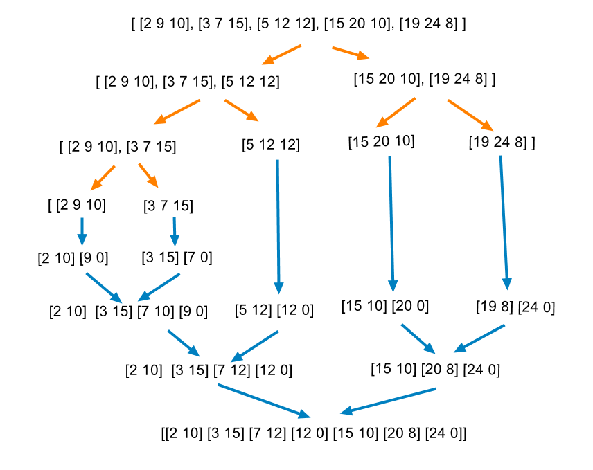
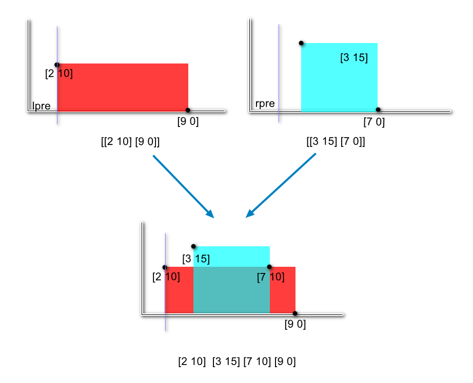
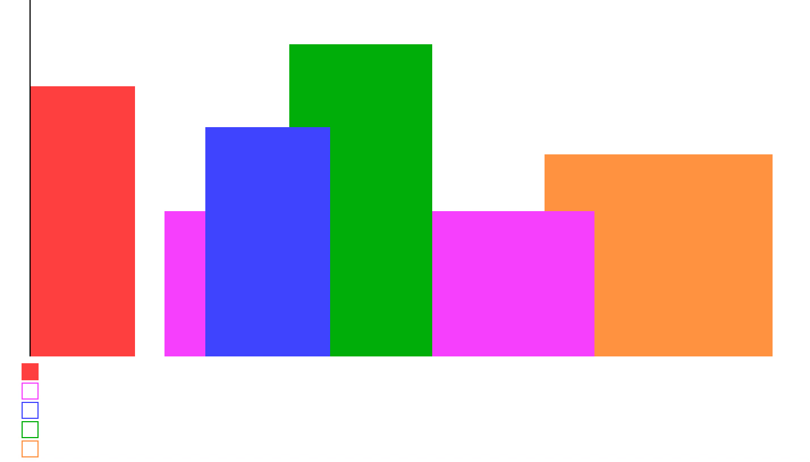

[toc]

A city's skyline is the outer contour of the silhouette formed by all the buildings in that city when viewed from a distance. Now suppose you are **given the locations and height of all the buildings** as shown on a cityscape photo (Figure A), write a program to output the skyline formed by these buildings collectively (Figure B).


The geometric information of each building is represented by a triplet of integers `[Li, Ri, Hi]`, where `Li` and `Ri` are the `x` coordinates of the left and right edge of the ith building, respectively, and `Hi` is its height. It is guaranteed that $0 \le L_i$, $R_i \le \text{INT_MAX}$, $0 < H_i \le \text{INT_MAX}$, and $R_i - L_i > 0$. You may assume all buildings are perfect rectangles grounded on an absolutely flat surface at height 0.

For instance, the dimensions of all buildings in Figure A are recorded as: `[ [2 9 10], [3 7 15], [5 12 12], [15 20 10], [19 24 8] ]` .

The output is a list of "key points" (red dots in Figure B) in the format of `[ [x1,y1], [x2, y2], [x3, y3], ... ]` that uniquely defines a skyline. A key point is the left endpoint of a horizontal line segment. Note that the last key point, where the rightmost building ends, is merely used to mark the termination of the skyline, and always has zero height. Also, the ground in between any two adjacent buildings should be considered part of the skyline contour.

For instance, the skyline in Figure B should be represented as:`[ [2 10], [3 15], [7 12], [12 0], [15 10], [20 8], [24, 0] ]`.

Notes:

* The number of buildings in any input list is guaranteed to be in the range `[0, 10000]`.
* The input list is already sorted in ascending order by the left `x` position `Li`.
* The output list must be sorted by the `x` position.
* There must be no consecutive horizontal lines of equal height in the output skyline. For instance, `[...[2 3], [4 5], [7 5], [11 5], [12 7]...]` is not acceptable; the three lines of height 5 should be merged into one in the final output as such: `[...[2 3], [4 5], [12 7], ...]`


## 题目解读

&emsp;给定建筑的参数，输出天际图的坐标。

```java
class Solution {
    public List<List<Integer>> getSkyline(int[][] buildings) {
        
    }
}
```

## 程序设计

* 参考官方解题，采用归并排序的分治思想，将建筑二分，然后归并。



* 终点在于归并，首先对于一个建筑，起始坐标加高度表示起始，结束坐标加0表示结束；归并时左右两侧的区间各自不想交且是有序的，每次从左右两侧选择坐标在前面的边界，但是只有边界，没法判断该边界是起始边界还是结束边界；考虑到单个有序的边界序列不存在连续的高度一致的坐标，连续坐标高度必然不一致，而高度大于前面的高度则表示前面的高度在当前高度截止，小于前面的高度也表示前面的高度在当前高度截止。即坐标和前一个坐标组成了完整的边界信息。这样我们在归并时不仅要记录当前坐标，还要维护前一个坐标的高度。
* 以`[2,10],[9,0]`和`[3,15],[7,0]`为例，左边前一坐标记为`leftHigh`，右侧为`rightHigh`，初始化为0；选择最前面的坐标，即左侧的`[2,10]`，`leftHigh=10`，此时当前高度10不等于之前的高度0，加入并更新合并后的高度10；然后选择右侧`[3,15]`，`rightHigh=15`，此时当前高度15不等于之前高度10，加入并更新合并后的高度为15；继续选择右侧`[7,0]`，此时`leftHigh=10`而`rightHigh=0`，表示当前高度为10，而10不等于15，加入并更新合并后的高度为10；最后选择左侧的`[9,0]`，此时`leftHigh=0`，当前高度也为0，不等于之前高度10，加入并更新合并后的高度为0。



* 上述没有讨论特殊情况，如`[0,2,3],[2,5,3]`两段是连续的，高度相等，在左侧边界`[2,0]`和右侧边界`[2,3]`中要先选择哪个归并是个问题。若先选择`[2,0]`，则当前高度是0，和之前高度3不一致，会加入`[2,0]`，这显然是不对的。如果先选择`[2,3]`，则当前高度是3，而之前高度是3，不会更新，再选择`[2,0]`，此时当前高度还是3，之前高度也是3，不会更新，结果正确。即坐标相等的情况下优先选择起始坐标，即高度不等于0的坐标。

```java
class Solution {
    public List<List<Integer>> getSkyline(int[][] buildings) {
        List<List<Integer>> res = new ArrayList<>();
        // 递归终止条件
        if (buildings == null || buildings.length == 0) return res;
        if (buildings.length == 1) {
          // 一个建筑起点为高度，终点为0，表示结束
          res.add(new ArrayList<>(){{add(buildings[0][0]); add(buildings[0][2]);}});
          res.add(new ArrayList<>(){{add(buildings[0][1]); add(0);}});
          return res;
        }
        int n = buildings.length;
        List<List<Integer>> left = getSkyline(Arrays.copyOfRange(buildings, 0, n / 2));
        List<List<Integer>> right = getSkyline(Arrays.copyOfRange(buildings, n / 2, n));
        
        return mergeSkyLine(left, right, res);
    }

    private List<List<Integer>> mergeSkyLine(List<List<Integer>>  left, List<List<Integer>> right, List<List<Integer>>  res) {
      int leftLen = left.size(), rightLen = right.size();
      // 遍历索引
      int leftIdx = 0, rightIdx = 0;
      // 记录当前左右建筑高度及合并后的高度（起始为0，结束也为0）
      int leftHigh = 0, rightHigh = 0, curHigh = 0;

      // 归并
      while (leftIdx < leftLen && rightIdx < rightLen) {
        List<Integer> l = left.get(leftIdx);
        List<Integer> r = right.get(rightIdx);

        // 当前的横坐标
        int curX;
        // 选择坐标在前面的，若坐标一致，则选择高度不是0的
        if (l.get(0) < r.get(0) || (l.get(0) == r.get(0) && l.get(1) != 0)) {
          curX = l.get(0);
          leftHigh = l.get(1);
          leftIdx++;
        } else {
          curX = r.get(0);
          rightHigh = r.get(1);
          rightIdx++;
        }
        // 上一次合并后的高度不等于当前的最高高度，说明高度发生了变化，需要记录当前点
        // 高度相同则无需记录
        if (curHigh != Math.max(leftHigh, rightHigh)) {
          curHigh = Math.max(leftHigh, rightHigh);
          update(res, curX, curHigh);
        }
      }

      while (leftIdx < leftLen) {
        List<Integer> l = left.get(leftIdx);
        int curX = l.get(0);
        leftHigh = l.get(1);
        if (curHigh != leftHigh) {
          curHigh = leftHigh;
          update(res, curX, curHigh);
        }
        leftIdx++;
      }

      while (rightIdx < rightLen) {
        List<Integer> r = right.get(rightIdx);
        int curX = r.get(0);
        rightHigh = r.get(1);
        if (curHigh != rightHigh) {
          curHigh = rightHigh;
          update(res, curX, curHigh);
        }
        rightIdx++;
      }
      return res;
    }

    private void update(List<List<Integer>>  res, int curX, int curHigh) {
      // 末尾的坐标不相等，则直接加入更新
          if (res.isEmpty() || res.get(res.size() - 1).get(0) != curX) {
            res.add(new ArrayList<>(){{add(curX); add(curHigh);}});
          }
          // 坐标相等，则更新（此处curHigh选择最大的，重复更新每次只会更新为最大的，若第一次就是最大，后续也会设置最大的这个值）
          else {
            res.get(res.size() - 1).set(1, curHigh);
          }
    }
}
```

> 可继续优化，归并函数不再传参是数组，而是数组起始结束索引，省去复制数组的时间。

## 性能分析

&emsp;时间复杂度为$O(N\log_2N)$，空间复杂度为$O(N)$。

执行用时：16ms，在所有java提交中击败了87.37%的用户。

内存消耗：41.7MB，在所有java提交中击败了88.89%的用户。

## 官方解题

&emsp;上述思路参考官方解题。除了这个思路，社区还有线段扫描的思路。其思路是保存当前区域的最大高度，每次遇到起始边界，则加入边界高度；遇到结束边界则删除边界高度；每次判断高度是否变化，变化则加入链表。由于需要动态排序最高高度，使用堆来存储。



```java
class Solution {
  public List<List<Integer>> getSkyline(int[][] buildings) {
    List<List<Integer>> res = new ArrayList<>();
    
    // 根据坐标排序
    int idx = 0;
    Integer[][] axis = new Integer[2 * buildings.length][2];
    for (int[] building : buildings) {
        axis[idx++] = new Integer[]{building[0], -building[2]};
        axis[idx++] = new Integer[]{building[1], building[2]};
    }
    // 根据坐标排序，如果坐标相同，起始边界在前面
    Arrays.sort(axis, (a, b) -> a[0] - b[0] == 0 ? a[1] - b[1] : a[0] - b[0]);

    // 最大堆，保存当前区域的高度
    PriorityQueue<Integer> queue = new PriorityQueue<>((a, b) -> b - a);
    // 记录前一高度
    int preHigh = 0;
    // 遍历
    for (Integer[] cur : axis) {
      // 起始边界，加入
      if (cur[1] < 0) queue.add(-cur[1]);
      // 结束边界，删除起始边界
      else queue.remove(cur[1]);
      // 获取当前区域的最高高度，如果为空则为0
      Integer high = queue.isEmpty() ? 0 : queue.peek();
      // 高度发生变化，则加入链表
      if (preHigh != high) {
        res.add(new ArrayList<Integer>() {{add(cur[0]); add(high);}});
        preHigh = high;
      }
    }
    return res;
  }
}
```

&emsp;时间复杂度为$O(N\log_2N)$，空间复杂度为$O(N)$。

执行用时：306ms，在所有java提交中击败了22.72%的用户。

内存消耗：44.5MB，在所有java提交中击败了74.07%的用户。