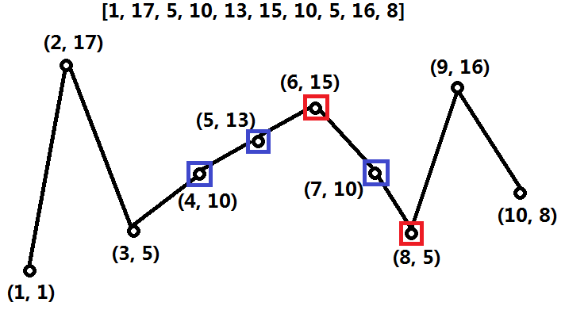

[toc]

A sequence of numbers is called a **wiggle sequence** if the differences between successive numbers strictly alternate between positive and negative. The first difference (if one exists) may be either positive or negative. A sequence with fewer than two elements is trivially a wiggle sequence.

For example, `[1,7,4,9,2,5]` is a wiggle sequence because the differences `(6,-3,5,-7,3)` are alternately positive and negative. In contrast, `[1,4,7,2,5]` and `[1,7,4,5,5]` are not wiggle sequences, the first because its first two differences are positive and the second because its last difference is zero.

Given a sequence of integers, return the length of the longest subsequence that is a wiggle sequence. A subsequence is obtained by deleting some number of elements (eventually, also zero) from the original sequence, leaving the remaining elements in their original order.


**Follow up:**
Can you do it in $O(n)$ time?


## 题目解读

&emsp;如果一个序列中元素的差呈正负相间，则称之为摆动序列。给定一个数组，判断是否包含摆动子序列。

```java
class Solution {
    public int wiggleMaxLength(int[] nums) {

    }
}
```

## 程序设计

* 仔细观察可发现，不管是差为正或差为负起始，第一个元素和最后一个元素可以出现在最长序列中，以第一个元素为例，假设存在最长子序列起始差为正或负，而第一个元素比最长子序列起始点大或小，即第一个元素与起始点构不成摆动序列，但是第一个元素与序列第二个元素满足摆动序列，即第一个元素与序列第二个元素及之后组成的暴动序列长度一样，也是最长子序列；而如果第一个元素和序列起始点能够构成摆动序列，则加入第一个元素的序列更长；总之第一个元素参与的摆动序列存在且最长序列必然是整个数组的最长序列。最后一个元素证明同理。
* 首先想到的是回溯，从第一个元素开始，试探并返回序列长度，选择最大的返回。但是该方法会超时，最坏情况时间复杂度为$O(N!)$。

```java
class Solution {
    public int wiggleMaxLength(int[] nums) {
        if (nums.length < 2) return nums.length;
        // 从第一个位置回溯
        return Math.max(wiggleMaxLength(nums, 0, true), wiggleMaxLength(nums, 0, false)) + 1;
    }
    // pos表示下一个差为正数还是负数
    private int wiggleMaxLength(int[] nums, int start, boolean pos) {
        int max = 0;
        for (int i = start + 1; i < nums.length; i++) {
            // 试探满足要求的所有组合
            if ((nums[i] - nums[start] > 0 && pos) || (nums[i] - nums[start] < 0 && !pos)) {
                max = Math.max(max, 1 + wiggleMaxLength(nums, i, !pos));
            }
        }
        return max;
    }
}
```

* 由于回溯重复计算，可使用数组记录优化，避免重复计算。

```java
class Solution {
    // 表示从当前位置元素开始后续的最大摆动序列数目
    int[] positive;
    int[] negative;

    public int wiggleMaxLength(int[] nums) {
        if (nums.length < 2) return nums.length;

        positive = new int[nums.length];
        negative = new int[nums.length];
        Arrays.fill(positive, -1);
        Arrays.fill(negative, -1);

        return Math.max(wiggleMaxLength(nums, 0, true), wiggleMaxLength(nums, 0, false)) + 1;
    }
    // pos表示下一个差为正数还是负数
    private int wiggleMaxLength(int[] nums, int start, boolean pos) {
        int max = 0;

        if (pos && positive[start] != -1) return positive[start];
        if (!pos && negative[start] != -1) return negative[start];
        for (int i = start + 1; i < nums.length; i++) {
            if ((nums[i] - nums[start] > 0 && pos) || (nums[i] - nums[start] < 0 && !pos)) {
                max = Math.max(max, 1 + wiggleMaxLength(nums, i, !pos));
            }
        }
        // 更新结果
        if (pos) positive[start] = max;
        else negative[start] = max; 
        return max;
    }
}
```

* 可以直接使用动态规划实现：

```java
class Solution {
    public int wiggleMaxLength(int[] nums) {
        if (nums.length < 2) return nums.length;

        // 表示到当前元素结束前面的序列长度
        int[] positive = new int[nums.length];
        int[] negtive = new int[nums.length];

        for (int i = 1; i < nums.length; i++) {
            for (int j = i - 1; j >= 0; j--) {
                if (nums[i] - nums[j] > 0) {
                    positive[i] = Math.max(positive[i], negtive[j] + 1);
                } else if (nums[i] - nums[j] < 0) {
                    negtive[i] = Math.max(negtive[i], positive[j] + 1);
                }
            }
        }
        // 需要加上第一个元素
        return Math.max(negtive[nums.length - 1], positive[nums.length - 1]) + 1;
    }
}
```

## 性能分析

&emsp;优化的回溯时间复杂度为$O(N^2)$，空间复杂度为$O(N)$。

执行用时：6ms，在所有java提交中击败了14.16%的用户。

内存消耗：37MB，在所有java提交中击败了5.55%的用户。

&emsp;动态规划时间复杂度为$O(N^2)$，空间复杂度为$O(N)$。

执行用时：5ms，在所有java提交中击败了23.04%的用户。

内存消耗：36.9MB，在所有java提交中击败了5.55%的用户。

## 官方解题

&emsp;除了上述基础的思路，官方还提供了其它三种思路。其共同思想如图，事实上可以证明最长序列的一种可能是以第一个元素和最后一个元素构成的峰谷。



&emsp;动态规划数组不再保存包含每个位置的最大序列，而是保存当前位置为止的最大序列，这个序列可能包含当前序列，也可能不包含。初始第一个元素为1，既可以作为负差也可以作为正差；如果当前值大于前一个值，则当前最大正差摆动为截止前一个位置的最大负差加一，而当前位置的负差序列是截止前一位置的负差序列，因为当前结点处于上升趋势，作为负差其前面的结点必然会少于前一个结点，即负差序列数不会超过前一个序列。其它情况同理。

```java
class Solution {
    public int wiggleMaxLength(int[] nums) {
        if (nums.length < 2) return nums.length;

        int[] positive = new int[nums.length];
        int[] negative = new int[nums.length];
        // 初始化
        positive[0] = negative[0] = 1; 
        for (int i = 1; i < nums.length; i++) {
            if (nums[i] > nums[i - 1]) {
                positive[i] = negative[i - 1] + 1;
                negative[i] = negative[i - 1];
            } else if (nums[i] < nums[i - 1]) {
                negative[i] = positive[i - 1] + 1;
                positive[i] = positive[i - 1];
            } else {
                negative[i] = negative[i - 1];
                positive[i] = positive[i - 1];
            }
        }
        return Math.max(positive[nums.length - 1], negative[nums.length - 1]);
    }
}
```

仔细观察，发现每次只是用到前一个位置的值，可以不用数组，使用单个的值即可，优化如下：

```java
class Solution {
    public int wiggleMaxLength(int[] nums) {
        if (nums.length < 2) return nums.length;

        int positive = 1, negative = 1; 
        for (int i = 1; i < nums.length; i++) {
            if (nums[i] > nums[i - 1]) {
                positive = negative+ 1;
            } else if (nums[i] < nums[i - 1]) {
                negative = positive + 1;
            }
        }
        return Math.max(positive, negative);
    }
}
```

&emsp;时间复杂度为$O(N)$，空间复杂度为$O(1)$。

执行用时：0ms，在所有java提交中击败了100.00%的用户。

内存消耗：37.1MB，在所有java提交中击败了5.55%的用户。

&emsp;经过上面分析，可知可以直接分析最长子序列的特殊情况，即只包含峰谷和起始点、结束点的情况，问题转化为寻找峰值点的个数。

```java
class Solution {
    public int wiggleMaxLength(int[] nums) {
        if (nums.length < 2) return nums.length;

        int diff = nums[1] - nums[0];
        // 如果起始不是平原，需要加上起始点和结束点共2个
        // 如果起始是平原，加上起始点和结束点，但是因为是平原，第一个转折处会被记为山峰或山谷，但这个点与起始点同层，会重复计数，故减去1，记作1
        int count = diff == 0 ? 1 : 2;
        for (int i = 2; i < nums.length; i ++) {
            int temp = nums[i] - nums[i - 1];
            // 山峰或山谷，序列数加一
            if ((diff <= 0 && temp > 0) || (diff >= 0 && temp < 0)) {
                count++;
                diff = temp;
            }
        } 
        return count;
    }
}
```

&emsp;时间复杂度为$O(N)$，空间复杂度为$O(1)$。

执行用时：0ms，在所有java提交中击败了100.00%的用户。

内存消耗：37.1MB，在所有java提交中击败了5.55%的用户。