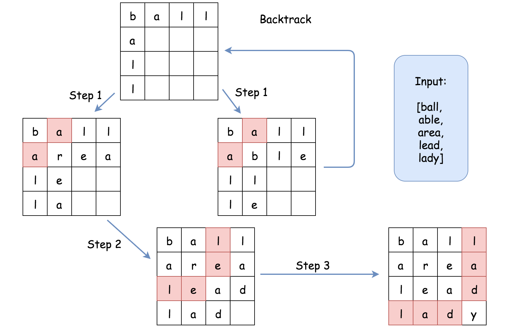

[toc]

Given a set of words (**without duplicates**), find all word squares you can build from them.

A sequence of words forms a valid word square if the `kth` row and column read the exact same string, where $0 \le k < \max(\text{numRows}, \text{numColumns})$.

For example, the word sequence `["ball","area","lead","lady"]` forms a word square because each word reads the same both horizontally and vertically.

```
b a l l
a r e a
l e a d
l a d y
```


**Note**:

* There are at least $1$ and at most $1000$ words.
* All words will have the exact same length.
* Word length is at least $1$ and at most $5$.
* Each word contains only lowercase English alphabet `a-z`.

**Example 1**:

```
Input:
["area","lead","wall","lady","ball"]

Output:
[
  [ "wall",
    "area",
    "lead",
    "lady"
  ],
  [ "ball",
    "area",
    "lead",
    "lady"
  ]
]

Explanation:
The output consists of two word squares. The order of output does not matter (just the order of words in each word square matters).
```

**Example 2**:

```
Input:
["abat","baba","atan","atal"]

Output:
[
  [ "baba",
    "abat",
    "baba",
    "atan"
  ],
  [ "baba",
    "abat",
    "baba",
    "atal"
  ]
]

Explanation:
The output consists of two word squares. The order of output does not matter (just the order of words in each word square matters).
```


## 题目解读

&emsp;给定单词列表，单词长度相等，求所有符合条件的单词方块。

```java
class Solution {
    public List<List<String>> wordSquares(String[] words) {

    }
}
```

## 程序设计

* 采用回溯的方式，判断当前单词是否与前一个单词在列方向是否构成序列，可采用字典树；判断当前单词与前一行在行方向是否契合，可采用方块字符记录比对。

```java
class Solution {
    public List<List<String>> wordSquares(String[] words) {
        int n = words[0].length();
        Trie trie = new Trie(words);

        List<List<String>> res = new LinkedList<>();
        Trie[] row = new Trie[n];
        Arrays.fill(row, trie);
        backTracing(words, row, new char[n][n], new LinkedList<>(), n, res);
        return res;
    }

    private void backTracing(String[] words, Trie[] row, char[][] record, List<String> path, int len, List<List<String>> res) {
        // 找到一组答案
        if (path.size() == len) {
            res.add(new ArrayList<>(path));
            return;
        }
        
        point: for (String word : words) {
            Trie[] next = new Trie[len];
            for (int i = 0; i < len; i++) {
                char c = word.charAt(i);
                // 同一行之前的字符不相等
                if (i < path.size() && c != record[path.size()][i]) continue point;
                next[i] = row[i].match(c);
                // 同一列无符合条件的单词
                if (next[i] == null) continue point;
				
                // 填充
                record[path.size()][i] = c;
                record[i][path.size()] = c;
            }
            // 试探
            path.add(word);
            backTracing(words, next, record, path, len, res);
            // 回溯
            path.remove(path.size() - 1);
        }
    }
}

class Trie {
    Trie[] children = new Trie[26];
    boolean isEnding;

    Trie() {

    }

    Trie(String[] words) {
        for (String word : words) {
            Trie tmp = this;
            for (char c : word.toCharArray()) {
                if (tmp.children[c - 'a'] == null) tmp.children[c - 'a'] = new Trie();
                tmp = tmp.children[c - 'a'];
            }
            tmp.isEnding = true;
        }
    }

    public Trie match(int c) {
        return this.children[c - 'a'];
    }
}
```

## 性能分析

&emsp;时间复杂度为$O((NL)^L)$，空间复杂度为$O(NL)$。

执行用时：522 ms, 在所有 Java 提交中击败了5.06%的用户。

内存消耗：41.6 MB, 在所有 Java 提交中击败了60.00%的用户。

## 官方解题

&emsp;官方思路简化了回溯中的候选结果遍历。上述思路在整个`words`列表中遍历，很多都是不符合条件的单词，效率较低；以`wall`，`area`为例，在查找第三个单词时，其前缀为`le`开头，这样可通过字典树得到候选集，将大大少于`words`列表，加快速度。



```java
class Solution {
    public List<List<String>> wordSquares(String[] words) {
        int n = words[0].length();
        Trie trie = new Trie(words);

        List<List<String>> res = new ArrayList<>();
        List<String> path = new ArrayList<>();

        for (String word : words) {
            path.add(word);
            backTracing(trie, path, res, n);
            path.remove(0);
        }
        return res;
    }

    private void backTracing(Trie trie, List<String> path, List<List<String>> res, int len) {
        int size = path.size();
        // 找到一组答案
        if (size == len) {
            res.add(new ArrayList<>(path));
            return;
        }
        
        char[] suffix = new char[size];
        for (int i = 0; i < size; i++) suffix[i] = path.get(i).charAt(size);

        for (String word : trie.matchSuffix(suffix)) {
            path.add(word);
            backTracing(trie, path, res, len);
            path.remove(size);
        }
    }
}

class Trie {
    Trie[] children = new Trie[26];
    boolean isEnding;
    List<String> words = new ArrayList<>();

    Trie() {

    }

    Trie(String[] words) {
        for (String word : words) {
            Trie tmp = this;
            for (char c : word.toCharArray()) {
                tmp.words.add(word);
                if (tmp.children[c - 'a'] == null) tmp.children[c - 'a'] = new Trie();
                tmp = tmp.children[c - 'a'];
            }
            tmp.isEnding = true;
            tmp.words.add(word);
        }
    }

    public List<String> matchSuffix(char[] suffix) {
        Trie tmp = this;
        for (char c : suffix) {
            tmp = tmp.children[c - 'a'];
            if (tmp == null) return new LinkedList<>();
        }
        return tmp.words;
    }
}
```

&emsp;对于第$len - L$个单词（即多叉树高度为$L$的单词），前缀遍历长度为$len - L$，回溯候选最多有$26^L$个，$T(L) = len - L + 26^LT(L - 1)$，则回溯时间复杂度为$O(\frac{len * (len + 1)}{2} + 26^{\frac{len * (len +１)}{2}}) \approx O(26^{\frac{len * (len +１)}{2}})$，尝试$N$个单词回溯的时间复杂度为$O(N26^{\frac{len * (len +１)}{2}})$；最坏为完全多叉树，每一层都存储了所有的$N$个单词，每层空间消耗$Nlen$，有$len$层，故最坏空间复杂度为$O(Nlen^2)$。

执行用时：29 ms, 在所有 Java 提交中击败了98.75%的用户。

内存消耗：42.2 MB, 在所有 Java 提交中击败了23.68%的用户。