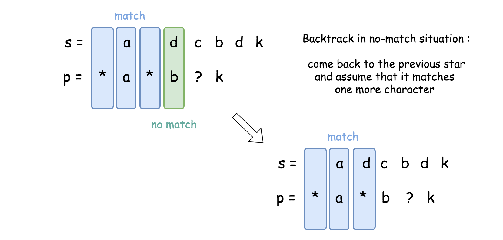

[toc]

Given an input string (`s`) and a pattern (`p`), implement wildcard pattern matching with support for `'?'` and `'*'`.

* `'?'` Matches any single character.
* `'*'` Matches any sequence of characters (including the empty sequence).

The matching should cover the **entire** input string (not partial).


**Note**:

* `s` could be empty and contains only lowercase letters `a-z`.
* `p` could be empty and contains only lowercase letters `a-z`, and characters like `?` or `*`.


## 题目解读

&emsp;`'?'`可以匹配任何单个字符。`'*'`可以匹配任意字符串（包括空字符串）。两个字符串完全匹配才算匹配成功。

```java
class Solution {
    public boolean isMatch(String s, String p) {

    }
}
```

## 程序设计

* 为[#10 Regular Expression Matching](./#10 Regular Expression Matching.md)的简化问题，`*`可以匹配任意序列，`?`匹配任意字符，如果两个序列当前字母匹配（字母相等或模式为`?`），则继续匹配下一个字母；如果字母不相等，直接返回`false`；如果模式为`*`，则匹配下一个字母（多个序列匹配`*`）或匹配下一个模式（空串匹配`*`）。

```java
class Solution {
    public boolean isMatch(String s, String p) {
        return isMatch(s, p, 0, 0);
    }

    private boolean isMatch(String s, String p, int l, int r) {
        if (p.length() == r) return s.length() <= l;

        // 当前字母匹配
        if (l < s.length() && (s.charAt(l) == p.charAt(r) || p.charAt(r) == '?'))
            return isMatch(s, p, l + 1, r + 1);
        else if (p.charAt(r) == '*') return (l < s.length() && isMatch(s, p, l + 1, r)) || isMatch(s, p, l, r + 1);
        else return false;
    }
}
```

* 上述思路会超时，采用动态规划形式：

```java
class Solution {
    int[][] dp;

    public boolean isMatch(String s, String p) {
        dp = new int[s.length() + 1][p.length() + 1];
        return isMatch(s, p, 0, 0);
    }

    private boolean isMatch(String s, String p, int l, int r) {
        if (dp[l][r] != 0) return dp[l][r] == 1;

        if (p.length() == r) {
            dp[l][r] = s.length() <= l ? 1 : -1;
            return dp[l][r] == 1;
        }

        // 当前字母匹配
        if (l < s.length() && (s.charAt(l) == p.charAt(r) || p.charAt(r) == '?')) {
            dp[l][r] = isMatch(s, p, l + 1, r + 1) ? 1 : -1;
        }
        else if (p.charAt(r) == '*') {
            dp[l][r] = (l < s.length() && isMatch(s, p, l + 1, r)) || isMatch(s, p, l, r + 1) ? 1 : -1;
        }
        else dp[l][r] = -1;

        return dp[l][r] == 1;
    }
}
```

## 性能分析

&emsp;动态规划时间复杂度为$O(MN)$，空间复杂度为$O(MN)$。

执行用时：25ms，在所有java提交中击败了42.60%的用户。

内存消耗：42.2MB，在所有java提交中击败了5.12%的用户。

## 官方解题

&emsp;除了上述方法，官方还提供了最优解。上述方法都是考虑`*`匹配哪些字符串，换个思路，不管`*`匹配哪些字符串，只需匹配串和模式串中的字母对齐即可。这样问题就转化为寻找星号后面的字母对应匹配串中字母的位置的问题，这个过程是回溯过程。如图，第一个比较对是`a`和`*`，此时假设`*`号匹配空字符串，`a`与其后继`a`比较，发现匹配成功，继续下一个比较对`d`与`*`，同理假设匹配空串，`d`与后继`b`比较，发现不匹配，回溯到之前的位置，即`d`与`*`号的位置，取`d`的后继`c`与`*`的后继`b`比较，以此类推，最后`c`的后继`b`匹配成功。



```java
class Solution {
    public boolean isMatch(String s, String p) {
        if (p.isEmpty()) return s.isEmpty();
        int lenP = p.length(), lenS = s.length();

        // 字符串遍历索引
        int idxS = 0, idxP = 0;
        // 记录*号及与*号对齐的位置
        int starP = -1, starS = -1;

        while (idxS < lenS) {
            // 匹配当前字母，继续遍历下一个
            if (idxP < lenP && (s.charAt(idxS) == p.charAt(idxP) || p.charAt(idxP) == '?')) {
                idxS++;
                idxP++;
            }
            // 当前模式为*
            else if (idxP < lenP && p.charAt(idxP) == '*') {
                // 记录*号对应比较对
                starP = idxP;
                starS = idxS;
                // 假设当前*号匹配空串，模式后移，匹配串不变
                idxP++;
            }
            // 当前字母不相等或模式已遍历完而字符串还有余，而starS为-1意味着没有向前回溯的位置，返回
            else if (starS == -1) {
                return false;
            } 
            // 回溯
            else {
                // 继续匹配*号后的字符
                idxS = starS + 1;
                idxP = starP + 1;
                // 记录本次开始匹配的位置（之前的位置对应字母认为是*号匹配序列的一部分）
                starS = idxS;
            }
        }
        // 最后若模式有余，则判断是否全是*，不是则无法匹配
        for (int i = idxP; i < lenP; i++) {
            if (p.charAt(i) != '*') return false;
        }
        return true;
    }
}
```

&emsp;最好的情况时间复杂度为$O(\min(M,N))$，平均情况时间复杂度为$O(M\log_2N)$；空间复杂度为$O(1)$。其中$M$为匹配串长度，$N$为模式长度。具体证明可参考[On the Average-case Complexity of Pattern Matching with Wildcards](./https://arxiv.org/pdf/1407.0950.pdf)。

执行用时：2ms，在所有java提交中击败了100.00%的用户。

内存消耗：40.3MB，在所有java提交中击败了15.36%的用户。