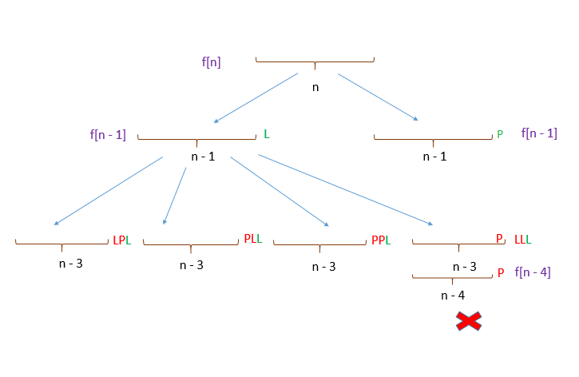
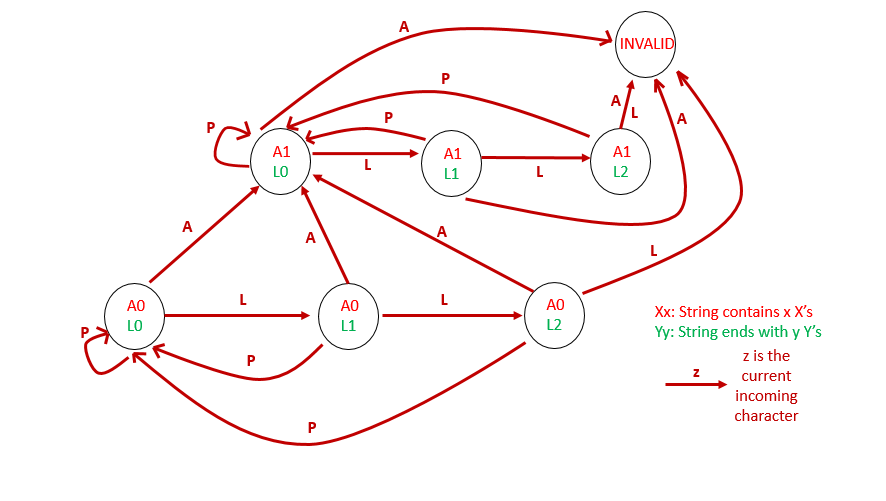

[toc]

Given a positive integer $n$, return the number of all possible attendance records with length n, which will be regarded as rewardable. The answer may be very large, return it after mod $10^9 + 7$.

A student attendance record is a string that only contains the following three characters:

```
'A' : Absent.
'L' : Late.
'P' : Present.
```

A record is regarded as rewardable if it doesn't contain **more than one 'A' (absent)** or **more than two continuous 'L' (late)**.


**Note:** The value of **n** won't exceed 100,000.


## 题目解读

&emsp;给定考勤记录数$n$，给出所有可以奖励的考勤方案。当考勤中不超过一次迟到及不超过两次连续迟到，则认为可以奖励。

```java
class Solution {
    public int checkRecord(int n) {

    }
}
```

## 程序设计

* 首先想到的是暴力回溯，需要保存前面两个考勤记录用于判断迟到数，及保存缺勤数。该方法时间复杂度为$O(3^N)$，会超时。

```java
class Solution {
    int count;

    public int checkRecord(int n) {
        if (n <= 0) return 0;
        checkRecord(n, 0, 2, 2);
        return count;
    }

    // absent表示A的数量，pre表示前一个记录0缺勤1迟到2到场
    private void checkRecord(int n, int absent, int prePre, int pre) {
        if (n == 0) {
            count++;
            return;
        }
        // 当前尝试缺勤
        if (absent == 0) checkRecord(n - 1, absent + 1, pre, 0);
        // 当前尝试迟到
        if (pre != 1 || prePre != 1) checkRecord(n - 1, absent, pre, 1);
        // 当前尝试在场
        checkRecord(n - 1, absent, pre, 2);
    }
}
```

* 仔细观察序列，假设当前为状态`X`，则序列为`xxxXxxx`，在上述暴力回溯中`X`后的序列是会被重复回溯的。参考官方解题，先不考虑`A`的情况，只考虑`P`和`L`的组合，则情况如下，即`f[n] = 2f[n - 1] - f[n - 4]`。这样可得递归形式：



```java
class Solution {
    int mod = 1_000_000_007;

    public int checkRecord(int n) {
        // 只考虑P和L的情况的组合数目
        int count = func(n);
        // 加入A的组合数目
        for (int i = 1; i <= n; i++) {
            count += func(i - 1) * func(n - i);
            count %= mod;
        }
        return count % mod;
    }

    private int func(int n) {
        if (n == 0) return 1;
        if (n == 1) return 2;
        if (n == 2) return 4;
        if (n == 3) return 7;
        return (2 * func(n - 1) - func(n - 4)) % mod;
    }
}
```

> 在$n$超过27后会超时，时间复杂度为$O(2^N)$，其次上述方法有个问题就是`(2 * func(n - 1) - func(n - 4)) % mod`在$n$超过36后得到的数值是负数。

* 引入额外空间保存计算结果，针对`(2 * func(n - 1) - func(n - 4)) % mod`为负数的情况，转化为`(2 * func(n - 1) % mod + mod - func(n - 4)) % mod`，其次将数组设为长整型。

```java


class Solution {
    int mod = 1_000_000_007;
    long[] dp;

    public int checkRecord(int n) {
        dp = new long[n + 1];
        // 只考虑P和L的情况的组合数目
        long count = func(n);
        // 加入A的组合数目
        for (int i = 1; i <= n; i++) {
            count += func(i - 1) * func(n - i);
            count %= mod;
        }
        return (int)(count % mod);
    }

    private long func(int n) {
        if (dp[n] != 0) return dp[n];
        if (n == 0) return dp[0] = 1;
        if (n == 1) return dp[1] = 2;
        if (n == 2) return dp[2] = 4;
        if (n == 3) return dp[3] = 7;
        dp[n] = (2 * func(n - 1) % mod  + mod - func(n - 4)) % mod;
        return dp[n];
    }
}
```

* 动态规划形式如下：

```java
class Solution {
    int mod = 1_000_000_007;

    public int checkRecord(int n) {
        int[] dp = new int[n < 4 ? 4 : (n + 1)];
        dp[0] = 1; dp[1] = 2; dp[2] = 4; dp[3] = 7;
		// 动态规划
        for (int i = 4; i <= n; i++) {
            dp[i] = (2 * dp[i - 1] % mod + mod - dp[i - 4]) % mod;
        }
        // 只考虑P和L的情况的组合数目
        long count = dp[n];
        // 加入A的组合数目
        for (int i = 1; i <= n; i++) {
            // 注意溢出
            count += (long)dp[i - 1] * dp[n - i];
            count %= mod;
        }
        return (int)(count % mod);
    }
}
```

## 性能分析

&emsp;回溯时间复杂度为$O(N^2)$，空间复杂度为$O(N)$。

执行用时：117ms，在所有java提交中击败了36.29%的用户。

内存消耗：51.5MB，在所有java提交中击败了100.00%的用户。

&emsp;动态规划时间复杂度为$O(N)$，空间复杂度为$O(N)$。

执行用时：66ms，在所有java提交中击败了67.95%的用户。

内存消耗：39.2MB，在所有java提交中击败了100.00%的用户。

## 官方解题

&emsp;除了上述思路，官方还提供了状态机的思路。



```java
public class Solution {
    long mod = 1_000_000_007;
    public int checkRecord(int n) {
        // 初始状态，存在0个缺勤，结尾0个迟到
        long a0l0 = 1;
        // 其它状态初始化
        long a0l1 = 0, a0l2 = 0, a1l0 = 0, a1l1 = 0, a1l2 = 0;
        for (int i = 0; i < n; i++) {
            // 状态a0l0可由a0l0、a0l1、a0l2拼接A转化得来
            long new_a0l0 = (a0l0 + a0l1 + a0l2) % M;
            // 状态a0l1可由a0l0拼接L得来
            long new_a0l1 = a0l0;
            // 状态a0l2可由a0l1拼接L得来
            long new_a0l2 = a0l1;
            // a1l0可由其它状态拼接A得来
            long new_a1l0 = (a0l0 + a0l1 + a0l2 + a1l0 + a1l1 + a1l2) % M;
            // a1l1可由a1l0拼接L得来
            long new_a1l1 = a1l0;
            // a1l2可由a1l1拼接L得来
            long new_a1l2 = a1l1;
            a0l0 = new_a0l0;
            a0l1 = new_a0l1;
            a0l2 = new_a0l2;
            a1l0 = new_a1l0;
            a1l1 = new_a1l1;
            a1l2 = new_a1l2;
        }
        return (int)((a0l0 + a0l1 + a0l2 + a1l0 + a1l1 + a1l2) % M);
    }
}
```

&emsp;时间复杂度为$O(N)$，空间复杂度为$O(1)$。

执行用时：46ms，在所有java提交中击败了80.31%的用户。

内存消耗：36.6MB，在所有java提交中击败了100.00%的用户。