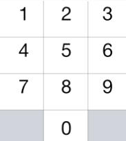

[toc]

A chess knight can move as indicated in the chess diagram below:

  

This time, we place our chess knight on any numbered key of a phone pad (indicated above), and the knight makes `N-1` hops.  Each hop must be from one key to another numbered key.

Each time it lands on a key (including the initial placement of the knight), it presses the number of that key, pressing `N` digits total.

How many distinct numbers can you dial in this manner?

Since the answer may be large, output the answer modulo $10^9 + 7$.


**Note:**

- $1 <= N <= 5000$


## 题目解读


```java
class Solution {
    public int knightDialer(int N) {

    }
}
```

## 程序设计


```java

```

## 性能分析


## 官方解题