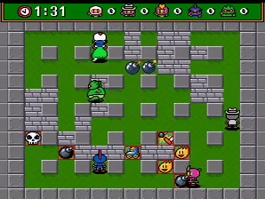

[toc]

Given a 2D grid, each cell is either a wall `'W'`, an enemy `'E'` or empty `'0'` (the number zero), return the maximum enemies you can kill using one bomb.
The bomb kills all the enemies in the same row and column from the planted point until it hits the wall since the wall is too strong to be destroyed.



**Note**: You can only put the bomb at an empty cell.


**Example**:

```
Input: [["0","E","0","0"],["E","0","W","E"],["0","E","0","0"]]
Output: 3 
Explanation: For the given grid,

0 E 0 0 
E 0 W E 
0 E 0 0

Placing a bomb at (1,1) kills 3 enemies.
```


## 题目解读

&emsp;放置炸弹，求最多可炸到的敌人数目。

```java
class Solution {
    public int maxKilledEnemies(char[][] grid) {

    }
}
```

## 程序设计

* 暴力遍历判断时间复杂度为$O(MN(M + N))$，可使用额外的空间记录从上、下、左、右到当前点的敌人数，减少时间复杂度。

```java
class Solution {
    public int maxKilledEnemies(char[][] grid) {
        if (grid == null || grid.length == 0 || grid[0].length == 0) return 0;
        int m = grid.length, n = grid[0].length;
        // 记录上下左右
        int[][] up = new int[m + 2][n + 2], left = new int[m + 2][n + 2], down = new int[m + 2][n + 2], right = new int[m + 2][n + 2];
        for (int i = 1; i <= m; i++) {
            for (int j = 1; j <= n; j++) {
                int cur = grid[i - 1][j - 1] == 'W' ? -1 : grid[i - 1][j - 1] == 'E' ? 1 : 0;
                // 从上往下，从左往右
                if (cur > -1) {
                    up[i][j] = up[i - 1][j] + cur;
                    left[i][j] = left[i][j - 1] + cur;
                }
                cur = grid[m - i][n - j] == 'W' ? -1 : grid[m - i][n - j] == 'E' ? 1 : 0;
                // 从下往上，从右往左
                if (cur > -1) {
                    down[m - i + 1][n - j + 1] = down[m - i + 2][n - j + 1] + cur;
                    right[m - i + 1][n - j + 1] = right[m - i + 1][n - j + 2] + cur;
                }
            }
        }

        int res = 0;
        for (int i = 1; i <= m; i++) {
            for (int j = 1; j <= n; j++) {
                if (grid[i - 1][j - 1] == '0') {
                    res = Math.max(res, down[i][j] + up[i][j] + left[i][j] + right[i][j]);
                }
            }
        }
        return res;
    }
}
```

```C#
public class Solution {
        public int MaxKilledEnemies(char[][] grid) {
            if (grid == null || grid.Length == 0 || grid[0].Length == 0) return 0;
            int m = grid.Length, n = grid[0].Length;
            int[,] up = new int[m + 2, n + 2], down = new int[m + 2, n + 2], left = new int[m + 2, n + 2], right = new int[m + 2, n + 2];

            for (var i = 1; i <= m; i++) {
                for (var j = 1; j <= n; j++) {
                    var cur = grid[i - 1][j - 1] == 'W' ? -1 : grid[i - 1][j - 1] == 'E' ? 1 : 0;
                    if (cur > -1) {
                        up[i, j] = up[i - 1, j] + cur;
                        left[i, j] = left[i, j - 1] + cur;
                    }

                    cur = grid[m - i][n - j] == 'W' ? -1 : grid[m - i][n - j] == 'E' ? 1 : 0;
                    if (cur > -1) {
                        down[m - i + 1, n - j + 1] = down[m - i + 2, n - j + 1] + cur;
                        right[m - i + 1, n - j + 1] = right[m - i + 1, n - j + 2] + cur;
                    }
                }
            }

            var res = 0;
            for (var i = 1; i <= m; i++) {
                for (var j = 1; j <= n; j++) {
                    if (grid[i - 1][j - 1] == '0') {
                        res = Math.Max(res, up[i, j] + down[i, j] + left[i, j] + right[i, j]);
                    }
                }
            }
            return res;
        }
    }
```

## 性能分析

&emsp;时间复杂度为$O(MN)$，空间复杂度为$O(MN)$。

执行用时：9 ms, 在所有 Java 提交中击败了46.88%的用户。

内存消耗：42.7 MB, 在所有 Java 提交中击败了48.94%的用户。

## 官方解题

&emsp;官方思路类似。
