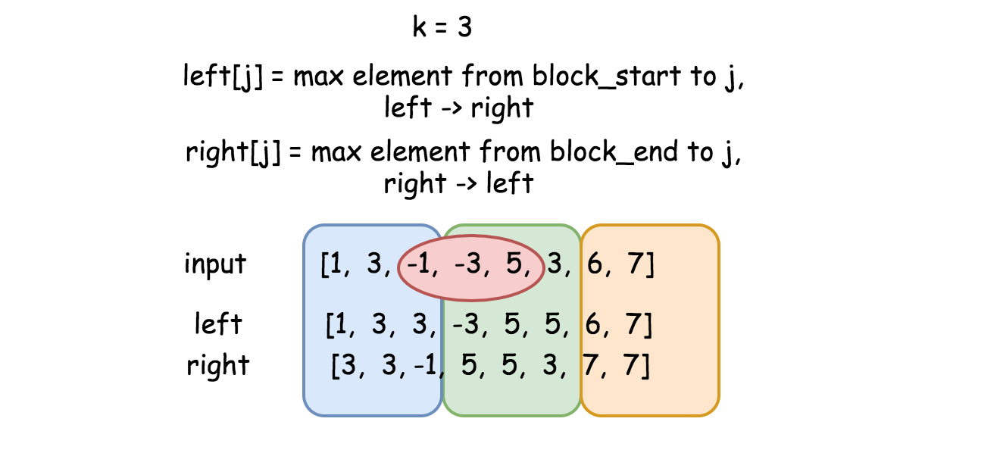

[toc]

Given an array `nums`, there is a sliding window of size $k$ which is moving from the very left of the array to the very right. You can only see the $k$ numbers in the window. Each time the sliding window moves right by one position. Return the max sliding window.


Follow up:
Could you solve it in linear time?


Constraints:

* $1 \le \text{nums.length} \le 10^5$
* $-10^4 \le \text{nums[i]} \le 10^4$
* $1 \le k \le \text{nums.length}$


## 题目解读

&emsp;返回滑动窗口中的最大值。

```java
class Solution {
    public int[] maxSlidingWindow(int[] nums, int k) {
        
    }
}
```

## 程序设计

* 最基本的思路是在窗口内遍历查找最大值，时间复杂度为$O(KN)$；可以使用优先级队列来避免遍历。

```java
class Solution {
    public int[] maxSlidingWindow(int[] nums, int k) {
        int[] res = nums.length - k + 1 > 0 ? new int[nums.length - k + 1] : new int[1];
        // 最大堆
        PriorityQueue<Integer> window = new PriorityQueue<>((a, b) -> nums[b] - nums[a]);

        // 定位窗口
        int left = 0, right = 0;
        while (right < k && right < nums.length) {
            window.add(right++);
        }
        if (right == nums.length) {
            res[0] = nums[window.poll()]; 
            return res;
        }
        // 滑动取值
        int idx = 0;
        while (right < nums.length) {
            res[idx++] = nums[window.peek()];
            // 移除旧值，加入新值
            window.remove(left++);
            window.add(right++);
        }
        // 最后一个窗口
        res[idx] = nums[window.peek()];
        return res;
    }
}
```

* 仔细观察示例，如果先加入窗口的值小于窗口中的最大值，这些值不影响最大值的取舍，而在最大值后的值，当最大值移出窗口时会影响当前窗口的最大值，受这个启发，维护窗口的队列为单调递减队列，窗口的最大值为队首元素。每次移动窗口，除了检查出队左侧，入队右侧如果比当前右侧小，则入队，大则队列右侧出队直到遇到大的值。

```java
class Solution {
    public int[] maxSlidingWindow(int[] nums, int k) {
        if (nums == null || nums.length == 0 || k <= 0) throw new IllegalArgumentException("invalid param");
        if (k == 1) return nums;

        int[] res = new int[nums.length - k + 1];
        Deque<Integer> deque = new ArrayDeque<>();
        // 定位窗口
        int left = 0, right = 0;
        while (right < k) {
            // 入队，维持单调递减队列
            while (!deque.isEmpty() && nums[right] >= nums[deque.getLast()]) {
                deque.pollLast();
            }
            deque.addLast(right);
            right++;
        }
        // 滑动窗口
        int idx = 0;
        while (right < nums.length) {
            // 最大值在队首
            res[idx++] = nums[deque.peekFirst()];
            // 移动窗口，如果队首是左侧，则出队
            if (deque.peekFirst() == left) deque.pollFirst();
            // 入队，维持单调递减队列
            while (!deque.isEmpty() && nums[right] >= nums[deque.getLast()]) {
                deque.pollLast();
            }
            deque.addLast(right);
            // 迭代
            left++; right++;
        }
        // 最后一个窗口
        res[idx] = nums[deque.peekFirst()];
        return res;
    }
}
```

## 性能分析

&emsp;时间复杂度为$O(N\log_2K)$，空间复杂度为$O(K)$。

执行用时：104ms，在所有java提交中击败了7.03%的用户。

内存消耗：48.7MB，在所有java提交中击败了6.67%的用户。

&emsp;时间复杂度为$O(N)$，空间复杂度为$O(K)$。

执行用时：13ms，在所有java提交中击败了64.48%的用户。

内存消耗：47MB，在所有java提交中击败了6.67%的用户。

## 官方解题

&emsp;除了上述思路，官方还提供了一种巧妙的解法。如图，可以将数组分块为$k$大小的格子（最后的一个格子可能不足$k$个），用`left`数组记录当前元素到格子左侧的数据中最大值，`right`数组则记录到右侧的最大值；这样，如果当前窗口就是这个格子，最大值为左侧到右侧的最大值，都记录在`left`或`right`数组中；如果是图中情况，则取`i`到右侧的最大值和`j`到左侧的最大值中的最大值。



```java
class Solution {
    public int[] maxSlidingWindow(int[] nums, int k) {
        if (nums == null || nums.length == 0 || k <= 0) throw new IllegalArgumentException("invalid param");

        int n = nums.length;
        int[] left = new int[n], right = new int[n];
        left[0] = nums[0];
        right[n - 1] = nums[n - 1];

        for (int i = 1; i < n; i++) {
            // 分区左侧
            if (i % k == 0) left[i] = nums[i];
            else left[i] = Math.max(left[i - 1], nums[i]);
        }
        for (int i = n - 2; i >= 0; i--) {
            // 分区右侧
            if (i % k == 0) right[i] = nums[i];
            else right[i] = Math.max(right[i + 1], nums[i]);
        }

        int[] res = new int[n - k + 1];
        // i为左侧起始位置
        for (int i = 0; i < n - k + 1; i++) {
            // j为右侧结束位置
            int j = i + k - 1;
            // 窗口正好是分区
            if (i % k == 0) res[i] = left[j];
            // 窗口横跨两个分区，取最大值
            else res[i] = Math.max(right[i], left[j]);
        }
        return res;
    }
}
```

&emsp;时间复杂度为$O(N)$，空间复杂度为$O(N)$。

执行用时：3ms，在所有java提交中击败了94.21%的用户。

内存消耗：47.6MB，在所有java提交中击败了6.67%的用户。