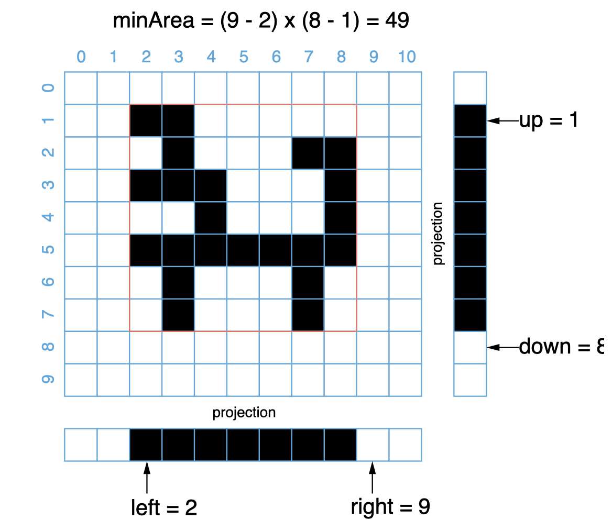

[toc]

An image is represented by a binary matrix with `0` as a white pixel and `1` as a black pixel. The black pixels are connected, i.e., there is only one black region. Pixels are connected horizontally and vertically. Given the location `(x, y)` of one of the black pixels, return the area of the smallest (axis-aligned) rectangle that encloses all black pixels.


## 题目解读

&emsp;给定矩形，0表示白像素，1表示黑像素，给出能包含所有黑色像素点的最小矩形面积。题目提出黑色的像素是连在一起的。

```java
class Solution {
    public int minArea(char[][] image, int x, int y) {
        
    }
}
```

## 程序设计

* 暴力法遍历整个矩形，记录顶点坐标，最后返回面积。

```java
class Solution {
    public int minArea(char[][] image, int x, int y) {
        int minRow = x, maxRow = x, minCol = y, maxCol = y;
        for(int i = 0; i < image.length; i++) {
            for(int j = 0; j < image[0].length; j++) {
                if(image[i][j] == '1') {
                    minRow = Math.min(minRow, i);
                    minCol = Math.min(minCol, j);
                    maxRow = Math.max(maxRow, i);
                    maxCol = Math.max(maxCol, j);
                }
            }   
        }
        return (maxRow - minRow + 1) * (maxCol - minCol + 1);
    }
}
```

* 由于题目说黑色的像素是连在一起的，可以不用遍历所有像素，而是从给定的`(x,y)`开始遍历。注意需要标注访问过的数据，不然会造成死循环。

```java
class Solution {
    int minRow, maxRow, minCol, maxCol;

    public int minArea(char[][] image, int x, int y) {
        minRow = maxRow = x;
        minCol = maxCol = y;
        traverseArea(image, x, y);
        return (maxRow - minRow + 1) * (maxCol - minCol + 1);
    }

    private void traverseArea(char[][] image, int x, int y) {
        if(x < 0 || x >= image.length || y < 0 || y >= image[0].length || image[x][y] == '0') {
            return;
        }
        // 标记为已访问
        image[x][y] = '0';
        minRow = Math.min(minRow, x);
        maxRow = Math.max(maxRow, x);
        minCol = Math.min(minCol, y);
        maxCol = Math.max(maxCol, y);
        // 递归访问周围结点
        traverseArea(image, x + 1, y);
        traverseArea(image, x - 1, y);
        traverseArea(image, x, y + 1);
        traverseArea(image, x, y - 1);
    }
}
```

* 可以利用二分查找来进行遍历，以行为例，二分查找行，然后遍历相应的列元素是否存在黑像素。实质就是边界判断的问题，判断上界，`right`需要占据黑色像素所在点，判断下界`right`需要占据白色像素点。



```java
class Solution {
    public int minArea(char[][] image, int x, int y) {
        int m, n;
        if(image == null || (m = image.length) == 0 || (n = image[0].length) == 0) {
            return 0;
        }
        int minRow = getRowRange(image, 0, x, true);
        // 注意right为m不是m-1
        int maxRow = getRowRange(image, x + 1, m, false);
        int minCol = getColRange(image, 0, y, true);
        int maxCol = getColRange(image, y + 1, n, false);
        return (maxRow - minRow) * (maxCol - minCol);
    }
    // flag为true返回最前面像素行，flag为false返回最后面像素行
    private int getRowRange(char[][] image, int left, int right, boolean flag) {
        while(left < right) {
            int mid = left + (right - left) / 2;
            // 查找mid行是否有黑像素
            boolean black = false;
            for(int i = 0; i < image[0].length; i++) {
                if(image[mid][i] == '1') {
                    black = true;
                    break;
                }
            }
            // 判断前界（right始终占据黑像素行）
            if(flag) {
                // mid包含黑像素
                if(black) {
                    right = mid;
                }
                // 不包含
                else {
                    left = mid + 1;
                }
            } 
            // 判断后界（right最后占据黑像素后一行，也就是后界）
            else {
                if(black) {
                    left = mid + 1;
                } else {
                    right = mid;
                }
            }
        }
        return left;
    }
    // flag为true返回最前面像素行，flag为false返回最后面像素行
    private int getColRange(char[][] image, int left, int right, boolean flag) {
        while(left < right) {
            int mid = left + (right - left) / 2;
            // 查找当前列是否包含黑像素
            boolean black = false;
            for(int i = 0; i < image.length; i++) {
                if(image[i][mid] == '1') {
                    black = true;
                    break;
                }
            }
            if(flag) {
                if(black) {
                    right = mid;
                } else {
                    left = mid + 1;
                }
            } else {
                if(black) {
                    left = mid + 1;
                } else {
                    right = mid;
                }
            }
        }
        return left;
    }
}
```

> 可将上面的：
>
> ```java
> if(flag) {
>     if(black) {
> 		right = mid;
>     } else {
>         left = mid + 1;
>     }
> } else {
>     if(black) {
>         left = mid + 1;
>     } else {
>         right = mid;
>     }
> }
> ```
>
> 合并为：
>
> ```java
> if(flag == black) {
>     right = mid;
> } else {
>     left = mid + 1;
> }
> ```

## 性能分析

&emsp;暴力法和递归方法时间复杂度都为$O(NM)$，空间复杂度为$O(1)$。

执行用时：3ms，在所有java提交中击败了81.54%的用户。

内存消耗：41.8MB，在所有java提交中击败了5.72%的用户。

&emsp;二分查找法时间复杂度为$O(N\log_2M + M\log_2N)$，空间复杂度为$O(1)$。

执行用时：1ms，在所有java提交中击败了100.00%的用户。

内存消耗：42.1MB，在所有java提交中击败了5.72%的用户。

## 官方解题

&emsp;见上。